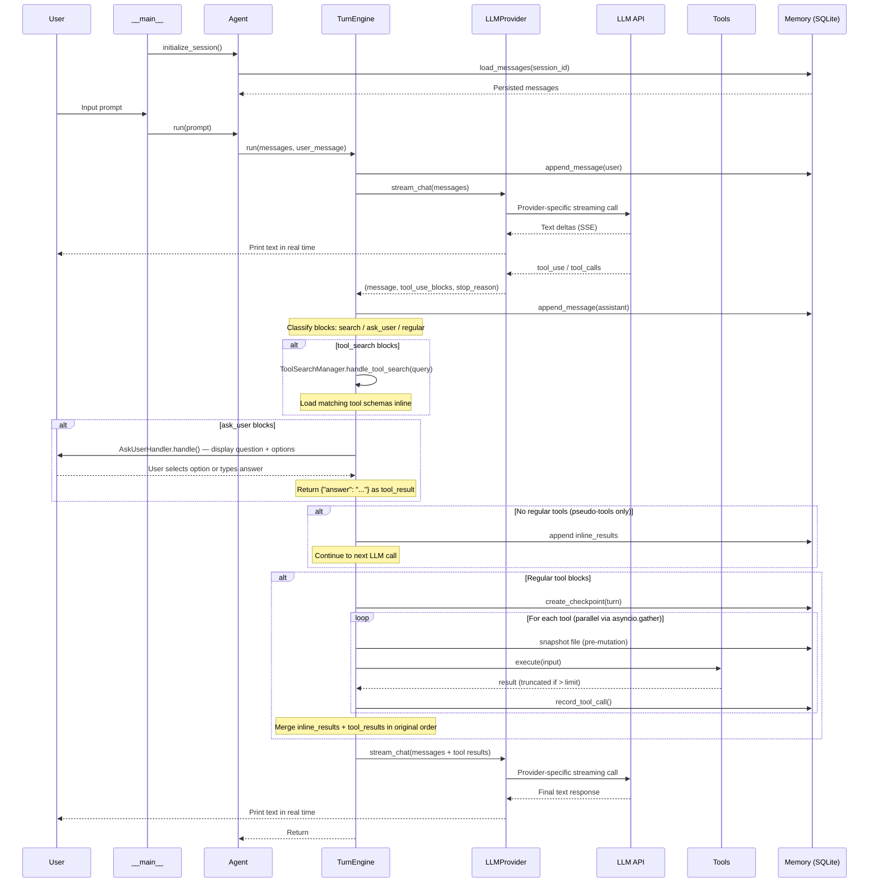

# Micro-X Agent

A general-purpose AI agent that turns natural language into action. Type what you want — Micro-X orchestrates tools, APIs, and services to get it done.

Built in Python on top of the [Model Context Protocol (MCP)](https://modelcontextprotocol.io/), Micro-X is an interactive REPL that streams LLM responses in real time, executes tools in parallel, and keeps API costs under control with a multi-layer cost reduction architecture. It supports Anthropic Claude, OpenAI GPT, DeepSeek, Gemini, and Ollama (local) as providers, runs on Windows, macOS, and Linux, and can be extended with any MCP-compatible server — no code changes needed.

> **[Get started in 2 minutes &rarr; QUICKSTART.md](QUICKSTART.md)**

This is the primary implementation of the Micro-X Agent. An earlier .NET prototype exists at [micro-x-agent-loop-dotnet](https://github.com/StephenDenisEdwards/micro-x-agent-loop-dotnet) but is no longer actively developed.

## What You Can Do

Ask Micro-X to read files, search the web, manage your Gmail, browse LinkedIn jobs, query GitHub repos, send WhatsApp messages, check system stats — or chain them together in a single prompt:

```
Read my CV from documents/CV.docx, search LinkedIn for .NET jobs in London
posted this week, and write a cover letter for the best match
```

```
Search my Gmail for emails from recruiters in the last week and summarise them
```

```
Search the web for "Python asyncio best practices" and summarise the top results
```

The agent figures out which tools to call, in what order, and streams results back as it works. When something is ambiguous, it asks you — not the other way around.

## Key Features

### Intelligent Agent Loop

- **Streaming responses** — text appears word-by-word as the LLM generates it
- **Parallel tool execution** — multiple tool calls in a single turn run concurrently via `asyncio.gather`
- **Human-in-the-loop** — the LLM pauses to ask clarifying questions when your request is ambiguous, presents structured choices, and continues after you answer ([ADR-017](documentation/docs/architecture/decisions/ADR-017-ask-user-pseudo-tool-for-human-in-the-loop.md))
- **Multi-provider LLM support** — pluggable provider architecture supporting Anthropic Claude, OpenAI GPT, DeepSeek, Gemini, and Ollama (local), with a provider pool for health tracking and same-family fallback
- **Semantic model routing** — three-stage classifier routes each turn to the most cost-effective provider/model pair ([ADR-020](documentation/docs/architecture/decisions/ADR-020-semantic-model-routing.md))
- **Sub-agents** — spawn parallel sub-agents for exploration, summarization, or general reasoning without polluting the main context
- **Automatic retry and resilience** — exponential backoff on API rate limits and transient errors ([ADR-016](documentation/docs/architecture/decisions/ADR-016-retry-resilience-for-mcp-servers-and-transport.md))

### Cost Reduction — Built In, Not Bolted On

Running an agent loop against a frontier LLM gets expensive fast. Micro-X ships with a layered cost architecture ([ADR-012](documentation/docs/architecture/decisions/ADR-012-layered-cost-reduction.md)) that attacks the problem at every level:

| Layer | Strategy | Impact |
|-------|----------|--------|
| Prompt caching | Ephemeral caching of system prompt and tool schemas | Saves on repeated context |
| Tool search | On-demand tool discovery replaces large schema payloads | ~12,700 &rarr; ~500 tokens per call |
| Conversation compaction | LLM-based summarization of older messages | Keeps long sessions in bounds |
| Compiled mode _(experimental)_ | Routes batch tasks to code generation | 4-20x cost reduction |
| Concise output formatting | Structured, compact tool results | Less token waste |
| Semantic model routing | Routes tasks by type to cheap/local models | 30-50% additional savings |

### Semantic Model Routing

A three-stage classifier ([ADR-020](documentation/docs/architecture/decisions/ADR-020-semantic-model-routing.md)) analyses each prompt and routes it to the most cost-effective provider and model:

1. **Rules** — regex patterns and turn context signals (zero latency, handles ~60-70% of turns)
2. **Keywords** — cosine similarity against keyword centroids (< 1ms, handles ~25-30%)
3. **LLM** — cheapest model classifies ambiguous cases (< 5% of turns)

Nine task types (`trivial`, `conversational`, `factual_lookup`, `summarization`, `code_generation`, `code_review`, `analysis`, `tool_continuation`, `creative`) map to `(provider, model)` pairs via config-driven routing policies. A `ProviderPool` dispatches to the target provider with health tracking, same-family fallback ([ADR-021](documentation/docs/architecture/decisions/ADR-021-same-family-provider-fallback.md)), and cache-aware switching. An optional feedback loop records outcomes and adjusts confidence thresholds adaptively.

### Session Memory

SQLite-backed persistence that survives process restarts and crashes. Full conversation transcripts, file checkpointing with per-file rewind, session resume/fork, and structured event tracing.

```
/session list              — List sessions
/session resume <id>       — Resume a previous session
/session continue          — Continue current session across restarts
/session fork              — Branch from current session
/rewind <checkpoint_id>    — Revert file mutations
```

### Trigger Broker (Scheduled & Triggered Runs)

An always-on lightweight daemon that dispatches agent runs on a schedule or in response to external triggers. Jobs are defined with cron expressions and run autonomously — no human at the keyboard required.

```bash
python -m micro_x_agent_loop --job add "daily-summary" "0 9 * * *" "Summarise today's news" --tz Europe/London
python -m micro_x_agent_loop --broker start
```

The broker spawns each run as an isolated subprocess using `--run`, with autonomous mode enabled (no `ask_user`, no interactive prompts). Overlap policies prevent duplicate runs, and all results are tracked in SQLite.

### API Server (HTTP & WebSocket)

A FastAPI-based server that exposes the agent over HTTP and WebSocket for web, desktop, and mobile clients:

```bash
python -m micro_x_agent_loop --server start              # Start server
python -m micro_x_agent_loop --server start --broker      # Start server with broker
python -m micro_x_agent_loop --server http://host:port    # Connect CLI to remote server
```

- **REST endpoints** — `POST /api/chat`, `GET /api/sessions`, `GET /api/health`
- **WebSocket** — `ws://host:port/api/ws/{session_id}` for real-time streaming via `WebSocketChannel`
- **Per-session agents** — `AgentManager` creates, caches, and evicts Agent instances per session
- **Broker integration** — optional broker routes for jobs, runs, HITL, and webhooks via `APIRouter`

### Sub-Agents

The agent can spawn sub-agents for parallel research and exploration via the `spawn_subagent` pseudo-tool. Sub-agents run as independent agent instances with their own context window, configured for specific tasks:

- **explore** — fast codebase exploration and search
- **summarize** — document or content summarization
- **general** — general-purpose multi-step reasoning

Sub-agents protect the main context window from excessive intermediate results and enable parallel independent queries.

### Voice Mode

Continuous speech-to-text input via Deepgram STT. Speak your prompts instead of typing — the agent processes `utterance_final` events and responds as normal. Configurable endpointing, device selection, and tuning profiles for balanced, fast, or conservative finalization.

### Extensibility

Every tool is an MCP server. Add capabilities by pointing the config at any MCP-compatible server — first-party TypeScript servers, third-party Go/Python/.NET servers, or your own. The agent discovers tools at startup and makes them available to the LLM automatically.

## Tool Ecosystem

### First-Party MCP Servers (TypeScript)

| Server | Capabilities |
|--------|-------------|
| **filesystem** | Shell commands, file read/write/append, persistent memory |
| **web** | URL fetching, Brave web search |
| **linkedin** | Job search and job detail retrieval |
| **github** | PRs, issues, code search, file access, repo listing |
| **google** | Gmail (search/read/send), Calendar (list/create/get), Contacts (full CRUD) |
| **anthropic-admin** | API usage and cost reporting |
| **interview-assist** | 14 tools for transcription analysis, STT sessions, and evaluation workflows |
| **codegen** _(experimental)_ | Python code generation from templates via a mini agentic loop |

### Third-Party MCP Servers

| Server | Capabilities |
|--------|-------------|
| **[system-info](https://github.com/StephenDenisEdwards/mcp-servers)** (.NET) | OS/CPU/memory info, disk usage, network interfaces |
| **[whatsapp](https://github.com/lharries/whatsapp-mcp)** (Go + Python) | Contact search, chat history, message sending, media transfer |

Tool names are prefixed as `{server}__{tool}` (e.g., `filesystem__bash`). See [ADR-015](documentation/docs/architecture/decisions/ADR-015-all-tools-as-typescript-mcp-servers.md).

## Experimental Features

### Codegen (Code Generation)

An isolated MCP server that generates Python task apps from templates via a constrained agentic loop. Instead of the full tool suite, codegen runs with a single `read_file` tool, a focused system prompt, and a 10-turn hard limit — then validates with unit tests and up to 3 fix rounds.

```
Generate a job search app using the prompt in job-search-prompt-v2.txt
```

See [Codegen Design](documentation/docs/design/DESIGN-codegen-server.md).

### Compiled Mode (Prompt/Compile Selection)

A cost-aware execution modality that decides whether a prompt should run conversationally or be compiled to code for batch execution. Two-stage classification — regex-based structural analysis (zero-cost) with LLM fallback for ambiguous cases.

Based on the [Cost-Aware Task Compilation](documentation/docs/research-papers/cost-aware-task-compilation-for-llm-agents/research-paper.md) research paper.

### Tool Search (On-Demand Discovery)

When the tool schema exceeds 40% of the context window, all schemas are replaced with a single `tool_search` tool. The LLM searches by keyword on-demand, and matching schemas are loaded inline — cutting per-call overhead from ~12,700 tokens to ~500.

## Architecture

### Component Overview

```mermaid
graph TD
    Main["__main__.py<br/>Entry Point"] --> Bootstrap["bootstrap.py<br/>Runtime Factory"]
    Bootstrap --> Agent["Agent<br/>Orchestrator"]
    Bootstrap --> Config["app_config.py<br/>config.json + .env"]
    Bootstrap --> McpMgr["McpManager<br/>MCP Connections"]
    Bootstrap --> Memory["memory/<br/>SQLite Persistence"]

    Agent --> TurnEngine["TurnEngine<br/>LLM Turn Loop"]
    Agent --> CmdRouter["CommandRouter<br/>Local Commands"]
    Agent --> VoiceRT["VoiceRuntime<br/>STT Integration"]
    Agent --> Formatter["ToolResultFormatter<br/>Structured → Text"]
    Agent --> AskUser["AskUserHandler<br/>Human-in-the-Loop"]
    Agent --> ToolSearch["ToolSearchManager<br/>On-Demand Discovery"]
    Agent --> ModeSelect["ModeSelector<br/>Prompt vs Compiled"]
    Agent --> SubAgent["SubAgentRunner<br/>Parallel Sub-Agents"]

    TurnEngine --> Classifier["SemanticClassifier<br/>Rules → Keywords → LLM"]
    TurnEngine --> ProvPool["ProviderPool<br/>Multi-Provider Dispatch"]
    TurnEngine --> McpTools["MCP Tool Proxies"]
    TurnEngine --> Events["TurnEvents<br/>Lifecycle Callbacks"]

    Classifier --> ProvPool
    ProvPool --> Provider["LLMProvider<br/>Protocol"]

    Agent --> Memory

    Provider --> AnthropicProv["AnthropicProvider<br/>family: anthropic"]
    Provider --> OpenAIProv["OpenAIProvider<br/>family: openai"]
    Provider --> DeepSeekProv["DeepSeekProvider<br/>family: openai"]
    Provider --> GeminiProv["GeminiProvider<br/>family: gemini"]
    Provider --> OllamaProv["OllamaProvider<br/>family: openai"]

    McpMgr --> McpSDK["mcp SDK"]
    McpMgr --> McpTools

    subgraph Memory["memory/ (SQLite)"]
        direction TB
        Store["MemoryStore"]
        SessionMgr["SessionManager"]
        CheckpointMgr["CheckpointManager"]
        Facade["MemoryFacade"]
    end

    subgraph Broker["broker/ (Trigger Broker)"]
        direction TB
        Scheduler["scheduler.py<br/>Cron Scheduling"]
        Dispatcher["dispatcher.py<br/>Job Dispatch"]
        Runner["runner.py<br/>Subprocess --run"]
        BrokerStore["store.py<br/>SQLite: jobs, runs"]
        Channels["channels.py<br/>Response Adapters"]
        Webhook["webhook_server.py<br/>HTTP Triggers"]
    end

    subgraph Server["server/ (API Server)"]
        direction TB
        App["app.py<br/>FastAPI + Lifespan"]
        AgentMgr["agent_manager.py<br/>Per-Session Agents"]
        WsChan["ws_channel.py<br/>WebSocket Streaming"]
        BrokerRoutes["broker_routes.py<br/>Broker API"]
    end

    Main --> Broker
    Main --> Server
    Server --> Agent

    subgraph McpServers["MCP Servers"]
        direction TB
        FS["filesystem<br/>bash, read_file, write_file,<br/>append_file, save_memory"]
        Web["web<br/>web_fetch, web_search"]
        LI["linkedin<br/>linkedin_jobs, linkedin_job_detail"]
        GH["github<br/>8 tools"]
        Google["google<br/>12 tools"]
        Admin["anthropic-admin<br/>anthropic_usage"]
        IA["interview-assist<br/>14 tools"]
        Codegen["codegen (Python)<br/>generate_code"]
    end

    McpMgr --> McpServers

    subgraph McpTools["MCP Tool Proxies"]
        direction TB
        McpProxy1["McpToolProxy<br/>(per discovered tool)"]
    end
```



### Agent Loop Sequence



### How the Agent Loop Works

1. You type a prompt at the `you>` prompt
2. The prompt is sent to the LLM via the streaming API
3. The response streams word-by-word to your terminal
4. If the LLM returns tool calls, TurnEngine classifies each block as **tool_search**, **ask_user**, or **regular**
5. Pseudo-tool blocks (search/ask_user) are handled inline — no MCP execution needed
6. Regular tool calls are executed **in parallel** via `asyncio.gather`
7. All results (inline + regular) are merged in original order and sent back to the LLM
8. Steps 3-7 repeat until the LLM responds with text only (no tool calls)
9. Conversation history is maintained across prompts in the same session
10. When the conversation grows large, compaction summarizes older messages to stay within context limits

### Source Layout

```
src/micro_x_agent_loop/
  __main__.py              -- Entry point: loads config, displays logo, starts REPL
  agent.py                 -- Agent orchestrator: conversation state, commands, turn delegation
  agent_channel.py         -- AgentChannel protocol + implementations (Terminal, Buffered, Broker)
  agent_config.py          -- Configuration dataclass (~55 fields)
  app_config.py            -- Config file parsing (config.json → AppConfig)
  bootstrap.py             -- Runtime factory: wires MCP, memory, provider into AppRuntime
  constants.py             -- Centralised magic numbers and defaults
  turn_engine.py           -- LLM turn loop: three-way block classification, parallel tool dispatch
  turn_events.py           -- TurnEvents Protocol + BaseTurnEvents (lifecycle callbacks)
  ask_user.py              -- AskUserHandler: human-in-the-loop pseudo-tool (questionary UI)
  tool_search.py           -- ToolSearchManager: on-demand tool discovery (keyword + semantic)
  mode_selector.py         -- Mode selection: structural pattern matching + LLM classification
  tool.py                  -- Tool Protocol + ToolResult dataclass
  tool_result_formatter.py -- Structured → text formatting (json, table, text, key_value)
  system_prompt.py         -- System prompt text with conditional directives
  compaction.py            -- Conversation compaction strategies (none, summarize)
  llm_client.py            -- Shared utilities (Spinner, retry callback)
  provider.py              -- LLMProvider Protocol definition (includes family property)
  provider_pool.py         -- Multi-provider dispatch, health tracking, same-family fallback
  semantic_classifier.py   -- Three-stage classifier: rules → keywords → LLM
  task_taxonomy.py         -- TaskType enum (9 types), cost tier classification
  turn_classifier.py       -- Legacy per-turn binary classifier (superseded by semantic routing)
  routing_feedback.py      -- SQLite-backed routing outcome recording, adaptive thresholds
  embedding.py             -- Ollama embedding client, vector index, cosine similarity
  sub_agent.py             -- SubAgentRunner: agent types (explore/summarize/general)
  cost_reconciliation.py   -- Cost reconciliation utilities
  manifest.py              -- Build manifest
  metrics.py               -- Structured metrics emission (cost tracking, API call analysis)
  usage.py                 -- UsageResult dataclass and pricing lookup
  api_payload_store.py     -- In-memory ring buffer for API request/response payloads
  analyze_costs.py         -- CLI for analysing metrics.jsonl files
  logging_config.py        -- LogConsumer Protocol + console/file implementations
  voice_runtime.py         -- Voice mode: continuous STT via MCP sessions
  voice_ingress.py         -- VoiceIngress Protocol + PollingVoiceIngress
  providers/
    anthropic_provider.py  -- Anthropic SDK (family: "anthropic")
    openai_provider.py     -- OpenAI SDK (family: "openai")
    deepseek_provider.py   -- DeepSeek provider (inherits family: "openai")
    gemini_provider.py     -- Gemini provider (family: "gemini")
    ollama_provider.py     -- Ollama local LLM (inherits family: "openai")
    common.py              -- Shared provider utilities (retry config)
  commands/
    router.py              -- CommandRouter: /help, /session, /checkpoint, /voice
    command_handler.py     -- CommandHandler base class
    prompt_commands.py     -- Prompt-related commands
    voice_command.py       -- /voice command handler
  services/
    session_controller.py  -- Session list/summary formatting service
    checkpoint_service.py  -- Checkpoint list/rewind formatting service
  mcp/
    mcp_manager.py         -- MCP server connection lifecycle (parallel startup)
    mcp_tool_proxy.py      -- Adapter: MCP tool → Tool Protocol + ToolResult
  memory/
    store.py               -- SQLite connection, schema bootstrap, transactions
    session_manager.py     -- Session CRUD, message persistence, fork
    checkpoints.py         -- File snapshotting, rewind
    events.py              -- Synchronous event emission
    event_sink.py          -- Async batched event emission
    facade.py              -- MemoryFacade Protocol (Active + Null implementations)
    pruning.py             -- Time/count-based retention enforcement
    models.py              -- SessionRecord, MessageRecord dataclasses
  broker/
    service.py             -- Broker daemon lifecycle (start/stop)
    scheduler.py           -- Cron-based job scheduling (croniter)
    dispatcher.py          -- Job dispatch and overlap policies
    runner.py              -- Subprocess execution via --run
    store.py               -- SQLite: broker_jobs, broker_runs, broker_questions
    channels.py            -- Response channel adapters
    response_router.py     -- Route broker results to channels
    webhook_server.py      -- HTTP webhook trigger endpoint
    polling.py             -- Polling-based trigger source
    cli.py                 -- Broker CLI commands (--broker, --job)
  server/
    app.py                 -- FastAPI application with lifespan management
    agent_manager.py       -- Per-session Agent lifecycle (create, cache, evict)
    ws_channel.py          -- WebSocketChannel: AgentChannel for real-time streaming
    broker_routes.py       -- Broker endpoints as APIRouter (jobs, runs, HITL, webhooks)
    client.py              -- WebSocket CLI client for --server http://... mode
    sdk.py                 -- SDK utilities

mcp_servers/ts/            -- TypeScript MCP servers (npm workspaces monorepo)
  packages/
    shared/                -- @micro-x/mcp-shared (validation, logging, errors, retry)
    filesystem/            -- bash, read_file, write_file, append_file, save_memory
    web/                   -- web_fetch, web_search
    linkedin/              -- linkedin_jobs, linkedin_job_detail
    github/                -- 8 GitHub tools (via Octokit)
    google/                -- 12 Google tools (Gmail, Calendar, Contacts via googleapis)
    anthropic-admin/       -- anthropic_usage
    interview-assist/      -- 14 tools (ia_* + stt_*)
```

All tools are TypeScript MCP servers — the Python agent loop is a pure MCP orchestrator. The system-info MCP server lives in the separate [mcp-servers](https://github.com/StephenDenisEdwards/mcp-servers) repository.

## Dependencies

### Core

| Package | Purpose |
|---------|---------|
| [anthropic](https://pypi.org/project/anthropic/) | Claude API (official SDK) |
| [openai](https://pypi.org/project/openai/) | OpenAI, DeepSeek, and Ollama APIs (OpenAI-compatible SDK) |
| [google-genai](https://pypi.org/project/google-genai/) | Gemini API |
| [mcp](https://pypi.org/project/mcp/) | Model Context Protocol client |
| [python-dotenv](https://pypi.org/project/python-dotenv/) | Load `.env` files |
| [tenacity](https://pypi.org/project/tenacity/) | Retry with exponential backoff |
| [loguru](https://pypi.org/project/loguru/) | Structured logging |
| [tiktoken](https://pypi.org/project/tiktoken/) | Token counting for context management |

### Server & Broker

| Package | Purpose |
|---------|---------|
| [fastapi](https://pypi.org/project/fastapi/) | API server (REST + WebSocket) |
| [uvicorn](https://pypi.org/project/uvicorn/) | ASGI server |
| [websockets](https://pypi.org/project/websockets/) | WebSocket transport |
| [croniter](https://pypi.org/project/croniter/) | Cron expression parsing for trigger broker |

### Utilities

| Package | Purpose |
|---------|---------|
| [questionary](https://pypi.org/project/questionary/) | Interactive prompts (ask_user UI) |
| [rich](https://pypi.org/project/rich/) | Terminal formatting |
| [httpx](https://pypi.org/project/httpx/) | Async HTTP client |
| [python-docx](https://pypi.org/project/python-docx/) | DOCX reading |
| [beautifulsoup4](https://pypi.org/project/beautifulsoup4/) | HTML parsing |
| [google-api-python-client](https://pypi.org/project/google-api-python-client/) | Google API discovery |

Tool-specific dependencies (HTTP clients, Google APIs, HTML parsing) are in the TypeScript MCP servers under `mcp_servers/ts/`.

## Documentation

Full documentation is available in [documentation/docs/](documentation/docs/index.md):

- [Software Architecture Document](documentation/docs/architecture/SAD.md) — system overview, components, data flow
- [Tool System Design](documentation/docs/design/DESIGN-tool-system.md) — tool interface, MCP servers, ToolResultFormatter
- [Compaction Design](documentation/docs/design/DESIGN-compaction.md) — conversation compaction algorithm
- [Codegen Design](documentation/docs/design/DESIGN-codegen-server.md) — code generation MCP server architecture
- [Memory System Design](documentation/docs/design/DESIGN-memory-system.md) — session persistence, checkpoints, events
- [Cost-Aware Task Compilation](documentation/docs/research-papers/cost-aware-task-compilation-for-llm-agents/research-paper.md) — research paper on prompt/compile mode
- [WhatsApp MCP Setup](documentation/docs/design/tools/whatsapp-mcp/README.md) — WhatsApp integration guide
- [Configuration Reference](documentation/docs/operations/config.md) — all settings with types and defaults
- [Semantic Routing Design](documentation/docs/design/DESIGN-semantic-model-routing.md) — classifier pipeline, routing policies, feedback loop
- [Architecture Decision Records](documentation/docs/architecture/decisions/README.md) — index of all 21 ADRs

## See Also

- [micro-x-agent-loop-dotnet](https://github.com/StephenDenisEdwards/micro-x-agent-loop-dotnet) — earlier .NET prototype (no longer actively developed)

## License

MIT
