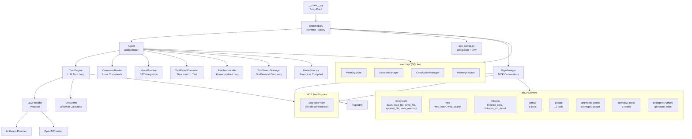
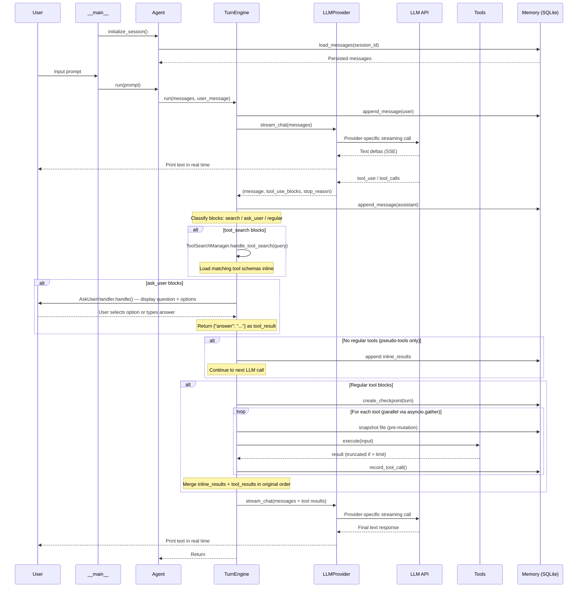

# micro-x-agent-loop-python

A minimal AI agent loop built with Python and the Anthropic Claude API. The agent runs in a REPL, takes natural-language prompts, and autonomously calls tools to get things done. Responses stream in real time as Claude generates them.

This is the primary implementation of the Micro-X Agent. An earlier .NET prototype exists at [micro-x-agent-loop-dotnet](https://github.com/StephenDenisEdwards/micro-x-agent-loop-dotnet) but is no longer actively developed.

## Features

- **Streaming responses** — text appears word-by-word as Claude generates it
- **Parallel tool execution** — multiple tool calls in a single turn run concurrently via `asyncio.gather`
- **Automatic retry** — tenacity-based exponential backoff on API rate limits
- **Conversation compaction** — LLM-based summarization keeps long conversations within context limits
- **MCP tool servers** — extend the agent with external tools via the Model Context Protocol (stdio and HTTP transports)
- **Configurable logging** — structured logging via loguru to console and/or file
- **All tools as MCP servers** — every tool is a TypeScript MCP server with structured output; tool availability determined by config
- **Cross-platform** — works on Windows, macOS, and Linux
- **Codegen** _(experimental)_ — isolated MCP server generates Python task apps from templates via a mini agentic loop with validation
- **Compiled mode** _(experimental)_ — cost-aware prompt/compile mode selection routes batch tasks to code generation (4-20x cost reduction)
- **Ask user** — LLM can pause mid-execution to ask clarifying questions with structured choices
- **Tool search** _(experimental)_ — on-demand tool discovery replaces large schema payloads with a single search tool
- **Session memory** _(experimental)_ — SQLite-backed transcript persistence, file checkpointing, and session resume/fork
- **Layered cost reduction** _(experimental)_ — prompt caching, tool schema caching, compaction, concise output, and tool search

## Quick Start

### Prerequisites

- [Python 3.11+](https://python.org/)
- [uv](https://docs.astral.sh/uv/) (package manager) — see [Why uv?](#why-uv) below
- A model provider API key:
  - [Anthropic API key](https://console.anthropic.com/) when `Provider=anthropic` (default), or
  - OpenAI API key when `Provider=openai`
- (Optional) Google OAuth credentials for Gmail and Calendar tools — see [Gmail Setup](#gmail-setup)
- [Node.js 18+](https://nodejs.org/) — required for TypeScript MCP tool servers
- (Optional) [Brave Search API key](https://brave.com/search/api/) for the `web_search` tool
- (Optional) Anthropic Admin API key (`sk-ant-admin...`) for the `anthropic_usage` tool
- (Optional) GitHub personal access token (`GITHUB_TOKEN`) for `github_*` tools
- (Optional) Deepgram API key (`DEEPGRAM_API_KEY`) for Interview Assist transcription/STT tools
- (Optional) [.NET 10 SDK](https://dotnet.microsoft.com/download) for the system-info MCP server (in the shared [mcp-servers](https://github.com/StephenDenisEdwards/mcp-servers) repo)
- (Optional) [Go 1.21+](https://go.dev/dl/) and a C compiler (GCC) for the WhatsApp MCP server
- (Optional) local clone of `interview-assist-2` for Interview Assist MCP tools (analysis/evaluation workflows)

### Install uv

[uv](https://docs.astral.sh/uv/) is a fast Python package and project manager built by [Astral](https://astral.sh/) (the Ruff team). It's written in Rust and replaces `pip`, `pip-tools`, `virtualenv`, and `pyenv` in a single tool — with 10-100x faster dependency resolution and installs.

**Windows (PowerShell) — recommended:**
```powershell
powershell -ExecutionPolicy ByPass -c "irm https://astral.sh/uv/install.ps1 | iex"
```
This automatically adds `uv` to your PATH. Restart your terminal after installing.

**macOS / Linux:**
```bash
curl -LsSf https://astral.sh/uv/install.sh | sh
```

**Or via pip:**
```bash
pip install uv
```

> **Windows PATH issue with `pip install uv`:** When pip installs with `--user` (the default when site-packages is not writeable), the `uv.exe` binary lands in a user Scripts directory that is **not** on your PATH. You'll see:
>
> ```
> 'uv' is not recognized as an internal or external command
> ```
>
> **Fix — choose one:**
>
> 1. **Add the Scripts directory to your PATH** (run in PowerShell, then restart your terminal):
>    ```powershell
>    $scriptsDir = & python -c "import sysconfig; print(sysconfig.get_path('scripts', 'nt_user'))"
>    [Environment]::SetEnvironmentVariable("Path", "$([Environment]::GetEnvironmentVariable('Path', 'User'));$scriptsDir", "User")
>    ```
>
> 2. **Use the official installer instead** (handles PATH automatically):
>    ```powershell
>    pip uninstall uv -y
>    powershell -ExecutionPolicy ByPass -c "irm https://astral.sh/uv/install.ps1 | iex"
>    ```
>
> 3. **Run uv as a Python module** (no PATH change needed):
>    ```bash
>    python -m uv sync
>    python -m uv run python -m micro_x_agent_loop
>    ```

**Verify the installation:**

```bash
uv --version
```

### 1. Clone and configure

```bash
git clone https://github.com/StephenDenisEdwards/micro-x-agent-loop-python.git
cd micro-x-agent-loop-python
```

Copy the example environment file and fill in your keys:

```bash
cp .env.example .env
```

Then edit `.env`:

```
ANTHROPIC_API_KEY=sk-ant-...
OPENAI_API_KEY=sk-...
GOOGLE_CLIENT_ID=your-client-id.apps.googleusercontent.com
GOOGLE_CLIENT_SECRET=your-client-secret
ANTHROPIC_ADMIN_API_KEY=sk-ant-admin...
BRAVE_API_KEY=BSA...
GITHUB_TOKEN=ghp_...
DEEPGRAM_API_KEY=dg_...
```

Required key depends on `Provider` in `config.json`:

- `Provider: "anthropic"` (default) -> `ANTHROPIC_API_KEY` required
- `Provider: "openai"` -> `OPENAI_API_KEY` required

All other keys are optional and only enable specific tool sets.

| Key | Required | Used for |
|-----|----------|----------|
| `ANTHROPIC_API_KEY` | Yes when `Provider=anthropic` | Main LLM provider |
| `OPENAI_API_KEY` | Yes when `Provider=openai` | Main LLM provider |
| `GOOGLE_CLIENT_ID` | No | Gmail, Calendar, Contacts tools (with secret) |
| `GOOGLE_CLIENT_SECRET` | No | Gmail, Calendar, Contacts tools (with client id) |
| `ANTHROPIC_ADMIN_API_KEY` | No | `anthropic_usage` tool |
| `BRAVE_API_KEY` | No | `web_search` tool |
| `GITHUB_TOKEN` | No | GitHub tools (`github_*`) |
| `DEEPGRAM_API_KEY` | No | Interview Assist STT transcription tools (`ia_transcribe_once`, `stt_*`) |

For the Interview Assist MCP server path, set `INTERVIEW_ASSIST_REPO` in the MCP server `env` block in `config.json` (not in `.env`).
### 2. Run

**Windows:**
```cmd
run.bat
```

**macOS / Linux:**
```bash
./run.sh
```

That's it — one command. The script handles everything automatically:

1. **First run:** Creates a Python virtual environment (`.venv/`), installs all dependencies via pip, then starts the agent. This takes 30-60 seconds.
2. **Subsequent runs:** Detects that the venv and packages are already installed, skips straight to starting the agent (instant).
3. **Recovery:** If the venv exists but packages are missing (e.g. after a failed install), it detects this and reinstalls automatically.

You never need to activate a virtual environment, run `pip install`, or know anything about Python packaging.

<details>
<summary>Alternative: using uv</summary>

```bash
uv sync
uv run python -m micro_x_agent_loop
```

</details>

<details>
<summary>Alternative: manual venv + pip</summary>

```bash
python -m venv .venv

# Activate — pick one:
.venv\Scripts\activate        # Windows (cmd)
.venv\Scripts\Activate.ps1    # Windows (PowerShell)
source .venv/bin/activate     # macOS / Linux

pip install .
python -m micro_x_agent_loop
```

</details>

#### You'll see:

```
micro-x-agent-loop (type 'exit' to quit)
MCP servers:
  - filesystem: bash, read_file, write_file, append_file, save_memory
  - web: web_fetch, web_search
  - linkedin: linkedin_jobs, linkedin_job_detail
  - github: list_prs, get_pr, create_pr, list_issues, create_issue, get_file, search_code, list_repos
  - google: gmail_search, gmail_read, gmail_send, calendar_list_events, ...
  - anthropic-admin: anthropic_usage
  - interview-assist: ia_healthcheck, ia_list_recordings, ...
  - system-info: system_info, disk_info, network_info
  - whatsapp: search_contacts, list_messages, list_chats, get_chat, ...
Working directory: C:\path\to\your\documents
Compaction: summarize (threshold: 80,000 tokens, tail: 6 messages)
Logging: console (stderr, DEBUG), file (agent.log, DEBUG)

you>
```

Type a natural-language prompt and press Enter. The agent will stream its response and call tools as needed. Type `exit` or `quit` to stop.

All tools are provided by MCP servers. If a server fails to connect, a warning is logged but the agent starts normally with the remaining servers.

### 3. MCP server setup (optional)

The system-info MCP server lives in the shared [mcp-servers](https://github.com/StephenDenisEdwards/mcp-servers) repository. To enable it:

1. Install the [.NET 10 SDK](https://dotnet.microsoft.com/download) (or later)
2. Clone and build the server:
   ```bash
   git clone https://github.com/StephenDenisEdwards/mcp-servers.git
   dotnet build mcp-servers/system-info/src
   ```
3. Update the `McpServers` entry in `config.json` to point to the server:
   ```json
   {
     "McpServers": {
       "system-info": {
         "transport": "stdio",
         "command": "dotnet",
         "args": ["run", "--no-build", "--project", "C:\\path\\to\\mcp-servers\\system-info\\src"]
       }
     }
   }
   ```
4. On next startup, the agent will show `system-info__system_info`, `system-info__disk_info`, and `system-info__network_info` in the tool list.

Rebuild after any code changes to the MCP server — the config uses `--no-build` to avoid build output interfering with the stdio transport.

### 4. WhatsApp MCP server setup (optional)

The agent can send and receive WhatsApp messages via the [lharries/whatsapp-mcp](https://github.com/lharries/whatsapp-mcp) external MCP server. This is a two-component system: a **Go bridge** that connects to WhatsApp Web, and a **Python MCP server** that the agent communicates with.

**Prerequisites:** [Go 1.21+](https://go.dev/dl/), a C compiler (GCC), and [uv](https://docs.astral.sh/uv/).

> **Windows users:** The Go bridge depends on CGO (go-sqlite3), which requires GCC in your PATH. Windows does not ship with GCC. Install via MSYS2 (`pacman -S mingw-w64-ucrt-x86_64-gcc`) or [WinLibs](https://winlibs.com/), then build using **PowerShell** (not Git Bash). See the [full WhatsApp setup guide](documentation/docs/design/tools/whatsapp-mcp/README.md) for details.

1. Clone and build the Go bridge:
   ```bash
   git clone https://github.com/lharries/whatsapp-mcp.git
   cd whatsapp-mcp/whatsapp-bridge
   CGO_ENABLED=1 go build -o whatsapp-bridge .
   ```

2. **Start the bridge in a separate terminal** (keep it open) and scan the **QR code** with your phone (WhatsApp > Settings > Linked Devices > Link a Device):
   ```bash
   ./whatsapp-bridge
   ```
   **Wait for sync** — after scanning the QR code, wait 30-60 seconds until you see `History sync complete` in the bridge terminal.

3. Add to `config.json` (Windows — use `python -m uv` since `uv` may not be on PATH):
   ```json
   {
     "McpServers": {
       "whatsapp": {
         "transport": "stdio",
         "command": "python",
         "args": ["-m", "uv", "--directory", "C:\\path\\to\\whatsapp-mcp\\whatsapp-mcp-server", "run", "main.py"]
       }
     }
   }
   ```
   On macOS/Linux, use `"command": "uv"` with `"args": ["--directory", "/path/to/...", "run", "main.py"]` instead.

4. Start the agent (with the bridge still running) — WhatsApp tools will appear in the MCP servers section. Test with: `List my 5 most recent WhatsApp chats`

The Go bridge must be running and authenticated before the agent starts. If the bridge shows `Client outdated (405)`, update the whatsmeow library and rebuild — see the [full WhatsApp setup guide](documentation/docs/design/tools/whatsapp-mcp/README.md#updating-the-bridge).

### 5. Interview Assist MCP server setup (optional)

This repo includes a TypeScript MCP server for `interview-assist-2` analysis/evaluation workflows and STT tools for voice mode.

1. Build the Interview Assist console once:

   ```powershell
   dotnet build C:\Users\steph\source\repos\interview-assist-2\Interview-assist-transcription-detection-console\Interview-assist-transcription-detection-console.csproj
   dotnet build C:\Users\steph\source\repos\interview-assist-2\Interview-assist-stt-cli\Interview-assist-stt-cli.csproj
   ```

2. Add server config:

   ```json
   {
     "McpServers": {
       "interview-assist": {
         "transport": "stdio",
         "command": "node",
         "args": ["C:\\path\\to\\micro-x-agent-loop-python\\mcp_servers\\ts\\packages\\interview-assist\\dist\\index.js"],
         "env": {
           "INTERVIEW_ASSIST_REPO": "C:\\path\\to\\interview-assist-2"
         }
       }
     }
   }
   ```

See [Interview Assist MCP docs](documentation/docs/design/tools/interview-assist-mcp/README.md) for tool list and details.

For voice transcription tools, set `DEEPGRAM_API_KEY` in `.env`.

### Configuration

App settings live in `config.json` in the project root:

```json
{
  "Model": "claude-sonnet-4-5-20250929",
  "MaxTokens": 8192,
  "Temperature": 1.0,
  "MaxToolResultChars": 40000,
  "MaxConversationMessages": 50,
  "CompactionStrategy": "summarize",
  "CompactionThresholdTokens": 80000,
  "ProtectedTailMessages": 6,
  "WorkingDirectory": "C:\\Users\\you\\documents",
  "LogLevel": "DEBUG",
  "LogConsumers": [
    { "type": "console" },
    { "type": "file", "path": "agent.log" }
  ],
  "McpServers": {
    "system-info": {
      "transport": "stdio",
      "command": "dotnet",
      "args": ["run", "--no-build", "--project", "C:\\path\\to\\mcp-servers\\system-info\\src"]
    }
  }
}
```

| Setting | Description | Default |
|---------|-------------|---------|
| `Model` | Claude model ID | `claude-sonnet-4-5-20250929` |
| `MaxTokens` | Max tokens per response | `8192` |
| `Temperature` | Sampling temperature (0.0 = deterministic, 1.0 = creative) | `1.0` |
| `MaxToolResultChars` | Max characters per tool result before truncation | `40000` |
| `MaxConversationMessages` | Max messages in history before trimming oldest | `50` |
| `CompactionStrategy` | `"none"` or `"summarize"` — LLM-based conversation compaction | `"none"` |
| `CompactionThresholdTokens` | Estimated token count that triggers compaction | `80000` |
| `ProtectedTailMessages` | Recent messages protected from compaction | `6` |
| `WorkingDirectory` | Default directory for file and shell tools | Current working directory |
| `LogLevel` | Logging level (DEBUG, INFO, WARNING, ERROR) | `"DEBUG"` |
| `LogConsumers` | Array of log outputs (`console` and/or `file`) | `[]` |
| `McpServers` | MCP server configurations (see [MCP docs](documentation/docs/operations/config.md#mcpservers)) | `{}` |

All settings are optional — sensible defaults are used when missing. See [Configuration Reference](documentation/docs/operations/config.md) for full details.

Secrets (API keys) stay in `.env` and are loaded by python-dotenv.

## Gmail Setup

Gmail and Calendar tools require Google OAuth2 credentials. If you don't need them, skip this section entirely — all other tools work without it.

### 1. Create OAuth credentials

1. Go to the [Google Cloud Console](https://console.cloud.google.com/)
2. Create a project (or select an existing one)
3. Enable the **Gmail API** and **Google Calendar API** under APIs & Services > Library
4. Go to APIs & Services > Credentials > Create Credentials > OAuth client ID
5. Application type: **Desktop app**
6. Copy the **Client ID** and **Client Secret** into your `.env` file

### 2. First-run authorization

The first time you use a Gmail tool (e.g. `gmail_search`), a browser window will open asking you to sign in to your Google account and grant permission. After you authorize:

- An access token is cached locally in `.gmail-tokens/token.json`
- Subsequent runs reuse the cached token (no browser prompt)
- The token auto-refreshes when expired

Calendar tools trigger a separate OAuth flow on first use, with tokens cached in `.calendar-tokens/`.

## Tools

All tools are implemented as TypeScript MCP servers. Tool names are prefixed as `{server}__{tool}` (e.g., `filesystem__bash`). See [ADR-015](documentation/docs/architecture/decisions/ADR-015-all-tools-as-typescript-mcp-servers.md).

### First-party MCP servers

| Server | Tools | Key Credential |
|--------|-------|----------------|
| `filesystem` | bash, read_file, write_file, append_file, save_memory | `FILESYSTEM_WORKING_DIR` |
| `web` | web_fetch, web_search | `BRAVE_API_KEY` |
| `linkedin` | linkedin_jobs, linkedin_job_detail | _(scraping)_ |
| `github` | list_prs, get_pr, create_pr, list_issues, create_issue, get_file, search_code, list_repos | `GITHUB_TOKEN` |
| `google` | gmail_search, gmail_read, gmail_send, calendar_list_events, calendar_create_event, calendar_get_event, contacts_search, contacts_list, contacts_get, contacts_create, contacts_update, contacts_delete | `GOOGLE_CLIENT_ID` + `GOOGLE_CLIENT_SECRET` |
| `anthropic-admin` | anthropic_usage | `ANTHROPIC_ADMIN_API_KEY` |
| `interview-assist` | 14 tools (ia_* + stt_*) | `INTERVIEW_ASSIST_REPO` |

### Third-party MCP servers

The system-info server (from the shared [mcp-servers](https://github.com/StephenDenisEdwards/mcp-servers) repo) provides:

| Tool | Description |
|------|-------------|
| `system-info__system_info` | OS, CPU, memory, uptime, .NET runtime |
| `system-info__disk_info` | Per-drive disk usage (fixed drives) |
| `system-info__network_info` | Network interfaces with IP addresses |

The external [WhatsApp MCP server](documentation/docs/design/tools/whatsapp-mcp/README.md) provides:

| Tool | Description |
|------|-------------|
| `whatsapp__search_contacts` | Search contacts by name or phone number |
| `whatsapp__list_messages` | Search/filter messages with pagination and context |
| `whatsapp__list_chats` | List chats with search and sorting |
| `whatsapp__get_chat` | Chat metadata by JID |
| `whatsapp__get_direct_chat_by_contact` | Find direct chat by phone number |
| `whatsapp__get_contact_chats` | All chats involving a contact |
| `whatsapp__get_last_interaction` | Most recent message with a contact |
| `whatsapp__get_message_context` | Messages surrounding a specific message |
| `whatsapp__send_message` | Send text to a phone number or group JID |
| `whatsapp__send_file` | Send a file (image, video, document) |
| `whatsapp__send_audio_message` | Send audio as a voice message (requires ffmpeg) |
| `whatsapp__download_media` | Download media from a message |

The local [Interview Assist MCP server](documentation/docs/design/tools/interview-assist-mcp/README.md) provides:

| Tool | Description |
|------|-------------|
| `interview-assist__ia_healthcheck` | Validate Interview Assist repo/project setup |
| `interview-assist__ia_list_recordings` | List recent Interview Assist recording files |
| `interview-assist__ia_analyze_session` | Generate markdown report from session JSONL |
| `interview-assist__ia_evaluate_session` | Evaluate precision/recall/F1 for a session |
| `interview-assist__ia_compare_strategies` | Compare heuristic/LLM/parallel detection strategies |
| `interview-assist__ia_tune_threshold` | Tune detection confidence threshold |
| `interview-assist__ia_regression_test` | Run regression check against baseline |
| `interview-assist__ia_create_baseline` | Create baseline JSON from session data |
| `interview-assist__ia_transcribe_once` | One-shot microphone/loopback transcription |
| `interview-assist__stt_list_devices` | List STT sources plus detected capture/render endpoint devices |
| `interview-assist__stt_start_session` | Start continuous STT session |
| `interview-assist__stt_get_updates` | Poll incremental STT events |
| `interview-assist__stt_get_session` | Read STT session status/counters |
| `interview-assist__stt_stop_session` | Stop STT session |

MCP tools are prefixed as `{server_name}__{tool_name}`. Any MCP-compatible server can be added via config — no code changes needed. See [Tool System Design](documentation/docs/design/DESIGN-tool-system.md#mcp-tools-dynamic) for details.

## Example Prompts

### File operations

```
Read the file documents/Stephen Edwards CV December 2025.docx and summarise it
```

```
Create a file called notes.txt with a summary of today's tasks
```

### Shell commands

```
List all Python files in this project
```

```
What's the current git status?
```

### LinkedIn job search

```
Search LinkedIn for remote senior .NET developer jobs posted in the last week
```

```
Get the full job description for the first result
```

### Web

```
Fetch the content from https://example.com and summarise it
```

```
Search the web for "Python asyncio best practices" and summarise the top results
```

### Gmail

```
Search my Gmail for unread emails from the last 3 days
```

```
Send an email to alice@example.com with subject "Meeting Notes" and body "Here are the notes from today's meeting..."
```

### Calendar

```
What meetings do I have today?
```

```
Create a meeting called "Team Standup" tomorrow at 10am for 30 minutes
```

### WhatsApp

```
Search my WhatsApp contacts for John
```

```
List my recent WhatsApp chats
```

```
Send a WhatsApp message to 1234567890 saying "I'll be there in 10 minutes"
```

### System information

```
What are my system specs?
```

### Multi-step tasks

```
Read my CV from documents/Stephen Edwards CV December 2025.docx, then search LinkedIn for .NET jobs in London posted this week, and write a cover letter for the best match
```

```
Search my Gmail for emails from recruiters in the last week and summarise them
```

### Voice mode

```text
/voice start microphone
```

```text
/voice start microphone --mic-device-name "Headset (Jabra Evolve2 65)"
```

```text
/voice start microphone --mic-device-id {0.0.1.00000000}.{...}
```

```text
/voice start microphone --chunk-seconds 2 --endpointing-ms 500 --utterance-end-ms 1500
```

```text
/voice status
```

```text
/voice events 50
```

```text
/voice stop
```

Voice mode details:

- The agent only executes spoken turns from `utterance_final` STT events.
- Finalization timing is controlled primarily by Deepgram settings passed through MCP (`endpointing_ms`, `utterance_end_ms`).
- `chunk_seconds` remains in the command surface for compatibility with earlier session implementations.
- If microphone capture is wrong/empty, use `interview-assist__stt_list_devices` and pass `--mic-device-name` or `--mic-device-id` on `/voice start`.

### Voice Tuning Quick Reference

Balanced (recommended):

```text
/voice start microphone --mic-device-name "Headset (Jabra Evolve2 65)" --endpointing-ms 500 --utterance-end-ms 1500
```

Fast response (may split more):

```text
/voice start microphone --mic-device-name "Headset (Jabra Evolve2 65)" --endpointing-ms 300 --utterance-end-ms 1000
```

Conservative finalization (less cutoff):

```text
/voice start microphone --mic-device-name "Headset (Jabra Evolve2 65)" --endpointing-ms 700 --utterance-end-ms 2200
```

## Dependencies

| Package | Purpose | C# Equivalent |
|---------|---------|---------------|
| [anthropic](https://pypi.org/project/anthropic/) | Claude API (official SDK) | Anthropic.SDK |
| [python-dotenv](https://pypi.org/project/python-dotenv/) | Load `.env` files | DotNetEnv |
| [tenacity](https://pypi.org/project/tenacity/) | Retry with exponential backoff | Polly |
| [loguru](https://pypi.org/project/loguru/) | Structured logging | Serilog |
| [mcp](https://pypi.org/project/mcp/) | Model Context Protocol client | ModelContextProtocol |

Tool-specific dependencies (HTTP clients, Google APIs, HTML parsing, docx reading) are now in the TypeScript MCP servers under `mcp_servers/ts/`.

## Quality Gates

This repo enforces code quality via CI and local hooks:

- `ruff check src tests` (lint)
- `ruff format --check src tests` (format)
- `mypy` on critical architecture modules:
  - `src/micro_x_agent_loop/agent.py`
  - `src/micro_x_agent_loop/turn_engine.py`
  - `src/micro_x_agent_loop/voice_runtime.py`
  - `src/micro_x_agent_loop/mcp/`
  - `src/micro_x_agent_loop/providers/`
- `python -m unittest discover -s tests`

Local setup:

```bash
pip install ".[dev]"
pre-commit install
```

## Why uv?

This project uses **uv** instead of pip for package management.

| Feature | uv | pip |
|---------|-----|-----|
| Install speed | 10-100x faster (Rust) | Baseline |
| Virtual env management | Automatic (`uv sync` creates `.venv/`) | Manual (`python -m venv`) |
| Run in venv | `uv run <cmd>` — no activate needed | `source .venv/bin/activate` first |
| Lockfile | `uv.lock` for reproducible installs | Requires `pip-compile` |
| Python version management | Built-in (`uv python install 3.12`) | Needs pyenv |
| Config format | Standard `pyproject.toml` | `requirements.txt` or `pyproject.toml` |

**Key commands for this project:**

| Command | What it does |
|---------|-------------|
| `uv sync` | Install all dependencies from `pyproject.toml` into `.venv/` |
| `uv run python -m micro_x_agent_loop` | Run the app inside the managed venv |
| `uv add <package>` | Add a new dependency to `pyproject.toml` and install it |
| `uv remove <package>` | Remove a dependency |

## Troubleshooting

### `'uv' is not recognized` on Windows

See the [Install uv](#install-uv) section above. The quickest fix is to run `uv` as a Python module instead:

```bash
python -m uv sync
python -m uv run python -m micro_x_agent_loop
```

### `ANTHROPIC_API_KEY` or `OPENAI_API_KEY` environment variable is required

Create a `.env` file in the project root containing the key for your configured provider:

```
ANTHROPIC_API_KEY=sk-ant-...
# or
OPENAI_API_KEY=sk-...
```

Or copy the example: `cp .env.example .env` and fill in your key.

### Gmail/Calendar tools not showing up

These tools only register when both `GOOGLE_CLIENT_ID` and `GOOGLE_CLIENT_SECRET` are set in `.env`. If you don't need them, this is expected — the other tools work without it.

### Gmail OAuth browser doesn't open

If the OAuth browser window fails to open on a headless machine, you'll need to run the first authorization on a machine with a browser. The resulting `.gmail-tokens/token.json` can then be copied to the headless machine.

### MCP server fails with "Failed to parse JSONRPC message"

The MCP server is writing non-JSONRPC data to stdout (e.g., build output or logging). For .NET servers, build separately (`dotnet build path/to/mcp-servers/system-info/src`) and use `--no-build` in the config. See [Troubleshooting](documentation/docs/operations/troubleshooting.md) for details.

### WhatsApp: `gcc not found` when building the bridge

The Go bridge uses CGO (go-sqlite3) and needs GCC. On Windows, install via MSYS2 or WinLibs, and build using PowerShell (not Git Bash). See [WhatsApp setup guide](documentation/docs/design/tools/whatsapp-mcp/README.md#windows-specific-the-cgo-problem).

### WhatsApp: `Client outdated (405)` when starting the bridge

WhatsApp has rejected the bridge's client version. Update the Go library and rebuild:
```bash
cd whatsapp-mcp/whatsapp-bridge
go get go.mau.fi/whatsmeow@latest && go mod tidy
CGO_ENABLED=1 go build -o whatsapp-bridge .
rm -rf store/           # delete old session
./whatsapp-bridge       # scan QR code again
```
See [Updating the Bridge](documentation/docs/design/tools/whatsapp-mcp/README.md#updating-the-bridge) for Windows instructions and troubleshooting build errors.

### WhatsApp: tools return empty results

All WhatsApp tools succeed but return no data. This means the SQLite database (`whatsapp-bridge/store/messages.db`) does not exist yet. Start the Go bridge, scan the QR code, and wait for the history sync to complete (30-60 seconds) before using the agent.

### WhatsApp: `Connection refused` when sending messages

The Go bridge must be running at `localhost:8080` before using WhatsApp tools. Start it with `./whatsapp-bridge` (or `.\whatsapp-bridge.exe` on Windows). The bridge must stay running in its own terminal.

### `Rate limited. Retrying in Xs...`

The agent automatically retries with exponential backoff (10s, 20s, 40s, 80s, 160s) when the Anthropic API returns a rate limit error. Wait for retries to complete — no action needed.

### Tool output truncated warning

If a tool returns more than 40,000 characters, the output is truncated. You can increase the limit in `config.json`:

```json
{
  "MaxToolResultChars": 80000
}
```

### Conversation history trimmed warning

When the conversation exceeds 50 messages, the oldest messages are removed. Enable compaction for smarter context management:

```json
{
  "CompactionStrategy": "summarize",
  "MaxConversationMessages": 100
}
```

## Architecture

### Component Overview



### Agent Loop Sequence



### Source Layout

```
src/micro_x_agent_loop/
  __main__.py              -- Entry point: loads config, displays logo, starts REPL
  agent.py                 -- Agent orchestrator: conversation state, commands, turn delegation
  agent_config.py          -- Configuration dataclass
  app_config.py            -- Config file parsing (config.json → AppConfig)
  bootstrap.py             -- Runtime factory: wires MCP, memory, provider into AppRuntime
  constants.py             -- Centralised magic numbers and defaults
  turn_engine.py           -- LLM turn loop: three-way block classification, parallel tool dispatch
  turn_events.py           -- TurnEvents Protocol + BaseTurnEvents (lifecycle callbacks)
  ask_user.py              -- AskUserHandler: human-in-the-loop pseudo-tool (questionary UI)
  tool_search.py           -- ToolSearchManager: on-demand tool discovery pseudo-tool
  mode_selector.py         -- Mode selection: structural pattern matching + LLM classification
  tool.py                  -- Tool Protocol + ToolResult dataclass
  tool_result_formatter.py -- Structured → text formatting (json, table, text, key_value)
  system_prompt.py         -- System prompt text with conditional directives
  compaction.py            -- Conversation compaction strategies (none, summarize)
  llm_client.py            -- Shared utilities (Spinner, retry callback)
  provider.py              -- LLMProvider Protocol definition
  metrics.py               -- Structured metrics emission (cost tracking, API call analysis)
  usage.py                 -- UsageResult dataclass and pricing lookup
  api_payload_store.py     -- In-memory ring buffer for API request/response payloads
  analyze_costs.py         -- CLI for analysing metrics.jsonl files
  logging_config.py        -- LogConsumer Protocol + console/file implementations
  voice_runtime.py         -- Voice mode: continuous STT via MCP sessions
  voice_ingress.py         -- VoiceIngress Protocol + PollingVoiceIngress
  providers/
    anthropic_provider.py  -- Anthropic SDK implementation of LLMProvider
    openai_provider.py     -- OpenAI SDK implementation of LLMProvider
    common.py              -- Shared provider utilities
  commands/
    router.py              -- CommandRouter: /help, /session, /checkpoint, /voice
    command_handler.py     -- CommandHandler base class
    voice_command.py       -- /voice command handler
  services/
    session_controller.py  -- Session list/summary formatting service
    checkpoint_service.py  -- Checkpoint list/rewind formatting service
  mcp/
    mcp_manager.py         -- MCP server connection lifecycle (parallel startup)
    mcp_tool_proxy.py      -- Adapter: MCP tool → Tool Protocol + ToolResult
  memory/
    store.py               -- SQLite connection, schema bootstrap, transactions
    session_manager.py     -- Session CRUD, message persistence, fork
    checkpoints.py         -- File snapshotting, rewind
    events.py              -- Synchronous event emission
    event_sink.py          -- Async batched event emission
    facade.py              -- MemoryFacade Protocol (Active + Null implementations)
    pruning.py             -- Time/count-based retention enforcement
    models.py              -- SessionRecord, MessageRecord dataclasses

mcp_servers/ts/            -- TypeScript MCP servers (npm workspaces monorepo)
  packages/
    shared/                -- @micro-x/mcp-shared (validation, logging, errors, retry)
    filesystem/            -- bash, read_file, write_file, append_file, save_memory
    web/                   -- web_fetch, web_search
    linkedin/              -- linkedin_jobs, linkedin_job_detail
    github/                -- 8 GitHub tools (via Octokit)
    google/                -- 12 Google tools (Gmail, Calendar, Contacts via googleapis)
    anthropic-admin/       -- anthropic_usage
    interview-assist/      -- 14 tools (ia_* + stt_*)
```

All tools are TypeScript MCP servers — the Python agent loop is a pure MCP orchestrator. The system-info MCP server lives in the separate [mcp-servers](https://github.com/StephenDenisEdwards/mcp-servers) repository.

### How the agent loop works

1. You type a prompt at the `you>` prompt
2. The prompt is sent to Claude via the Anthropic streaming API
3. Claude's response streams word-by-word to your terminal
4. If Claude returns tool calls, TurnEngine classifies each block as **tool_search**, **ask_user**, or **regular**
5. Pseudo-tool blocks (search/ask_user) are handled inline — no MCP execution needed
6. Regular tool calls are executed **in parallel** via `asyncio.gather`
7. All results (inline + regular) are merged in original order and sent back to Claude
8. Steps 3-7 repeat until Claude responds with text only (no tool calls)
9. The conversation history is maintained across prompts in the same session
10. When the conversation grows large, compaction summarizes older messages to stay within context limits

## Experimental Features

The agent includes several experimental features for cost reduction, code generation, and intelligent execution. These are opt-in via `config.json`.

### Codegen (Code Generation MCP Server)

An isolated MCP server that generates Python task apps from templates via a mini agentic loop. Instead of using the full 59-tool agent loop (which fails due to tool distraction and context drift), codegen runs a constrained loop with a single `read_file` tool, a focused system prompt, and a 10-turn hard limit.

**How it works:**

1. User says something like `"generate a job search app using the prompt in job-search-prompt-v2.txt"`
2. The agent calls `generate_code(task_name, prompt)` on the codegen MCP server
3. The server copies a template directory, builds a system prompt with the template's API surface, and runs a mini agentic loop so the LLM can read any files referenced in the prompt
4. Generated `.py` files are written to `tools/{task_name}/`
5. Built-in validation runs unit tests with up to 3 fix rounds
6. The agent calls `run_task(task_name)` to execute the generated app

**Config:** Add the `codegen` MCP server entry (see `config-base.json` for the full entry):

```json
{
  "McpServers": {
    "codegen": {
      "transport": "stdio",
      "command": "python",
      "args": ["-m", "uv", "--directory", "mcp_servers/python/codegen", "run", "main.py"],
      "env": {
        "PROJECT_ROOT": "/path/to/micro-x-agent-loop-python",
        "WORKING_DIR": "/path/to/your/documents"
      }
    }
  }
}
```

**Example prompts:**

```
Generate a job search app using the prompt in job-search-prompt-v2.txt

Generate a repo summary app that will create a markdown report listing all repos
along with a summary composed from the README.md. Then email that markdown file
to me at user@example.com as an attachment.
```

See [Codegen Design](documentation/docs/design/DESIGN-codegen-server.md) and [Codegen Prompts Example](documentation/docs/examples/codegen-prompts.txt) for details.

### Compiled Mode (Prompt/Compile Mode Selection)

A cost-aware execution modality that decides whether a user prompt should run in **prompt mode** (conversational, single-turn) or **compiled mode** (structured batch execution with code generation). For batch-processing tasks (e.g. scoring 100 job listings), compiled mode can reduce costs by 4-20x.

Based on the [Cost-Aware Task Compilation](documentation/docs/research-papers/cost-aware-task-compilation-for-llm-agents/research-paper.md) research paper.

**Stage 1 — Structural pattern matching (zero-cost):** Regex-based analysis detects signals in the prompt — batch processing, scoring/ranking, statistics, mandatory fields, structured output, multiple data sources. Signals are classified as STRONG, MODERATE, or SUPPORTIVE. If ≥2 strong signals are found, COMPILED mode is recommended automatically.

**Stage 2 — LLM classification (for ambiguous cases):** When Stage 1 returns AMBIGUOUS, a cheap LLM call (temp=0, ~$0.01) classifies the prompt. Defaults to COMPILED on parse failure (asymmetric cost — the batch penalty is much higher than the compile penalty).

**Config:**

```json
{
  "ModeAnalysisEnabled": true,
  "Stage2ClassificationEnabled": true,
  "Stage2Model": ""
}
```

`Stage2Model` defaults to the main model if empty. See [Mode Selection Plan](documentation/docs/planning/PLAN-mode-selection-llm-classification.md) for implementation details.

### Ask User (Human-in-the-Loop Questioning)

The LLM can call an `ask_user` pseudo-tool to pause and ask the user a clarifying question, present choices, or request approval. The user's answer is returned as a normal tool result, and the LLM continues. This is always-on — no configuration needed.

The LLM uses `ask_user` when the request is ambiguous, there are multiple valid approaches, a destructive action needs approval, or required information is missing. It does not use it for routine confirmations or questions answerable from context.

When the LLM calls `ask_user` with options, you see an interactive prompt:

```
assistant> Which database should we use?

  1. PostgreSQL — Battle-tested relational database
  2. SQLite — Lightweight, file-based, no server needed
  3. MongoDB — Document store for flexible schemas

Select an option (1-3) or type your own answer:
```

Select with arrow keys or type a number. Choose "Other" to type a free-form answer instead. On non-interactive terminals, falls back to plain text input.

See [Human-in-the-Loop Research](documentation/docs/research/human-in-the-loop-user-questioning.md), [Ask User Plan](documentation/docs/planning/PLAN-ask-user.md), and [ADR-017](documentation/docs/architecture/decisions/ADR-017-ask-user-pseudo-tool-for-human-in-the-loop.md).

### Tool Search (On-Demand Tool Discovery)

When tool schema size exceeds a threshold (default: 40% of the context window), all tool schemas are replaced with a single `tool_search` tool. The LLM searches for tools by keyword on-demand, and matching schemas are loaded for the current turn. This dramatically reduces tokens per API call — from ~12,700 tokens of schema down to ~500 initially.

**Config:**

```json
{
  "ToolSearchEnabled": "auto"
}
```

Values: `"false"` (off), `"true"` (always on), `"auto"` (activate when schema exceeds threshold), `"auto:N"` (custom threshold percentage). See [Tool Search Plan](documentation/docs/planning/PLAN-tool-search.md).

### Memory System (Session Persistence)

SQLite-backed session continuity with transcript persistence, file checkpointing/rewind, and structured event tracing. Sessions survive process restarts and crashes.

**Key capabilities:**
- **Session management** — create, resume, continue, fork with parent tracking
- **Message persistence** — full ordered transcript with token estimates
- **Tool call recording** — execution records with inputs/results/errors
- **File checkpointing** — pre-mutation snapshots with per-file rewind via `/rewind`
- **Retention control** — configurable time-based and count-based pruning

**Commands:**

```
/session list [limit]        — List sessions
/session resume <id>         — Resume by ID or title
/session continue            — Continue current session across restarts
/session fork                — Branch from current session
/session new                 — Start new session
/rewind <checkpoint_id>      — Revert file mutations
```

**Config:**

```json
{
  "MemoryEnabled": true,
  "MemoryDbPath": ".micro_x/memory.db",
  "MemoryMaxSessions": 200,
  "MemoryMaxMessagesPerSession": 5000,
  "MemoryRetentionDays": 30,
  "EnableFileCheckpointing": true,
  "CheckpointWriteToolsOnly": true,
  "UserMemoryEnabled": true,
  "UserMemoryDir": ".micro_x/memory"
}
```

See [Memory System Design](documentation/docs/design/DESIGN-memory-system.md) for the full design.

### Cost Reduction Layers

A multi-layer approach to reducing API costs ([ADR-012](documentation/docs/architecture/decisions/ADR-012-layered-cost-reduction.md)):

| Layer | Strategy | Status |
|-------|----------|--------|
| 1 | Prompt caching (ephemeral) | Implemented |
| 2 | Tool schema caching | Implemented |
| 3 | Tool result summarization | Disabled by default ([ADR-013](documentation/docs/architecture/decisions/ADR-013-tool-result-summarization-reliability.md)) |
| 4 | Compaction smart trigger | Implemented |
| 5 | Concise output formatting | Implemented |
| 6 | Tool search (on-demand discovery) | Implemented |
| 7 | Cheaper models for sub-tasks | Partial (compaction only) |

Tool result summarization is disabled by default because no summarization can reliably preserve "what matters" — that depends on user intent. Available as opt-in for loss-tolerant workloads:

```json
{
  "ToolResultSummarizationEnabled": true,
  "ToolResultSummarizationThreshold": 4000
}
```

## Documentation

Full documentation is available in the [documentation/docs/](documentation/docs/index.md) directory:

- [Software Architecture Document](documentation/docs/architecture/SAD.md) — system overview, components, data flow
- [Tool System Design](documentation/docs/design/DESIGN-tool-system.md) — tool interface, MCP servers, ToolResultFormatter
- [Compaction Design](documentation/docs/design/DESIGN-compaction.md) — conversation compaction algorithm
- [Codegen Design](documentation/docs/design/DESIGN-codegen-server.md) — code generation MCP server architecture
- [Memory System Design](documentation/docs/design/DESIGN-memory-system.md) — session persistence, checkpoints, events
- [Cost-Aware Task Compilation](documentation/docs/research-papers/cost-aware-task-compilation-for-llm-agents/research-paper.md) — research paper on prompt/compile mode
- [WhatsApp MCP Setup](documentation/docs/design/tools/whatsapp-mcp/README.md) — WhatsApp integration guide, prerequisites, pain points
- [Configuration Reference](documentation/docs/operations/config.md) — all settings with types and defaults
- [Architecture Decision Records](documentation/docs/architecture/decisions/README.md) — index of all ADRs

## See Also

- [micro-x-agent-loop-dotnet](https://github.com/StephenDenisEdwards/micro-x-agent-loop-dotnet) — earlier .NET prototype (no longer actively developed)

## License

MIT

