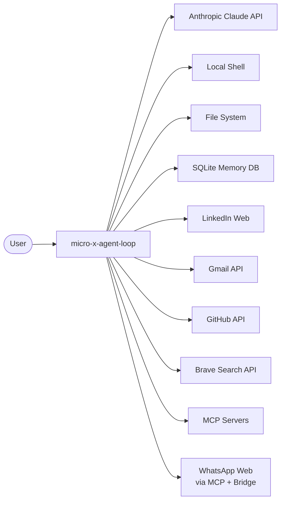
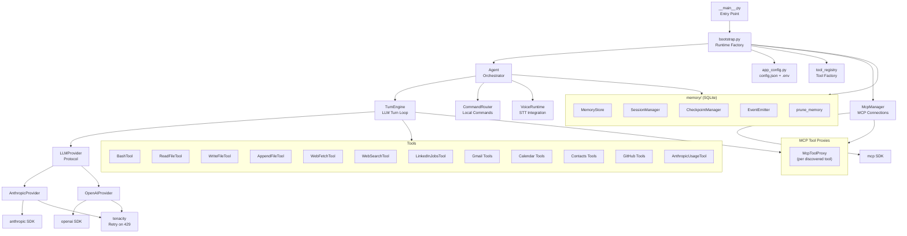
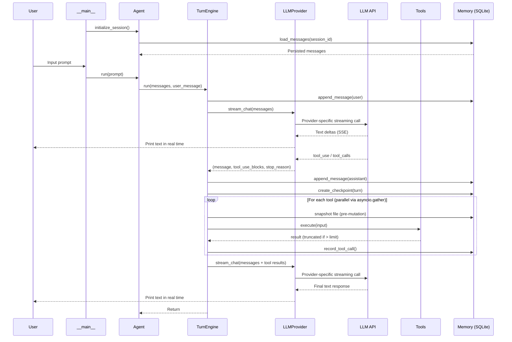

# Software Architecture Document

**Project:** micro-x-agent-loop-python
**Version:** 1.1
**Last Updated:** 2026-02-25

## 1. Introduction and Goals

micro-x-agent-loop-python is a minimal AI agent loop built with Python and a pluggable LLM backend (Anthropic Claude or OpenAI GPT). It provides a REPL interface where users type natural-language prompts (or use voice mode) and the agent autonomously calls tools to accomplish tasks.

### Key Goals

- Provide a simple, extensible agent loop for personal automation
- Support file operations, shell commands, web search, job searching, email, GitHub, and messaging
- Stream responses in real time for better user experience
- Persist session state and execution history for continuity across restarts
- Keep the codebase small and easy to understand

### Stakeholders

| Role | Concern |
|------|---------|
| User | Natural-language task completion via tools |
| Developer | Easy to add new tools, understand the codebase |

## 2. Constraints

| Constraint | Rationale |
|-----------|-----------|
| Python 3.11+ | Minimum version for `typing.Protocol` features and modern syntax |
| Anthropic or OpenAI API | LLM provider for reasoning and tool dispatch (config-driven) |
| Console application | Simplicity; no web UI overhead |
| OAuth2 for Gmail | Required by Google API |

## 3. Context and Scope

### System Context



The agent sits between the user and external services. The user provides natural-language instructions; the agent uses the configured LLM to decide which tools to call, executes them, and returns results. Session state is persisted locally in SQLite when memory is enabled.

### External Interfaces

| Interface | Protocol | Purpose |
|-----------|----------|---------|
| Anthropic API | HTTPS / SSE | LLM reasoning and tool dispatch (default provider) |
| OpenAI API | HTTPS / SSE | LLM reasoning and tool dispatch (alternative provider) |
| Gmail API | HTTPS / OAuth2 | Email search, read, send |
| Google Contacts API | HTTPS / OAuth2 | Contact search, create, update, delete |
| Google Calendar API | HTTPS / OAuth2 | Event listing, creation, retrieval |
| GitHub API | HTTPS (raw httpx) | Repos, PRs, issues, code search, file access |
| Brave Search API | HTTPS | Web search results |
| LinkedIn | HTTPS / HTML scraping | Job search and detail fetching |
| Local shell | Process execution | Bash/cmd commands |
| File system | Direct I/O | Read/write files (.txt, .docx) |
| SQLite | Local file I/O | Session, message, checkpoint, and event persistence |
| MCP servers | stdio / StreamableHTTP | Dynamic external tools via Model Context Protocol |
| Deepgram STT (via Interview Assist MCP) | HTTPS / WebSocket | Continuous speech transcription for voice mode |
| WhatsApp Web | MCP stdio + HTTP :8080 + WebSocket | Messaging via Go bridge (whatsmeow) and Python MCP server |

## 4. Solution Strategy

| Decision | Approach |
|----------|----------|
| Agent loop | Iterative: send message, check for tool_use, execute tools, repeat |
| Multi-provider | `LLMProvider` Protocol with Anthropic-format canonical messages; translation at API boundary |
| Streaming | Provider-specific streaming (Anthropic SSE / OpenAI SSE) prints text deltas in real time |
| Resilience | tenacity decorator with exponential backoff for rate limits (per-provider) |
| Secrets | `.env` file loaded by python-dotenv; never committed to git |
| App config | `config.json` for non-secret settings |
| Tool extensibility | `Tool` Protocol class; register in `tool_registry` or connect via MCP |
| Session persistence | Opt-in SQLite-backed memory for sessions, messages, tool calls, checkpoints, and events |
| File safety | Checkpoint/rewind for mutating tools (`write_file`, `append_file`) |
| Shared MCP server | [mcp-servers](https://github.com/StephenDenisEdwards/mcp-servers) repo — .NET MCP server providing system information tools (shared with .NET agent) |

## 5. Building Block View

### Level 1: Components



### Level 2: Key Modules

| Module | Responsibility |
|--------|---------------|
| `__main__` | Entry point; loads config, delegates to bootstrap, runs REPL |
| `bootstrap` | Factory that wires all runtime components (tools, providers, memory, MCP) into an `AppRuntime` |
| `app_config` | Parses `config.json` into `AppConfig` dataclass; resolves runtime environment variables into `RuntimeEnv` |
| `Agent` | Top-level orchestrator: holds conversation state, routes commands, delegates turns to `TurnEngine` |
| `AgentConfig` | Dataclass holding all agent configuration (model, tools, memory components, compaction) |
| `TurnEngine` | Executes a single LLM turn: streams response, dispatches tools in parallel, handles retries |
| `CommandRouter` | Routes `/help`, `/session`, `/checkpoint`, `/voice` commands to handlers |
| `SessionController` | Formatting service for session list entries, summaries, and short IDs |
| `CheckpointService` | Formatting service for checkpoint list entries and rewind outcome reports |
| `VoiceRuntime` | Manages continuous voice input via MCP STT sessions (start/stop/poll) |
| `LLMProvider` | Protocol defining `stream_chat`, `create_message`, `convert_tools` |
| `AnthropicProvider` | Anthropic SDK implementation of `LLMProvider` |
| `OpenAIProvider` | OpenAI SDK implementation of `LLMProvider` (translates message format at API boundary) |
| `llm_client` | Shared utilities: `Spinner` (terminal feedback), `_on_retry` (tenacity callback) |
| `tool_registry` | Factory that assembles the built-in tool list with conditional groups based on available credentials |
| `Tool` | Protocol class: `name`, `description`, `input_schema`, `is_mutating`, `predict_touched_paths`, `execute` |
| `memory/store` | SQLite connection, schema bootstrap (6 tables), transaction context manager |
| `memory/session_manager` | Session CRUD, message persistence with monotonic sequencing, fork, tool call recording |
| `memory/checkpoints` | File snapshotting before mutations, rewind with per-file outcome reporting |
| `memory/events` | Synchronous event emission to DB |
| `memory/event_sink` | Async batched event emission (queue + periodic flush) |
| `memory/pruning` | Time-based and count-based retention enforcement |
| `memory/models` | Frozen dataclasses for `SessionRecord` and `MessageRecord` |
| `McpManager` | Connects to all configured MCP servers, discovers tools, manages lifecycle |
| `McpToolProxy` | Adapter wrapping an MCP tool + session into the `Tool` Protocol |
| [mcp-servers](https://github.com/StephenDenisEdwards/mcp-servers) (external) | Shared .NET MCP server exposing `system_info`, `disk_info`, `network_info` via stdio |
| WhatsApp MCP (external) | External two-component MCP server: Go bridge (WhatsApp Web connection, SQLite, HTTP API) + Python FastMCP server (12 tools for messaging, contacts, chats) |
| `html_utilities` | Shared HTML-to-plain-text conversion |
| `gmail_auth` | OAuth2 flow and token caching for Gmail |
| `gmail_parser` | Base64url decoding, MIME parsing, text extraction |

## 6. Runtime View

### Agent Loop Sequence



### Conversation History Management

Before each LLM call, the agent runs its configured compaction strategy. With the `"summarize"` strategy, the middle of the conversation is summarized via an LLM call when estimated tokens exceed a threshold. After compaction, `_trim_conversation_history()` runs as a hard backstop — when `len(_messages)` exceeds `MaxConversationMessages`, the oldest messages are removed. See [Compaction Design](../design/DESIGN-compaction.md).

### Tool Result Truncation

When a tool result exceeds `MaxToolResultChars`, it is truncated and a message is appended:
```
[OUTPUT TRUNCATED: Showing 40,000 of 85,000 characters from read_file]
```
A warning is also printed to stderr.

## 7. Crosscutting Concepts

### Error Handling

- Tool execution errors are caught and returned as error text to Claude (not raised)
- Unknown tool names return an error result
- API rate limits are retried automatically via tenacity
- Checkpoint tracking failures are non-blocking (logged + event emitted, tool still executes)
- Unrecoverable errors propagate to the REPL catch block

### Session Persistence and Memory

When `MemoryEnabled=true`, the agent persists all conversation state to a local SQLite database:

- **Sessions** — create, resume, fork, rename, list. Session resolution supports ID or case-insensitive title match.
- **Messages** — every user/assistant message is persisted with monotonic sequencing. On resume, messages are reloaded into the in-memory conversation.
- **Tool calls** — full input/output/error records for each tool invocation.
- **Checkpoints** — file snapshots before mutating tools execute. `/rewind` restores files to checkpoint state.
- **Events** — structured lifecycle events (session, message, tool, checkpoint, rewind) persisted for traceability.
- **Pruning** — time-based and count-based retention runs at startup.

See [Memory System Design](../design/DESIGN-memory-system.md) and [ADR-009](decisions/ADR-009-sqlite-memory-sessions-and-file-checkpoints.md).

### Security

- API keys stored in `.env`, loaded at startup, never logged
- `.env` is in `.gitignore`
- Gmail tokens stored in `.gmail-tokens/` (also gitignored)
- BashTool executes arbitrary commands (by design for agent autonomy)
- Checkpoint file backups are stored in the local SQLite database

### Configuration Layers

| Layer | Source | Purpose |
|-------|--------|---------|
| Secrets | `.env` | API keys (Anthropic, Google, Brave, GitHub) |
| App settings | `config.json` | Model, tokens, temperature, limits, paths, memory, MCP servers |
| Defaults | Code | Fallback values when config is missing |

See [Configuration Reference](../operations/config.md) for the full settings table.

## 8. Architecture Decisions

See [Architecture Decision Records](decisions/README.md) for the full index.

| ADR | Title | Status |
|-----|-------|--------|
| [ADR-001](decisions/ADR-001-python-dotenv-for-secrets.md) | python-dotenv for secrets management | Accepted |
| [ADR-002](decisions/ADR-002-tenacity-for-retry.md) | tenacity for API retry resilience | Accepted |
| [ADR-003](decisions/ADR-003-streaming-responses.md) | Streaming responses via SSE | Accepted |
| [ADR-004](decisions/ADR-004-raw-html-for-gmail.md) | Raw HTML for Gmail email content | Accepted |
| [ADR-005](decisions/ADR-005-mcp-for-external-tools.md) | MCP for external tool integration | Accepted |
| [ADR-006](decisions/ADR-006-separate-repos-for-third-party-mcp-servers.md) | Separate repos for third-party MCP servers | Accepted |
| [ADR-007](decisions/ADR-007-google-contacts-built-in-tools.md) | Google Contacts as built-in tools | Accepted |
| [ADR-008](decisions/ADR-008-github-built-in-tools-with-raw-httpx.md) | GitHub as built-in tools via raw httpx | Accepted |
| [ADR-009](decisions/ADR-009-sqlite-memory-sessions-and-file-checkpoints.md) | SQLite memory for sessions, events, and file checkpoints | Accepted |
| [ADR-010](decisions/ADR-010-multi-provider-llm-support.md) | Multi-provider LLM support (provider abstraction) | Accepted |
| [ADR-011](decisions/ADR-011-continuous-voice-mode-via-stt-mcp-sessions.md) | Continuous voice mode via STT MCP sessions | Accepted |

## 9. Risks and Technical Debt

| Risk | Impact | Mitigation |
|------|--------|-----------|
| LinkedIn HTML scraping is brittle | Job tools break when LinkedIn changes DOM | Multiple CSS selector fallbacks; accept degradation |
| Single Gmail account | Can't switch users without restart | Acceptable for personal use |
| BashTool has no sandboxing | Agent can execute any command | By design; user accepts risk |
| Bash mutations are not tracked by checkpoints | `/rewind` cannot restore files changed by shell commands | Phase 3 planned: best-effort command parsing for mutation detection |
| SQLite memory growth | Long-running usage accumulates data | Configurable retention policies with pruning at startup |

## 10. Glossary

| Term | Definition |
|------|-----------|
| Agent loop | Iterative cycle: prompt -> LLM -> tool calls -> LLM -> response |
| Tool use | Claude's mechanism for requesting function execution |
| SSE | Server-Sent Events; used for streaming API responses |
| Rate limit | API throttling (HTTP 429); handled by tenacity retry |
| REPL | Read-Eval-Print Loop; the interactive console interface |
| Protocol | Python structural typing — any class with matching methods satisfies the interface |
| Session | A persisted conversation timeline with a stable ID |
| Checkpoint | A snapshot of file state before mutating tools execute within a user turn |
| Rewind | Restoring files to their state at a given checkpoint |
| MCP | Model Context Protocol; standard for connecting LLM agents to external tool servers |
