# micro-x-agent-loop-python Documentation

Central navigation hub for all project documentation.

## Quick Start

- [Getting Started](operations/getting-started.md) - Setup, prerequisites, first run

## Architecture

- [Software Architecture Document](architecture/SAD.md) - System overview, components, data flow
- [Architecture Decision Records](architecture/decisions/README.md) - Index of all ADRs

## Design

- [Agent Loop Design](design/DESIGN-agent-loop.md) - Core agent loop, tool dispatch, streaming
- [Tool System Design](design/DESIGN-tool-system.md) - Tool interface, registry, built-in tools
- [Compaction Design](design/DESIGN-compaction.md) - Conversation compaction via strategy pattern
- [Interview Assist MCP](design/tools/interview-assist-mcp/README.md) - MCP wrapper for interview-assist-2 analysis/evaluation workflows

## Operations

- [Getting Started](operations/getting-started.md) - Prerequisites, setup, running
- [Configuration Reference](operations/config.md) - All settings with types and defaults
- [Sessions and Rewind](operations/sessions.md) - Session lifecycle, resume/fork, checkpoint rewind commands
- [Troubleshooting](operations/troubleshooting.md) - Common issues and solutions

## Examples

- [Example Prompts](examples/README.md) - Prompt packs and workflow examples
- [Agent Prompt Examples](examples/agent-prompt-examples.md) - Ready-to-use prompts across core agent workflows

## Planning

- [Continuous Voice Agent Plan](planning/PLAN-continuous-voice-agent.md) - Session-based STT MCP and `/voice` orchestration plan

## Document Map

```mermaid
graph TD
    INDEX[index.md] --> SAD[SAD.md]
    INDEX --> ADR[ADR Index]
    INDEX --> DESIGN1[Agent Loop Design]
    INDEX --> DESIGN2[Tool System Design]
    INDEX --> DESIGN3[Compaction Design]
    INDEX --> OPS1[Getting Started]
    INDEX --> OPS2[Configuration]
    INDEX --> OPS3[Troubleshooting]

    ADR --> ADR001[ADR-001: python-dotenv for Secrets]
    ADR --> ADR002[ADR-002: tenacity for Retry]
    ADR --> ADR003[ADR-003: Streaming Responses]
    ADR --> ADR004[ADR-004: Raw HTML for Gmail]
    ADR --> ADR005[ADR-005: MCP for External Tools]
    ADR --> ADR006[ADR-006: Separate Repos for Third-Party MCP Servers]
    ADR --> ADR007[ADR-007: Google Contacts as Built-in Tools]
    ADR --> ADR008[ADR-008: GitHub Built-in Tools via Raw httpx]
    ADR --> ADR009[ADR-009: SQLite Memory + File Checkpoints]
    ADR --> ADR010[ADR-010: Multi-Provider LLM Support]
    ADR --> ADR011[ADR-011: Continuous Voice via STT MCP Sessions]

    SAD --> DESIGN1
    SAD --> DESIGN2
    DESIGN2 --> TOOLS[Per-Tool Docs]
    OPS2 --> OPS3
```

