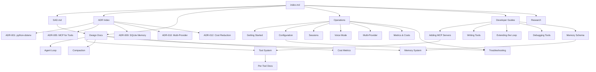

# micro-x-agent-loop-python Documentation

Central navigation hub for all project documentation.

## Quick Start

- [Getting Started](operations/getting-started.md) - Setup, prerequisites, first run
- [QUICKSTART](../../QUICKSTART.md) - Complete getting-started guide with examples

## Architecture

- [Software Architecture Document](architecture/SAD.md) - System overview, components, data flow
- [Architecture Decision Records](architecture/decisions/README.md) - Index of all ADRs

## Design

- [Agent Loop Design](design/DESIGN-agent-loop.md) - Core agent loop, tool dispatch, streaming
- [Tool System Design](design/DESIGN-tool-system.md) - Tool interface, MCP servers, ToolResultFormatter
- [Compaction Design](design/DESIGN-compaction.md) - Conversation compaction via strategy pattern
- [Memory System Design](design/DESIGN-memory-system.md) - Session persistence, checkpoints, events
- [Cost Metrics Design](design/DESIGN-cost-metrics.md) - Structured metrics emission and cost tracking
- [Interview Assist MCP](design/tools/interview-assist-mcp/README.md) - MCP wrapper for interview-assist-2 analysis/evaluation workflows

## Operations

- [Getting Started](operations/getting-started.md) - Prerequisites, setup, running
- [Configuration Reference](operations/config.md) - All settings with types and defaults
- [Sessions and Rewind](operations/sessions.md) - Session lifecycle, resume/fork, checkpoint rewind commands
- [Voice Mode](operations/voice-mode.md) - Continuous voice input setup and tuning
- [Multi-Provider Setup](operations/multi-provider-setup.md) - Switching between Anthropic and OpenAI
- [Metrics and Costs](operations/metrics-and-costs.md) - Cost tracking, metrics.jsonl, analysis
- [Prompt Caching Cost Analysis](operations/prompt-caching-cost-analysis.md) - Measured savings from prompt caching
- [Troubleshooting](operations/troubleshooting.md) - Common issues and solutions

## Developer Guides

- [Adding an MCP Server](guides/adding-an-mcp-server.md) - Step-by-step guide to creating and registering a new tool
- [Writing a Custom Tool](guides/writing-a-custom-tool.md) - Tool protocol, schema design, error handling
- [Extending the Agent Loop](guides/extending-the-agent-loop.md) - Event callbacks, slash commands, compaction strategies
- [Debugging Tool Failures](guides/debugging-tool-failures.md) - Diagnosis patterns for tool execution problems
- [Session Memory Schema](guides/session-memory-schema.md) - SQLite schema reference and query examples
- [Coding Standards](guides/coding-standards.md) - Python best practices, SOLID, KISS, DRY principles and project conformity
- [Documentation Guide](guides/documentation-guide.md) - Where docs go, naming conventions, templates, indexes

## Examples

- [Example Prompts](examples/README.md) - Prompt packs and workflow examples
- [Agent Prompt Examples](examples/agent-prompt-examples.md) - Ready-to-use prompts across core agent workflows

## Research

- [Research Index](research/README.md) - All framework studies and research themes
- [AI Agent Sandboxing](research/ai-agent-sandboxing.md) - Execution isolation approaches across platforms
- [Human-in-the-Loop User Questioning](research/human-in-the-loop-user-questioning.md) - Survey of ask-user patterns across agent systems
- [Agent Framework Comparison](research/agent-framework-comparison.md) - Cross-framework comparison matrix

## Planning

- [Planning Index](planning/INDEX.md) - Prioritised work queue and plan status
- [Continuous Voice Agent Plan](planning/PLAN-continuous-voice-agent.md) - Session-based STT MCP and `/voice` orchestration plan
- [Ask User Plan](planning/PLAN-ask-user.md) - `ask_user` pseudo-tool for LLM-initiated user questioning (completed)

## Document Map

```mermaid
graph TD
    INDEX[index.md] --> SAD[SAD.md]
    INDEX --> ADR[ADR Index]
    INDEX --> DESIGN[Design Docs]
    INDEX --> OPS[Operations]
    INDEX --> GUIDES[Developer Guides]
    INDEX --> RESEARCH[Research]

    DESIGN --> DESIGN1[Agent Loop]
    DESIGN --> DESIGN2[Tool System]
    DESIGN --> DESIGN3[Compaction]
    DESIGN --> DESIGN4[Memory System]
    DESIGN --> DESIGN5[Cost Metrics]

    OPS --> OPS1[Getting Started]
    OPS --> OPS2[Configuration]
    OPS --> OPS3[Sessions]
    OPS --> OPS4[Voice Mode]
    OPS --> OPS5[Multi-Provider]
    OPS --> OPS6[Metrics & Costs]
    OPS --> OPS7[Troubleshooting]

    GUIDES --> G1[Adding MCP Servers]
    GUIDES --> G2[Writing Tools]
    GUIDES --> G3[Extending the Loop]
    GUIDES --> G4[Debugging Tools]
    GUIDES --> G5[Memory Schema]

    ADR --> ADR001[ADR-001: python-dotenv]
    ADR --> ADR005[ADR-005: MCP for Tools]
    ADR --> ADR009[ADR-009: SQLite Memory]
    ADR --> ADR010[ADR-010: Multi-Provider]
    ADR --> ADR012[ADR-012: Cost Reduction]

    SAD --> DESIGN
    DESIGN2 --> TOOLS[Per-Tool Docs]
    OPS2 --> OPS7
    G1 --> DESIGN2
    G5 --> DESIGN4
```
