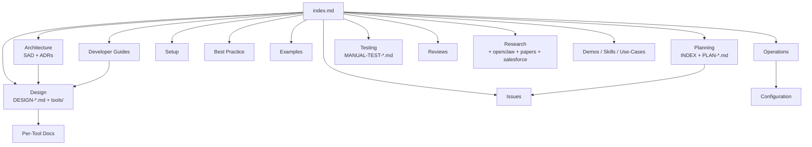

# micro-x-agent-loop-python Documentation

Central navigation hub for all project documentation.

## Quick Start

- [Getting Started](operations/getting-started.md) - Setup, prerequisites, first run
- [QUICKSTART](../../QUICKSTART.md) - Complete getting-started guide with examples

## Architecture

- [Software Architecture Document](architecture/SAD.md) - System overview, components, data flow
- [Architecture Decision Records](architecture/decisions/README.md) - Index of all ADRs

## Design

### Core system

- [Agent Loop Design](design/DESIGN-agent-loop.md) - Core agent loop, tool dispatch, streaming
- [Agent Loop Tool Calls](design/agent-loop-tool-calls.md) - Tool-call dispatch mechanics companion to the agent-loop design
- [Tool System Design](design/DESIGN-tool-system.md) - Tool interface, MCP servers, ToolResultFormatter
- [Compaction Design](design/DESIGN-compaction.md) - Conversation compaction via strategy pattern
- [Memory System Design](design/DESIGN-memory-system.md) - Session persistence, checkpoints, events
- [Cost Metrics Design](design/DESIGN-cost-metrics.md) - Structured metrics emission and cost tracking
- [Semantic Model Routing](design/DESIGN-semantic-model-routing.md) - Cross-provider task-type model routing
- [Cache-Preserving Tool Routing](design/DESIGN-cache-preserving-tool-routing.md) - Canonical serialisation + provider-aware tool search
- [Task Decomposition](design/DESIGN-task-decomposition.md) - Task store, dependency DAG, multi-agent decomposition

### Services and interfaces

- [Trigger Broker](design/DESIGN-trigger-broker.md) - Always-on cron/webhook run dispatcher
- [Trigger Broker Phase 2](design/DESIGN-trigger-broker-phase2.md) - Webhooks, messaging channels, HITL, retries
- [Agent API Server](design/DESIGN-agent-api-server.md) - FastAPI REST + WebSocket server
- [WebSocket Protocol](design/DESIGN-websocket-protocol.md) - Real-time streaming frame protocol
- [Codegen Server](design/DESIGN-codegen-server.md) - TypeScript codegen MCP server

### Conceptual and proposed

- [Agent Loop: ReAct & LangGraph](design/DESIGN-agent-loop-react-and-langgraph.md) - Conceptual mapping to ReAct/LangGraph patterns
- [Account Management APIs](design/DESIGN-account-management-apis.md) - Account/usage API surface (partially implemented)
- [Map-Evaluate Pattern](design/DESIGN-map-evaluate-pattern.md) - Map-evaluate execution pattern (proposal)
- [Describe-Structure Tool](design/DESIGN-describe-structure-tool.md) - Generic structure-describing filesystem tool (proposal)

### Per-tool documentation

- [Per-Tool Docs](design/tools/) - One README per MCP tool / tool group (see e.g. [Interview Assist MCP](design/tools/interview-assist-mcp/README.md))

## Operations

- [Getting Started](operations/getting-started.md) - Prerequisites, setup, running
- [Configuration Reference](operations/config.md) - All settings with types and defaults
- [Sessions and Rewind](operations/sessions.md) - Session lifecycle, resume/fork, checkpoint rewind commands
- [Voice Mode](operations/voice-mode.md) - Continuous voice input setup and tuning
- [Multi-Provider Setup](operations/multi-provider-setup.md) - Switching between Anthropic and OpenAI
- [Local LLMs with Ollama](operations/local-llm-ollama.md) - Running local models via Ollama (Docker + GPU)
- [Metrics and Costs](operations/metrics-and-costs.md) - Cost tracking, metrics.jsonl, analysis
- [Prompt Caching Cost Analysis](operations/prompt-caching-cost-analysis.md) - Measured savings from prompt caching
- [API Server](operations/api-server.md) - Running the HTTP/WebSocket server and connecting clients
- [Trigger Broker](operations/trigger-broker.md) - Running the scheduled/webhook job daemon
- [Troubleshooting](operations/troubleshooting.md) - Common issues and solutions

## Developer Guides

- [Adding an MCP Server](guides/adding-an-mcp-server.md) - Step-by-step guide to creating and registering a new tool
- [Writing a Custom Tool](guides/writing-a-custom-tool.md) - Tool protocol, schema design, error handling
- [Extending the Agent Loop](guides/extending-the-agent-loop.md) - Event callbacks, slash commands, compaction strategies
- [Debugging Tool Failures](guides/debugging-tool-failures.md) - Diagnosis patterns for tool execution problems
- [Codegen Tool Types](guides/codegen-tool-types.md) - Keeping codegen wrappers in sync with MCP schemas
- [Google MCP Setup](guides/google-mcp-setup.md) - Setting up the Google (Gmail/Calendar/Contacts) MCP server
- [Publishing the Google MCP](guides/publishing-google-mcp.md) - Worked example of publishing an MCP server
- [Session Memory Schema](guides/session-memory-schema.md) - SQLite schema reference and query examples
- [Coding Standards](guides/coding-standards.md) - Python best practices, SOLID, KISS, DRY principles and project conformity
- [Documentation Guide](guides/documentation-guide.md) - Where docs go, naming conventions, templates, indexes
- [Task Decomposition Implementation Guide](task-decomposition-implementation-guide.md) - Build spec for the task-decomposition subsystem

## Setup

- [MCP Server Setup](setup/mcp-servers.md) - Per-server setup catalogue (filesystem, web, github, google, linkedin, x-twitter, discord, etc.)

## Best Practice

- [MCP Servers](best-practice/mcp-servers.md) - Production-grade MCP server design, security, transport, and versioning
- [Observability for AI Agents](best-practice/observability-for-ai-agents.md) - Traces, metrics, evals, cost tracking, and alerting for agents

## Examples

- [Example Prompts](examples/README.md) - Prompt packs and workflow examples
- [Agent Prompt Examples](examples/agent-prompt-examples.md) - Ready-to-use prompts across core agent workflows

## Planning

- [Planning Index](planning/INDEX.md) - Prioritised work queue and plan status
- [Continuous Voice Agent Plan](planning/PLAN-continuous-voice-agent.md) - Session-based STT MCP and `/voice` orchestration plan
- [Ask User Plan](planning/PLAN-ask-user.md) - `ask_user` pseudo-tool for LLM-initiated user questioning (completed)
- [Observability Plan](planning/PLAN-observability.md) - Production-grade observability + session step-through, 8-phase delivery from a code-grounded audit

## Issues

- [Issue Resolution Records](issues/README.md) - Index of significant issues discovered and resolved (ISSUE-NNN)

## Testing

- [Manual Test Plans](testing/) - `MANUAL-TEST-*.md` step-by-step verification plans for shipped features (api-server, checkpoints, codegen, compaction, pricing, prompt-caching, semantic-routing, sub-agents, task-decomposition, trigger-broker, and more)

## Reviews

- [Code Review Index](review/index.md) - Cross-cutting review reports (cost reduction, prompt versioning, tool-result summarisation, Claude Code feature comparison)

## Research

- [Research Index](research/README.md) - All framework studies and research themes
- [AI Agent Sandboxing](research/ai-agent-sandboxing.md) - Execution isolation approaches across platforms
- [Human-in-the-Loop User Questioning](research/human-in-the-loop-user-questioning.md) - Survey of ask-user patterns across agent systems
- [Agent Framework Comparison](research/agent-framework-comparison.md) - Cross-framework comparison matrix
- [OpenClaw Architecture Research](openclaw-research/README.md) - Numbered deep-dive series (00–22) studying the OpenClaw architecture
- [Research Papers](research-papers/cost-aware-task-compilation-for-llm-agents/research-paper.md) - Formal write-ups, e.g. Cost-Aware Task Compilation for LLM Agents
- [Salesforce Research](salesforce/salesforce-research-report.md) - Salesforce CRM API investigation and agentic-integration reference

## Other

- [Demo Recordings](demos/README.md) - Terminal recordings (asciinema/VHS tapes) of agent workflows
- [Claude Skills Skeleton](claude-skills/skeleton/SKILL.md) - Template/skeleton for authoring a Claude skill
- [Use-Case Artifacts](use-cases/) - Captured agent run outputs and example reports (raw artifacts, not curated docs)
- [CV Skills Evidence](CV-repo-skills-evidence.md) - Skills-evidence analysis drawn from local repositories

## Document Map

This map shows the top-level documentation categories reachable from this hub. Each
category links to its own index or representative entry point above.

```mermaid
graph TD
    INDEX[index.md] --> ARCH[Architecture<br/>SAD + ADRs]
    INDEX --> DESIGN[Design<br/>DESIGN-*.md + tools/]
    INDEX --> OPS[Operations]
    INDEX --> GUIDES[Developer Guides]
    INDEX --> SETUP[Setup]
    INDEX --> BP[Best Practice]
    INDEX --> EX[Examples]
    INDEX --> PLAN[Planning<br/>INDEX + PLAN-*.md]
    INDEX --> ISSUES[Issues]
    INDEX --> TEST[Testing<br/>MANUAL-TEST-*.md]
    INDEX --> REVIEW[Reviews]
    INDEX --> RESEARCH[Research<br/>+ openclaw + papers + salesforce]
    INDEX --> OTHER[Demos / Skills / Use-Cases]

    ARCH --> DESIGN
    DESIGN --> TOOLS[Per-Tool Docs]
    OPS --> CONFIG[Configuration]
    GUIDES --> DESIGN
    PLAN --> ISSUES
```
