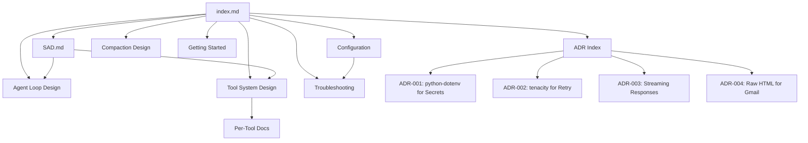

# micro-x-agent-loop-python Documentation

Central navigation hub for all project documentation.

## Quick Start

- [Getting Started](operations/getting-started.md) - Setup, prerequisites, first run

## Architecture

- [Software Architecture Document](architecture/SAD.md) - System overview, components, data flow
- [Architecture Decision Records](architecture/decisions/README.md) - Index of all ADRs

## Design

- [Agent Loop Design](design/DESIGN-agent-loop.md) - Core agent loop, tool dispatch, streaming
- [Tool System Design](design/DESIGN-tool-system.md) - Tool interface, registry, built-in tools
- [Compaction Design](design/DESIGN-compaction.md) - Conversation compaction via strategy pattern

## Operations

- [Getting Started](operations/getting-started.md) - Prerequisites, setup, running
- [Configuration Reference](operations/config.md) - All settings with types and defaults
- [Troubleshooting](operations/troubleshooting.md) - Common issues and solutions

## Document Map

