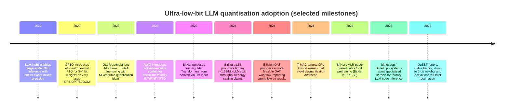

# 1‑bit Weight Large Language Models in 2026

## Executive summary

“1‑bit LLMs” are best understood as a family of **extreme low‑precision** approaches that compress (or constrain) model weights to **binary** values (typically {−1, +1}) or to **ternary** values (typically {−1, 0, +1}, often marketed as “~1‑bit” because log₂(3)≈1.58). The most visible research line is **BitNet/BitNet b1.58**, which **trains models as low‑bit from the start** (quantisation-aware training) and reports strong quality while achieving large memory/throughput/energy advantages—especially at larger scales—provided you also deploy **custom kernels**. citeturn5view2turn11view6turn11view8turn7search0

In contrast, **post‑training quantisation (PTQ)** methods such as **GPTQ** and **AWQ** are mature and widely used for production inference at **3–4 bits**, but **pushing arbitrary pretrained LLMs all the way to 1‑bit** (true binary weights) usually incurs severe quality loss unless the model/training recipe is designed for it. citeturn9view2turn9view1turn11view10turn5view1

From a production standpoint (April 2026), the most reliable pattern is a **hybrid stack**: use **INT4 weight‑only** (AWQ/GPTQ‑style) for general serving efficiency, and consider **native low‑bit models (BitNet‑style)** when memory/energy constraints are extreme or when you can standardise on a specific family and inference stack (e.g., bitnet.cpp or specialised CPU/GPU kernels). citeturn13view0turn11view10turn17view2turn12view1

## What “1‑bit” means in practice

The phrase “1‑bit quantisation” is overloaded. In LLM practice it usually decomposes along three axes.

**Weight value set (binary vs ternary vs “effective 1‑bit”).**  
Binary schemes constrain weights to two values (commonly {−1, +1}), which is true 1‑bit storage in the idealised sense. BitNet’s initial framing is explicitly “1‑bit Transformers” with a custom linear layer recipe (BitLinear) to train low‑bit weights from scratch. citeturn5view2turn7search0  
Later work popularised **ternary** weights {−1, 0, +1} (BitNet b1.58), referred to as “1‑bit LLMs” in broader discussion because each parameter can be represented in ~log₂(3)=1.58 bits. citeturn11view6turn9view0  
Separately, some deployment formats aimed at local inference package “1‑bit” variants that are **not truly 1.00 bits/weight once scales/metadata are counted** (e.g., GGUF IQ1_S and IQ1_M are documented at **1.56** and **1.75 bits‑per‑weight**, respectively). citeturn5view9turn5view8turn13view4

**Quantisation granularity (per‑weight vs per‑block/per‑channel/per‑group).**  
Even when the codebook is binary, most systems need **scaling factors** (and sometimes offsets) shared over groups/channels/blocks. This makes storage “near‑1‑bit” rather than exactly 1 bit/weight. Modern inference stacks routinely describe **block** or **groupwise** quantisation where a whole block shares a scale factor. citeturn5view10turn13view0turn5view11  
For example, NVIDIA’s description of block quantisation is explicitly “elements are grouped into blocks” with a shared scale. citeturn5view10

**Mapping scheme (symmetric vs asymmetric).**  
A symmetric mapping pins the quantised grid around 0 (zero‑point fixed), whereas an asymmetric mapping learns both scale and zero‑point. In modern toolchains this is frequently a configurable choice (e.g., TorchAO exposes mapping types “ASYMMETRIC or SYMMETRIC” for int‑x quantisation configs). citeturn13view6

A useful deployment‑oriented definition of a “1‑bit weight LLM” is therefore:

> **W1 (or ~W1.x) model**: the *stored* weights are binary/ternary (often group‑scaled), while **activations and KV cache are typically higher precision** (INT8, FP16/BF16, FP8, etc.), and real speedups depend on kernel support for mixed‑precision matmuls. citeturn11view10turn13view0turn9view5turn6view1

## Key methods and the state of the literature

The field splits into **PTQ**, **quantisation‑aware training (QAT)** (including “train‑from‑scratch” low‑bit architectures), and **parameter‑efficient fine‑tuning on quantised bases**.

### Comparative method table

| Method family | Typical use | Typical weight bits | Core idea (one‑line) | Where it’s strong | Main failure mode at “1‑bit” |
|---|---:|---:|---|---|---|
| LLM.int8() | Inference | 8 | Mixed INT8 with an outlier‑aware FP16 path to preserve quality | Large models with strong outliers; “no degradation” target | Not an extreme low‑bit scheme; does not deliver “1‑bit” storage | citeturn5view5 |
| GPTQ | PTQ inference | 3–4 (can push to 2/ternary) | One‑shot, approximate second‑order reconstruction to minimise quant error | Fast PTQ for very large LLMs; good quality at 3–4 bits | Extremely low bits need careful grouping/scales; still degrades for many models | citeturn9view2turn11view5 |
| AWQ | PTQ inference | 3–4 | Activation‑aware per‑channel scaling protects salient channels without mixed precision | Strong PTQ at INT4; robust generalisation vs reconstruction overfit | Still not “true 1‑bit”; needs kernels/packing to realise speedups | citeturn9view1turn11view2 |
| QLoRA | Fine‑tuning | 4 (base) + 16‑bit adapters | Fine‑tune LoRA adapters while base weights stay 4‑bit | Cost‑effective tuning of large models on modest GPUs | Not a 1‑bit method; base remains 4‑bit | citeturn5view6turn13view3 |
| EfficientQAT | QAT | 2–4 (published results across bits) | Block‑wise training + end‑to‑end quant parameter training to make QAT feasible | Better low‑bit quality than PTQ at 2–3 bits; lower cost than naive QAT | QAT complexity; still needs training compute and careful recipes | citeturn5view7turn12view6 |
| BitNet / BitNet b1.58 | QAT (train‑from‑scratch) | 1 (binary) or 1.58 (ternary) | Replace linear layers (BitLinear) and train low‑bit weights end‑to‑end | “Native” low‑bit models with strong efficiency claims | Requires specialised kernels; PTQ to this regime often fails | citeturn5view2turn11view6turn11view10 |
| QuEST | QAT (weights+acts) | down to 1‑bit (weights+acts), “optimal” around 4‑bit in paper | Hadamard normalisation + trust gradient estimator for stable low‑bit training | Training stability, scaling‑law behaviour in low‑bit regimes | Kernel and training complexity; still research‑heavy | citeturn9view3turn14search2 |
| “Leverage pretrained → 1‑bit” (BinaryLLM) | QAT / adaptation | 1‑bit target | Progressive conversion from pretrained FP weights to binary | Potentially cheaper than training from scratch | Still early; bridging FP→binary gap is hard | citeturn9view4turn8search2 |

### Notes on “1‑bit training” versus “1‑bit inference packs”

BitNet b1.58 2B4T explicitly distinguishes **packed weights for inference** from **master weights used for training** (full‑precision checkpoint for training vs packed form for inference). citeturn6view1turn5view1  
This separation is common: training often retains high‑precision state even if inference storage is low‑bit, which directly affects whether “1‑bit” reduces *training* costs or primarily *deployment* costs. citeturn19view0turn19view2

## Empirical impacts: quality, memory, throughput, and energy

This section consolidates **directly reported** numbers from primary sources. Because papers differ in models, datasets, and evaluation harnesses, treat cross‑paper comparisons as indicative rather than strictly apples‑to‑apples. citeturn12view1turn11view6turn11view2

### Accuracy and perplexity: native low‑bit vs PTQ

**BitNet b1.58 vs FP16 LLaMA‑like baselines (reported cost + PPL + zero‑shot accuracy).**  
The BitNet b1.58 paper reports (a) memory and latency reductions at small scales, and (b) throughput scaling at 70B when batch size is increased until GPU memory is saturated. citeturn11view6turn11view8

| Model | Size | Memory (GB) | Latency (ms) | WikiText2 PPL | Notes |
|---|---:|---:|---:|---:|---|
| FP16 baseline | 700M | 2.08 | 1.18 | 12.33 | Baseline row (1.0×). citeturn11view6 |
| BitNet b1.58 | 700M | 0.80 | 0.96 | 12.87 | ~2.60× lower memory, ~1.23× faster latency but slightly worse PPL. citeturn11view6 |
| FP16 baseline | 1.3B | 3.34 | 1.62 | 11.25 | Baseline row (1.0×). citeturn11view6 |
| BitNet b1.58 | 1.3B | 1.14 | 0.97 | 11.29 | ~2.93× lower memory; near‑parity PPL. citeturn11view6 |
| FP16 baseline | 3B | 7.89 | 5.07 | 10.04 | Baseline row (1.0×). citeturn11view6 |
| BitNet b1.58 | 3B | 2.22 | 1.87 | 9.91 | ~3.55× lower memory; ~2.71× faster; PPL slightly better. citeturn11view6 |

The same source provides a compact zero‑shot table (ARC‑easy/challenge, HellaSwag, BoolQ, OpenbookQA, PIQA, Winogrande) showing **BitNet b1.58 3B/3.9B** competitive with or exceeding the FP16 3B baseline on the reported average. citeturn11view6turn11view7

**Throughput scaling at 70B.**  
BitNet b1.58 reports that, on two A100 80GB GPUs with pipeline parallelism and sequence length 512, it supports **11×** the batch size and **8.9×** the throughput of the FP16 70B baseline before hitting memory limits. citeturn11view8

### PTQ methods: comparative quality at low bits

EfficientQAT includes tables that directly compare **FP16**, **GPTQ**, **AWQ**, and other methods on Llama‑2/Llama‑3, reporting both (a) average zero‑shot accuracy on five common tasks and (b) perplexity on WikiText2 and C4 at context length 2048. citeturn12view0turn12view1

Selected excerpts (3‑bit, group 128) illustrate a common pattern: **AWQ tends to beat GPTQ on perplexity and sometimes accuracy**, but both degrade relative to FP16—and the gap grows as bits drop. citeturn12view1turn12view0

| Family | Precision | Llama‑2‑70B avg zero‑shot (5 tasks) | Llama‑2‑70B WikiText2 PPL | Llama‑2‑70B C4 PPL |
|---|---|---:|---:|---:|
| FP16 | 16‑bit | 72.41 | 3.32 | 5.52 citeturn12view0turn12view1 |
| GPTQ | 3‑bit g128 | 71.47 | 3.85 | 5.85 citeturn12view0turn12view1 |
| AWQ | 3‑bit g128 | 71.41 | 3.74 | 5.81 citeturn12view0turn12view1 |

At **2‑bit**, EfficientQAT reports it can obtain a 2‑bit Llama‑2‑70B in ~41 hours on a single A100‑80GB with “less than 3 points” average zero‑shot accuracy degradation (69.48 vs 72.41), highlighting the potential of QAT to push lower than typical PTQ regimes. citeturn12view6turn5view7

### Task metrics beyond accuracy: EM, pass@k, and instruction evaluation

AWQ’s arXiv HTML provides PTQ results at INT4‑g128 on **MBPP** (code) and **GSM8K** (math), including pass@1/pass@10 and (for GSM8K) EM‑style accuracy figures. citeturn11view2

| Task (metric) | Model(s) | FP16 | GPTQ | AWQ |
|---|---|---:|---:|---:|
| MBPP (pass@1) | CodeLlama‑7B‑Instruct | 38.53 | 31.97 | 40.64 citeturn11view2 |
| GSM8K | Llama‑2‑7B | 13.87 | 12.13 | 13.57 citeturn11view2 |
| GSM8K | Llama‑2‑13B | 26.16 | 24.26 | 25.25 citeturn11view2 |
| GSM8K | Llama‑2‑70B | 56.41 | 56.03 | 56.40 citeturn11view2 |

For “native ~1‑bit” results with EM reported, BitNet b1.58 2B4T reports multiple benchmarks including **TriviaQA EM**, **GSM8K EM**, and **MATH‑500 EM** (plus instruction metrics like IFEval and MT‑Bench), and gives a direct comparison to Int4 PTQ (GPTQ/AWQ) of a competing model (Qwen2.5 1.5B). citeturn11view10turn11view9

### Memory and bandwidth savings: what you actually save

**Weight storage scales linearly with bits-per-weight.** The table below gives *weight‑only* storage, computed as:

\[
\text{bytes}=\frac{\text{params}\times \text{bits}}{8}
\]

It excludes KV cache, optimiser state, and non‑weight tensors; real VRAM/RAM in production can differ materially (especially for long context where KV cache dominates). GPTQ explicitly notes KV cache storage as an additional budget item even after compressing weights. citeturn11view3turn13view0

| Model size | FP16/BF16 | INT8 | INT4 | INT2 | Binary W1 | Ternary W1.58 | GGUF IQ1_S (1.56b eff.) | GGUF IQ1_M (1.75b eff.) |
|---|---:|---:|---:|---:|---:|---:|---:|---:|
| 7B | 14.0 GB | 7.0 GB | 3.5 GB | 1.75 GB | 0.88 GB | 1.38 GB | 1.37 GB | 1.53 GB |
| 13B | 26.0 GB | 13.0 GB | 6.5 GB | 3.25 GB | 1.63 GB | 2.57 GB | 2.54 GB | 2.84 GB |
| 30B | 60.0 GB | 30.0 GB | 15.0 GB | 7.50 GB | 3.75 GB | 5.93 GB | 5.85 GB | 6.56 GB |
| 70B | 140.0 GB | 70.0 GB | 35.0 GB | 17.5 GB | 8.75 GB | 13.83 GB | 13.65 GB | 15.31 GB |

The “IQ1_*” effective bits‑per‑weight values are taken from GGUF documentation (which explicitly lists 1‑bit IQ formats and their resulting bits‑per‑weight once metadata is included). citeturn5view9turn5view8turn13view4  

For local deployment, llama.cpp documentation provides a sanity check on the magnitude of these savings at 7B (e.g., F16 ~14 GB; Q4_K_M ~4.5 GB; Q2_K ~3 GB) and frames perplexity as a standard quality proxy. citeturn13view5turn1search6

### Latency, throughput, and energy: where the wins come from

Most real‑world decoding is **memory‑bandwidth bound**, so savings often come from (a) moving fewer bytes of weights and (b) enabling higher batch/concurrency before memory saturation, not merely from “fewer FLOPs”. This is a central motivation in AWQ (token generation slowed by memory bandwidth) and in BitNet b1.58 (explicit batch size/throughput advantages). citeturn9view1turn11view8

**Kernel‑reality check: weight‑only quantisation often dequantises on the fly.**  
TensorRT‑LLM describes INT4/INT8 weight‑only as “quantise weights and dequantise … on‑the‑fly in linear layers,” with FP16/BF16 activations. This means speedups depend heavily on how dequantisation is fused with matmul and how well kernels exploit tensor cores/memory hierarchy. citeturn13view0turn9view5

**Native 1‑bit/ternary models typically require custom packing/unpacking and specialised kernels.**  
The BitNet b1.58 2B4T technical report describes a “pack‑store‑load‑unpack‑compute” CUDA strategy for W1.58A8 matmuls, noting that commodity GPUs are not optimised for the 1‑bit paradigm. citeturn6view1turn5view1

**Energy estimates (arithmetic operations) from BitNet b1.58 and BitNet b1.58 2B4T.**  
BitNet b1.58 reports an estimated **71.4×** reduction in arithmetic operations energy for matrix multiplication at 7nm (using the cited energy model) and shows end‑to‑end energy advantage growing with model size. citeturn11view8  
The BitNet b1.58 2B4T report also provides an operation‑energy table (e.g., FP16 vs INT8 add/mul energies at 7nm), used for decoding energy estimation. citeturn6view3turn11view12

**CPU/edge results (where 1‑bit matters most).**  
T‑MAC targets the gap where systems dequantise low‑bit weights to higher precision, adding overhead; it proposes LUT‑based kernels and reports up to **4× throughput** and **70% energy reduction** compared to llama.cpp for low‑bit inference, including strong token/s numbers for BitNet models on edge devices. citeturn9view5turn17view1  
bitnet.cpp (official inference framework) reports CPU speedups and energy reductions across ARM and x86 and publishes a running timeline of releases; it also explicitly acknowledges dependence on lookup‑table methodologies (T‑MAC) and llama.cpp. citeturn17view2turn17view3

## Hardware and software stacks

### CPUs

For CPU inference, the biggest determinants are **bit‑packing format**, **SIMD width**, **cache locality**, and whether you have a kernel that avoids “dequantise to FP16 first”.

T‑MAC’s motivation is that many systems fall back to dequantisation‑based computation, creating overhead; it instead performs LUT‑based mpGEMM directly. citeturn9view5  
bitnet.cpp positions itself as an official CPU/GPU framework for “1‑bit” (ternary 1.58‑bit) models with dedicated kernels and published speed/energy figures. citeturn17view2turn16search0  
For general low‑bit (not necessarily “1‑bit”), llama.cpp remains a key baseline for local inference and quantisation formats (GGUF + many quant types), and it explicitly frames perplexity as a core evaluation signal for quantisation. citeturn13view4turn13view5turn1search6

### GPUs

For GPU serving, production systems largely centre around weight‑only INT4/INT8 or mixed schemes (e.g., FP8 activations / low‑bit weights), because hardware support is strongest there.

NVIDIA’s TensorRT‑LLM describes weight‑only INT4/INT8 as dequantising weights on‑the‑fly within matmuls; it also states explicit support for per‑group scaling and zero offsets for GPTQ/AWQ‑style schemes via dedicated plugins. citeturn13view0turn13view1  
AWQ includes detailed kernel considerations: CPU SIMD unpacking strategies, GPU packing choices, and kernel fusion to reduce launch overhead. citeturn11view0turn9view1  
For ternary “1‑bit” models, BitNet b1.58 2B4T reports a custom W1.58A8 CUDA kernel with packed ternary weights, highlighting that the kernel/tooling layer is integral to realising savings. citeturn6view1turn5view1

### NPUs and mobile/edge accelerators

For NPUs, practical support is typically best for **INT8** and increasingly **INT4**, but true 1‑bit matmul support is still uncommon in commodity stacks (and often requires bespoke kernels or hardware co‑design).

A concrete example of ecosystem movement is ONNX Runtime’s statement that DirectML + ONNX Runtime support **INT4 AWQ**, enabling deployment across many Windows devices with DX12‑capable GPUs. citeturn5view12  
bitnet.cpp explicitly states CPU/GPU support and suggests NPU support as “coming next,” which is consistent with the broader “hardware catch‑up” dynamic for 1‑bit‑style kernels. citeturn17view2

### Libraries and toolchains you can actually use

- **bitsandbytes** (k‑bit training/inference primitives for 8‑bit/4‑bit, widely used for QLoRA) documents Linear8bit/Linear4bit modules and its role in 4‑bit training workflows. citeturn13view3turn5view6  
- **TorchAO** (PyTorch‑native quantisation) exposes weight‑only configs (INT4/INT8) and “intx” configs (1≤x≤8) with symmetric/asymmetric mapping options—useful for experimentation and for building pipelines that share code between training and serving. citeturn13view6turn2search1  
- **ONNX Runtime** documents INT4/UInt4 quantisation support as block‑wise weight‑only quantisation for supported ops; it also notes that GPU performance improvements require appropriate hardware support. citeturn5view11turn13view8  
- **llama.cpp / GGUF** provides an extensive set of quant formats (including experimental “I‑Quants” around ~1.5–2 bpw) and a standard workflow for converting/quantising models for local inference. citeturn13view4turn5view8turn5view9

## Open problems and risk factors

**Training stability and the “hidden full‑precision” cost.**  
Many QAT approaches rely on gradient estimators (e.g., STE) and therefore retain high‑precision state during training. A direct‑quantised‑training paper explicitly argues that 1‑bit/ternary training “still demands substantial memory footprints” because high‑precision weights required for STE must be maintained, motivating training that updates low‑precision weights directly (e.g., with stochastic rounding). citeturn19view0turn19view2  
QuEST claims stable convergence down to 1‑bit weights/activations using a “trust gradient estimator” and includes GPU kernel support in its release. citeturn9view3turn14search2

**Scaling laws at ultra‑low precision are still an active area.**  
BitNet and follow‑ups explicitly claim scaling‑law behaviour and propose “recipes” for training future generations of low‑bit LLMs. citeturn7search0turn11view6turn9view3

**Calibration dependence and metadata overhead.**  
At very low bits, the *choice of which weights/channels to protect (or the scales used)* can dominate outcomes. AWQ argues reconstruction‑based PTQ can overfit calibration sets; its method avoids backprop/reconstruction and instead uses activation‑aware scaling to protect salient channels. citeturn9view1turn10view0  
For local “~1‑bit” GGUF routes, quantising to 1–2 bit mixtures often requires an **importance matrix** (imatrix) derived from representative calibration text, and toolchains warn when it’s absent for 1–2 bit mixtures. citeturn18view0turn18view2  
Even GPTQ’s “effective bits” discussion makes clear that groupwise scales/zero‑points affect storage and quality at extreme low bits (e.g., discussion of FP16 scales and per‑group zero points in 2‑bit experiments). citeturn11view5turn11view5

**Kernel availability and dequantisation overhead.**  
If your runtime dequantises low‑bit weights into FP16 activations without fusing efficiently, you can lose much of the theoretical benefit. This is explicitly recognised in both system work (T‑MAC’s dequantisation overhead framing) and in mainstream stacks (TensorRT‑LLM’s on‑the‑fly dequantisation description). citeturn9view5turn13view0

**Security, safety, and robustness are not monotonic with bit‑width.**  
Recent work suggests quantisation can change safety/robustness outcomes in complex ways. A study on safety/reliability of quantised LLMs introduces a new dataset (OpenSafetyMini) and reports that the “optimal” quantisation method can vary at 4‑bit, while vector‑quantisation techniques look better at 2‑bit on their benchmarks. citeturn15search1turn15search13  
A separate fault‑injection/jailbreaking study finds quantisation influences attack success rates and transferability (including differences between FP8/INT8/INT4 and transferred jailbreak persistence). citeturn15search0turn15search4  
A broader analysis paper reports that fine‑tuning tends to increase jailbreak success while quantisation has variable effects, suggesting you should evaluate safety post‑quantisation rather than assume it is preserved. citeturn15search14

## Deployment guidance and checklists

### When to use “1‑bit” in production

Use native “1‑bit/1.58‑bit” models when:

- You are **strictly memory/energy constrained** (edge/CPU‑only, low‑power devices), and you can adopt the **matching inference system** (bitnet.cpp/T‑MAC‑style kernels) rather than assuming generic INT4 kernels will work. citeturn17view2turn9view5turn6view1  
- Your requirements tolerate a narrower model menu (e.g., specific BitNet b1.58 checkpoints), and you can standardise on their activation format (often INT8 activations in BitNet b1.58 systems). citeturn11view10turn6view1

Prefer INT4 weight‑only (AWQ/GPTQ family) when:

- You need broad compatibility with GPU serving stacks (TensorRT‑LLM, ONNX Runtime/DirectML, etc.) and predictable quality. citeturn13view0turn5view12turn12view1  
- You are deploying general pretrained LLMs where **PTQ to “true 1‑bit” is not supported or not quality‑safe**. This is consistent with the BitNet b1.58 2B4T report’s framing that conventional PTQ can degrade noticeably and that native 1‑bit architecture offers a better point on the efficiency–performance curve (in their comparisons). citeturn6view0turn11view10

### Recommended hybrid inference pipeline

A robust architecture is to treat ultra‑low‑bit models as **routers and filters**, not necessarily as universal “final answer” generators.

```mermaid
flowchart TD
  A[User request] --> B[Safety + policy filter]
  B --> C[Lightweight local model\n(~1-2 bpw or INT4)\nintent + risk + routing]
  C -->|Simple/low-risk| D[Local generation\n(INT4 or 1.58-bit model)]
  C -->|Needs tools/RAG| E[Retriever + reranker]
  E --> F[Mid-tier model\n(INT4 weight-only)]
  C -->|Hard reasoning / high stakes| G[High-tier model\n(full precision / hosted)]
  D --> H[Post-checks\n(PII, hallucination heuristics)]
  F --> H
  G --> H
  H --> I[Response]
```

This architecture aligns with the empirical reality that (a) ultra‑low‑bit inference benefits are greatest on edge/CPU constraints, and (b) higher‑precision fallbacks remain useful for peak quality. citeturn9view5turn13view0turn11view8

### Benchmarking methodology you can trust

A practical benchmarking harness should measure **quality**, **latency**, **throughput**, **memory**, and **energy**—and do so under the same prompt templates and decoding settings.

- **Quality**: perplexity (e.g., WikiText2) for regression detection plus task suites via EleutherAI’s lm‑evaluation‑harness; BitNet b1.58 2B4T reports using lm‑evaluation‑harness for many benchmarks. citeturn11view12turn18view0  
- **Generation tasks**: report EM / pass@k where available (GSM8K, HumanEval/MBPP) and include instruction‑following metrics (IFEval, MT‑Bench); BitNet b1.58 2B4T reports IFEval/MT‑Bench and describes MT‑Bench judge tooling. citeturn11view9turn11view12  
- **Performance**: always separate **prefill** vs **decode** and specify batch size + sequence length; BitNet b1.58 throughput comparisons fix sequence length 512 and batch until memory cap. citeturn11view8  
- **Energy**: measure real energy (RAPL on CPU, board power on edge, GPU power sampling) *and* keep an arithmetic‑energy estimate only as a secondary explanatory model; BitNet b1.58 uses an arithmetic energy model and publishes per‑op energies in its technical report. citeturn11view8turn11view12  
- **Safety/robustness**: rerun your safety eval post‑quantisation; recent work shows quantisation affects safety/attack success in non‑trivial ways. citeturn15search0turn15search1turn15search14

### Step‑by‑step conversion checklist

**INT4 weight‑only conversion (production default for many stacks)**

1. Choose an algorithm: AWQ or GPTQ, and select group size (commonly 128). citeturn13view0turn12view1  
2. Build a representative calibration set (ideally real traffic slices); avoid overly narrow calibration to reduce overfit risk (AWQ explicitly points out reconstruction overfitting issues). citeturn9view1turn18view0  
3. Quantise and export to your runtime format:
   - For TensorRT‑LLM: ensure you have per‑group scales/zero offsets and the right plugin path; the docs describe how GPTQ/AWQ are supported and what options to set. citeturn13view0turn13view1  
   - For ONNX Runtime: use block‑wise weight‑only INT4 where supported, and confirm GPU hardware support if you expect speedups. citeturn5view11turn13view8  
4. Validate quality with perplexity + task suite; compare to FP16 and to a known “good” INT4 baseline such as AWQ. citeturn12view1turn11view2  
5. Benchmark decode throughput at multiple batch sizes; weight‑only often raises the maximum safe batch/concurrency due to VRAM savings even when per‑token compute doesn’t scale linearly. citeturn11view8turn13view0

**Going below INT4 toward “1‑bit” deployment**

1. Decide whether you are adopting a **native** low‑bit model family (BitNet b1.58) versus trying to compress an arbitrary pretrained model. Native models have the strongest evidence of high quality at ~1.58 bits. citeturn11view6turn6view0  
2. If targeting GGUF “~1–2 bpw” inference (IQ1/IQ2 families), plan to compute an **importance matrix** and use representative calibration text; toolchains explicitly warn that 1–2 bit mixtures need imatrix for quality. citeturn18view0turn18view2turn5view9  
3. Use a runtime with genuine low‑bit mpGEMM kernels (e.g., bitnet.cpp / T‑MAC / specialised systems). Without such kernels you may mainly get storage savings, not speed/energy wins. citeturn9view5turn17view2turn13view0  
4. Re‑evaluate safety/robustness post‑quantisation (do not assume monotonic behaviour). citeturn15search0turn15search1

### Adoption timeline



Milestones are drawn from the primary papers and official repos. citeturn5view5turn9view2turn5view6turn9view1turn7search0turn11view6turn5view7turn9view5turn4search0turn14search3turn9view3

### Concise recommendations for production use

For most teams today: start with **INT4 weight‑only** (AWQ/GPTQ‑style) in a mature serving stack (TensorRT‑LLM or ONNX Runtime), because it is well supported, measurable, and typically preserves quality acceptably at scale. citeturn13view0turn12view1turn11view2

Adopt “1‑bit” (in the practical sense of **~1–2 bpw** or **ternary 1.58‑bit**) when you have hard constraints (CPU‑only edge, strict power caps) and can commit to compatible kernels and evaluation. Use a hybrid pipeline so you keep a path to higher‑precision fallbacks and to safety guardrails. citeturn9view5turn17view2turn11view8turn15search14