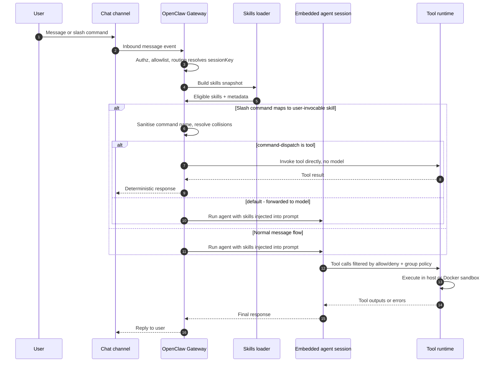

# OpenClaw “Skills” Feature Deep Research Report

## Executive summary

OpenClaw skills are **AgentSkills-compatible skill folders** designed to “teach” an embedded agent how to use tools and execute repeatable workflows. A skill is fundamentally a **directory** anchored by a `SKILL.md` file (YAML frontmatter + Markdown instructions), optionally accompanied by scripts and resources. citeturn7search2turn8view0turn6view1

Because skills primarily provide **instructions and metadata**, the *real* capability boundary is controlled by **tool policy, sandboxing, and Gateway authentication**. Skills can meaningfully change what the agent *does*, but they should not be treated as a permission system. citeturn8view2turn12view1turn12view0

From a lifecycle perspective, skills are: (a) discovered from multiple locations with deterministic precedence, (b) gated/filtered based on environment and requirements at load time, (c) injected into the system prompt as part of each run via a session “skills snapshot”, and (d) updated either locally (workspace overrides) or via the public registry (ClawHub) with semver versioning and content-hash-based update safety. citeturn1view0turn6view1turn6view3turn10view3

Security is currently the most sensitive dimension. Official guidance explicitly frames OpenClaw as a **single trusted-operator boundary**, not a hostile multi-tenant boundary, and recommends splitting trust boundaries by running separate gateways/hosts where needed. citeturn12view0 Recent ecosystem events—including malicious skills distributed via ClawHub reported by mainstream tech press—reinforce a supply-chain threat model where “skills are code” (or instructions that can trigger code) and must be treated accordingly. citeturn9news41turn11news39turn12view3

Assumptions for this report: OpenClaw **latest stable release** as of **3 March 2026 (Asia/Bangkok)**; the GitHub release feed shows `openclaw 2026.3.1` published **2 March 2026**. citeturn20view0 Deployment target is provider-agnostic (no specific cloud), consistent with official guidance that the Gateway is local-first and typically loopback-bound by default. citeturn17view3turn17view0

## Official documentation and release artefacts

The official docs describe skills as **AgentSkills-compatible folders** used to teach the agent how to perform specific tasks by composing tools. citeturn7search2turn1view0 The “Creating Skills” guide presents the core mental model and minimum viable structure: create a directory (commonly under the OpenClaw workspace), add a `SKILL.md` with YAML frontmatter (`name`, `description`, plus optional metadata) and Markdown instructions, then refresh/restart so the Gateway re-indexes the skill. citeturn8view0

In parallel, OpenClaw’s “Slash Commands” documentation explains how skills become **user-invocable commands** when configured as `user-invocable`: names are sanitised to `a-z0-9_` (max 32 chars), collisions receive suffixes, and invocation can be routed either through the model (default) or directly to a tool for deterministic dispatch (`command-dispatch: tool`). This is a critical design axis because it changes both reliability and cost. citeturn8view1

Release notes (GitHub Releases) show ongoing hardening and refactoring that affects skills in practice—for example: removing certain skills from the core repo in favour of registry management (“manage/install from ClawHub”), and explicitly hardening skill guidance around shell command safety to reduce injection risks. citeturn5view0turn5view1turn20view0

At the ecosystem layer, the official ClawHub docs define ClawHub as the **public skill registry** for OpenClaw, with semver versioning, tags (including `latest`), changelogs, and CLI-based workflows for search/install/update/publish/sync. citeturn6view1turn10view3

## Skill architecture and lifecycle

OpenClaw’s skill system is best understood as a **load-time filter + per-run prompt injection + optional deterministic command entrypoint**, layered on top of the Gateway control plane and embedded agent runtime.

### Skill format and discovery

Skills are directories centred on `SKILL.md` (YAML frontmatter + Markdown). citeturn7search2turn8view0 Metadata matters operationally: OpenClaw uses requirements declarations (such as binaries on `PATH`, required env vars, and config requirements) to compute eligibility, and can surface missing requirements in status/UX (e.g., the macOS companion app reads skill eligibility from the Gateway). citeturn6view0turn1view0

Skills can come from multiple sources with deterministic precedence. Official documentation describes a model where **workspace skills** (including those installed via ClawHub into the workspace) are loaded and can override other locations, and where additional directories can be configured. citeturn6view1turn6view3turn1view0

### Gating, eligibility, and state

Eligibility is computed at load time using declared requirements and configuration allowlists. For example, the skills config supports: bundled allowlists, extra scan directories, live watching/reload, install preferences, and per-skill enablement and env injection. citeturn6view3turn1view0turn3view0

OpenClaw’s Security model is explicit that the platform assumes a trusted operator boundary; therefore, “skill state” is not a privileged per-user state in the multi-tenant sense. State typically lives in the session structure, workspace files, memory, or external services—not inside the `SKILL.md` itself. citeturn12view0turn17view0

### Versioning and updates

There are two distinct update tracks:

* **Local development / overrides**: edit files in a workspace skill directory; watcher support helps the Gateway pick up changes on subsequent turns when enabled. citeturn6view3turn1view0  
* **Registry-managed distribution** via entity["company","ClawHub","OpenClaw skill registry"]: each publish creates a new semver `SkillVersion`, tags can be moved for rollback, updates compare a local content hash to registry versions before overwriting, and installed skills are recorded in a lockfile (`.clawhub/lock.json`). citeturn10view3turn6view1

### Skill invocation lifecycle diagram



This flow matches official descriptions that the Gateway is the control plane, skills are injected into prompt construction, and tools are governed by tool policy and (optionally) sandbox execution. citeturn17view0turn15view0turn8view2turn12view1turn8view1

## SDKs, APIs, developer tooling and examples

Skills can be built and operated with “no SDK” (just files), but the surrounding ecosystem offers multiple programmable surfaces: Gateway WebSocket protocol, HTTP endpoints, plugin SDK, and the ClawHub registry tooling.

### SDK/API comparison table

| Surface | Primary use in skills lifecycle | Language/transport | Maturity signal | Notable features for skill builders | Sample code / reference |
|---|---|---:|---|---|---|
| `SKILL.md` (AgentSkills-compatible format) | Authoring & runtime behaviour: instructions + metadata used for eligibility and prompting | Markdown + YAML frontmatter | Core feature; officially documented | Minimal “Hello World” skill; skills can include scripts/resources; best-practice guidance emphasises injection safety when using shell tools | Creating Skills guide shows minimal `SKILL.md`. citeturn8view0turn7search2 |
| ClawHub CLI (`clawhub`) | Install/update/publish/sync skills | Node CLI | Official docs + common workflows | Search, install, update `--all`; publish with semver/tags; `sync` uploads updates; lockfile; content-hash comparisons; registry URL overrides | ClawHub docs list CLI workflows and version/tag rules. citeturn10view3turn6view1 |
| ClawHub registry API (+ schema) | Automation around registry (CI publishing, audits, internal tooling) | HTTP API (CLI-friendly); schema in TS | Official repo documents typed schema and API routing | Versioned bundles; metadata parsing; moderation hooks; search via embeddings; provides API schema package for clients | ClawHub repo + docs reference schema and API for automation. citeturn6view2turn6view1 |
| OpenClaw plugin API (extensions) | Add **new tools/commands/RPC**, and optionally ship skills directories with code | TypeScript module loaded in-process | Official docs; explicit safety notes | Register Gateway RPC, HTTP handlers, agent tools, CLI commands; can register auto-reply commands that bypass model; plugins can ship skills directories via manifest | Plugins docs include code examples for registering RPC/commands and discuss trust/safety constraints. citeturn15view2turn16search26 |
| Gateway WebSocket protocol | Build operator clients, CI control plane, custom skill dashboards, skill status tooling | JSON over WebSocket | Official protocol spec with version negotiation | Role+scope handshake; typed requests/responses/events; node and operator roles; includes helper methods like `skills.bins` and tool catalog retrieval; device identity & pairing | Gateway protocol doc includes handshake frames and scope model. citeturn17view1turn21view1 |
| Gateway HTTP: OpenAI-compatible Chat Completions | Drive agent runs from external systems (testing harness, staging automation) | HTTP (OpenAI compatible) | Official docs; disabled by default | Executes requests as normal agent runs with same routing/permissions; bearer auth is effectively operator access; session key behaviour via OpenAI `user` | OpenAI Chat Completions doc. citeturn17view2 |
| Gateway HTTP: Tools Invoke API (`POST /tools/invoke`) | Deterministic tooling (test probes, CI health checks, non-LLM integrations) | HTTP | Official docs; always enabled but gated | Invoke single tool directly; filtered by same tool policy chain as agents; has default hard denylist for HTTP; configurable extra deny/allow | Tools Invoke API doc. citeturn24view0 |
| Community: `openclaw-go` | Build typed clients for WS + HTTP endpoints in Go | Go | Explicitly “not officially affiliated”; no stable v1 tag | Typed WS client with many RPC methods; clients for chat completions, tools invoke, discovery; useful for automation/test rigs in Go-heavy shops | Go package docs + examples; includes non-affiliation note. citeturn19view0 |

### Practical note on “what counts as a skill SDK”

OpenClaw skills are intentionally text-first (instructions + metadata). When you need deterministic behaviour, typed inputs/outputs, or robust authentication, official guidance trends toward **tools** and **plugins** rather than “complex skills”. Tools are typed, allow/deny can be enforced centrally, and plugin tools can be sandboxed. citeturn8view2turn15view2turn12view1

## Security, permissions, privacy and threat models

### Trust boundary and permission model

Official security guidance is explicit: OpenClaw is designed for a **personal assistant model** with a single trusted operator boundary per gateway; it is *not* intended to provide hostile multi-tenant isolation for mutually untrusted users sharing the same instance. citeturn12view0 This matters directly for skills because any user who can reach the bot within that trust boundary may be able to steer tool-enabled behaviour unless policies and allowlists are strict. citeturn12view0turn8view2

From the Gateway API side, official docs repeatedly emphasise that HTTP bearer access to control-plane endpoints should be treated as **operator-level** access. This includes OpenAI-compatible endpoints and `/tools/invoke`. citeturn17view2turn24view0turn23search1

### Threat model: skills and supply chain

The official **THREAT MODEL ATLAS** document uses the entity["organization","MITRE","nonprofit research org"] ATLAS framework and includes explicit techniques such as malicious skill installation and update poisoning, indicating that the project itself considers the skill marketplace a first-class attack surface. citeturn12view3

Recent incidents reported in mainstream outlets describe malicious skills being uploaded to ClawHub and used to distribute malware or trick users into running dangerous commands, underscoring that threat model in the wild. citeturn9news41turn11news39

In response, OpenClaw announced a partnership with entity["company","VirusTotal","threat intel platform"] to scan all skills published to ClawHub. The official post describes deterministic packaging, SHA-256 hashing, VirusTotal lookups/uploads, and LLM-assisted “Code Insight” analysis, plus daily rescans and automated approval/blocking logic. citeturn18view0 (The post is authored by entity["people","Peter Steinberger","OpenClaw creator"] and includes contributions/attribution to entity["people","Jamieson O'Reilly","security advisor"] and entity["people","Bernardo Quintero","VirusTotal founder"].) citeturn18view0

### Concrete vulnerability example: skills status leakage

A GitHub security advisory (CVE-2026-26326) documents that the Gateway method `skills.status` previously returned raw resolved config values in requirement checks, which could leak secrets (e.g., chat tokens) to read-scoped clients; it was patched in 2026.2.14. citeturn25view0turn25view1 This is a useful “design lesson”: even read-only introspection APIs that “help with skills” can become secret exfiltration vectors if they surface resolved configuration values.

### Sandboxing and secrets

OpenClaw supports running tool execution inside entity["company","Docker","container platform"] to reduce blast radius, while explicitly noting this is not a perfect security boundary. citeturn12view1 Skills configuration can inject env vars and per-skill API keys into host runs, but sandboxed sessions do not inherit host environment—so secret injection mechanics differ between host and sandbox. citeturn6view3turn11search16

For secrets management, OpenClaw supports SecretRefs (env/file/exec sources) with an in-memory snapshot model, eager resolution on activation, and atomic swap on reload, to keep secret-provider outages off hot paths. citeturn12view2

### Security and privacy compliance checklist

The checklist below is derived from official Security guidance, Sandboxing docs, Secrets Management docs, Skills docs, and the Tools Invoke/OpenAI HTTP endpoint docs. citeturn12view0turn12view1turn12view2turn11search4turn17view2turn24view0turn18view0

**Control-plane and network exposure**
- Ensure Gateway bind defaults remain loopback unless you explicitly need LAN/tailnet exposure; avoid direct public exposure of control-plane surfaces. citeturn17view3turn17view2
- Treat any credential that can access `/v1/*` or `/tools/invoke` as operator-level; store/rotate accordingly. citeturn17view2turn24view0turn23search1
- If using remote access, prefer a private overlay network such as entity["company","Tailscale","VPN provider"] or SSH tunnelling rather than opening Gateway ports broadly. citeturn21view3turn17view3

**Skill trust and supply chain**
- Treat third-party skills as untrusted until reviewed; prefer known publishers; audit diffs before updating. citeturn11search4turn10view3turn18view0
- Use ClawHub’s versioning/tags and content-hash update behaviour to enforce reviewable change management. citeturn10view3
- Use public scan signals (e.g., VirusTotal scan status in ClawHub) as *one* factor, not as proof of safety. citeturn18view0

**Tool permissions and execution boundaries**
- Prefer least-privilege tool profiles and allowlists; deny risky tool groups by default for non-owner agents where possible. citeturn8view2turn12view0
- Enable sandboxing for risky tools and untrusted inputs; decide scope (`session` vs `agent` vs `shared`) and workspace access (`none`/`ro`/`rw`) explicitly. citeturn12view1
- For skill-authored scripts, treat `exec` as a high-risk capability and avoid building patterns that interpolate untrusted text into shell commands. citeturn8view0turn8view2turn5view1

**Secrets and data minimisation**
- Prefer SecretRefs over plaintext keys in config; ensure SecretRef surfaces are active only where required. citeturn12view2
- Avoid putting secrets into prompts, logs, or skill files; understand that per-skill env injection affects host runs, while sandboxed runs require explicit docker env configuration or baked images. citeturn11search4turn6view3
- Regularly rotate credentials after suspected exposure; advisories explicitly recommend rotation in some scenarios (e.g., leaked chat tokens). citeturn25view0turn12view0

## Integration patterns, testing/CI/CD, performance and migration

### Integration patterns with third-party services and data sources

The most robust integration pattern is: **tools for capability + skills for policy and workflow**, rather than “skills as integration code”.

1) **Typed tool + skill wrapper**: Implement the integration as a tool (often via a plugin), then ship a skill that teaches the agent when/how to use that tool. This gives you schema validation, policy enforcement, and clearer audit boundaries. citeturn15view2turn8view2

2) **Deterministic command dispatch**: For workflows where LLM variability is unacceptable (e.g., “rotate a token”, “run a known maintenance check”), expose a user-invocable skill and set `command-dispatch: tool` so the command routes directly to the tool without invoking the model. citeturn8view1turn24view0

3) **Script-backed skill (lightweight)**: For teams that cannot justify plugin/tool development, a skill can include scripts and instruct the agent to run them through `exec`. This is easier but expands your attack surface and should be paired with sandboxing, strict tool allowlists, and careful input validation. citeturn8view0turn12view1turn8view2

4) **MCP-style tool backends (ecosystem pattern)**: The OpenClaw threat model explicitly includes external tool providers, and the default workspace guidance references “mcporter” as a tool server runtime/CLI for managing external skill backends. citeturn12view3turn15view1 In practice, MCP backends are frequently wrapped as local tools CLIs that the agent can call, which centralises credentials and can be audited more easily than ad-hoc HTTP calls from prompts. citeturn14search20turn15view1

### Code snippets

#### Minimal skill (file-only)

```md
---
name: hello_world
description: A simple skill that says hello.
---

# Hello World Skill

When the user asks for a greeting, use the echo tool to say:
"Hello from your custom skill!".
```

This mirrors the official “Creating Skills” scaffold and is sufficient for OpenClaw to index and load the skill. citeturn8view0

#### Minimal skill backed by a script (two languages)

Below are two equivalent patterns where the skill instructs the agent to run a local script via `exec`. (This is a convenience pattern; prefer typed tools for production integrations.) citeturn8view0turn8view2turn12view1

**Variant A: Node.js script**

`SKILL.md`:

```md
---
name: hello_node
description: Run a Node.js script that prints a greeting.
---

# Hello (Node)

When asked to greet, run:

node ./hello.js

Return the script output verbatim.
```

`hello.js`:

```js
// hello.js
console.log("Hello from Node.js!");
```

**Variant B: Python script**

`SKILL.md`:

```md
---
name: hello_python
description: Run a Python script that prints a greeting.
---

# Hello (Python)

When asked to greet, run:

python3 ./hello.py

Return the script output verbatim.
```

`hello.py`:

```python
# hello.py
print("Hello from Python!")
```

#### Secure authentication to an external API (recommended patterns)

**Pattern: per-skill env injection + SecretRefs**

OpenClaw supports per-skill env injection (`skills.entries.<skill>.env`) and an `apiKey` convenience field for skills declaring a primary env var, plus SecretRefs to avoid plaintext storage. citeturn6view3turn12view2turn6view0

Example code (Node.js) that reads a token from env and calls an external API:

```js
// api_client.js
import fetch from "node-fetch";

const token = process.env.MY_API_TOKEN;
if (!token) throw new Error("Missing MY_API_TOKEN");

const resp = await fetch("https://api.example.com/v1/me", {
  headers: { Authorization: `Bearer ${token}` },
});

if (!resp.ok) {
  throw new Error(`API error: ${resp.status} ${resp.statusText}`);
}

const data = await resp.json();
console.log(JSON.stringify(data, null, 2));
```

Example code (Python):

```python
# api_client.py
import os
import requests

token = os.environ.get("MY_API_TOKEN")
if not token:
    raise RuntimeError("Missing MY_API_TOKEN")

r = requests.get(
    "https://api.example.com/v1/me",
    headers={"Authorization": f"Bearer {token}"},
    timeout=20,
)
r.raise_for_status()
print(r.json())
```

Key operational notes:
- Keep secrets out of prompts/logs; env injection introduces secrets into the runtime for the agent turn, so logging and transcript hygiene matter. citeturn11search4turn12view0  
- If you run sessions sandboxed, host `process.env` is not inherited; supply secrets via explicit docker env config or image baking. citeturn6view3turn12view1

### Testing, debugging, CI/CD and deployment best practices

**Local test loop**
- Use the official skill scaffolding and test with `openclaw agent --message ...` as recommended in the Creating Skills guide. citeturn8view0
- Inspect eligibility and requirements using `openclaw skills` subcommands (list/info/check) as documented in the CLI reference. citeturn16search8turn6view0
- Use Gateway runbook commands (`openclaw gateway status`, logs) to ensure the control plane is healthy, and keep config validation strict (the Gateway refuses to start on schema mismatch). citeturn17view3turn16search3

**CI/CD for skills**
- Treat skill packs as versioned artefacts: publish with semver, use tags for promotion/rollback, and rely on content-hash safety checks to prevent accidental overwrites. citeturn10view3turn6view1
- Maintain a deterministic install state via ClawHub lockfile semantics and pinned versions rather than floating `latest` for production-like deployments. citeturn10view3turn6view1
- Use `/tools/invoke` for deterministic probes in CI (e.g., “list sessions”, “validate tool availability”) since it bypasses the model and is filtered by the same tool policy chain as agent runs. citeturn24view0

**Operational debugging**
- When a skill “doesn’t show up”, cases often reduce to load precedence, gating/requirements, or watcher refresh. Official docs distinguish status/eligibility surfaces (e.g., `skills.status` in the macOS app) and configuration allowlists. citeturn6view0turn6view3turn1view0
- For command-driven skills, validate the slash-command sanitisation and collision behaviour, and decide whether you want model-forwarding (flexible) or tool dispatch (deterministic). citeturn8view1

### Performance, scalability and cost considerations

Skills cost money primarily by increasing **prompt size** (tokens) and by inducing additional tool calls.

OpenClaw’s skills documentation explicitly quantifies prompt overhead: a baseline skills block has a non-trivial token cost, and each additional skill adds incremental token overhead; therefore, keeping enabled skills slim is a practical cost-control strategy. citeturn3view0turn1view0

For scalability, the Gateway architecture (single long-lived control plane, per-session serialisation by default, typed WS protocol) is designed to manage concurrency and multi-channel routing centrally, while tool policy + sandboxing + agent-level overrides allow separating “high-risk” or “high-cost” capabilities into isolated agents or sandboxes. citeturn17view0turn12view1turn11search27turn8view2

### Limitations, common pitfalls and migration strategies

**Common pitfalls**
- Confusing skills with permissions: skills instruct; tools and Gateway policy control what can actually be executed. citeturn8view2turn12view0turn1view0
- Assuming env injection works in sandboxes: it does not unless explicitly configured for docker execution. citeturn6view3turn12view1
- Treating `/v1/chat/completions` or `/tools/invoke` as “safe narrow APIs”: official docs warn these are effectively operator-access surfaces and must not be publicly exposed. citeturn17view2turn24view0turn23search1
- Underestimating supply-chain risk: the threat model explicitly includes malicious skills and update poisoning, and real-world incidents show this is not theoretical. citeturn12view3turn9news41turn11news39

**Migration strategies**
- **From older OpenClaw “skill-as-capability” patterns**: Official tools documentation notes that first-class typed tools replace older `openclaw-*` skills; migration generally means moving “capability” into tools (core or plugin) and reserving skills for instruction/orchestration. citeturn8view2
- **From other AgentSkills ecosystems**: Because OpenClaw uses AgentSkills-compatible folders, portability is primarily about directory placement, metadata compatibility, and aligning the required tool names/policies with OpenClaw’s tool catalogue. citeturn7search2turn8view2turn6view3
- **From “prompt packs / command systems” (slash-command driven)**: Adopt `user-invocable` skills for the UX, then use deterministic dispatch (`command-dispatch: tool`) for commands that must not depend on model interpretation. citeturn8view1turn24view0

### Recommended next steps for a team starting to build skills

First, define your **trust boundary and deployment posture**: decide whether this is a single trusted operator gateway or a team-shared gateway, and split gateways/credentials by trust boundary if there is any adversarial-user risk. citeturn12view0turn17view3

Second, establish a “secure baseline” before writing skills: enable strict tool allowlists and sandboxing defaults appropriate to your use case, and treat all control-plane credentials as operator secrets. citeturn8view2turn12view1turn17view2turn24view0

Third, adopt a layered development approach:
- Start with a minimal skill (`SKILL.md`) and validate discovery/eligibility with `openclaw skills` tooling. citeturn8view0turn16search8  
- Use typed tools (plugin tools where necessary) for real integrations, then author skills as the “manual” for when/how to use them. citeturn15view2turn8view2  
- For command-like workflows, decide whether each should be model-forwarded or deterministically tool-dispatched. citeturn8view1

Fourth, operationalise change management:
- Put skills in version control and adopt semver/tagging discipline for releases; use ClawHub workflows and lockfile state for reproducible installs. citeturn10view3turn6view1turn15view1  
- Add CI checks that (a) validate frontmatter/schema conventions, (b) run unit tests for any bundled scripts, and (c) perform secret scanning and “hardening” checks analogous to `openclaw security audit`. citeturn12view0turn8view0turn12view2

Finally, treat the skill ecosystem as a supply chain: incorporate registry scanning signals, review diffs on update, and have an incident response runbook that includes credential rotation and audit logging. citeturn18view0turn10view3turn12view0turn25view0