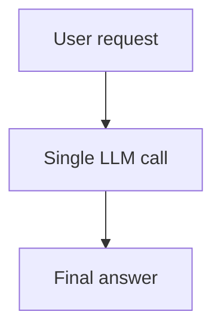
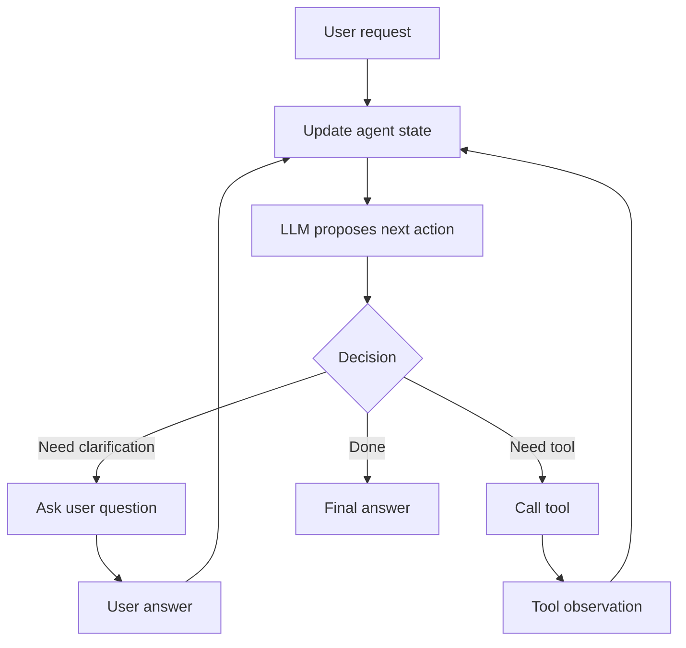
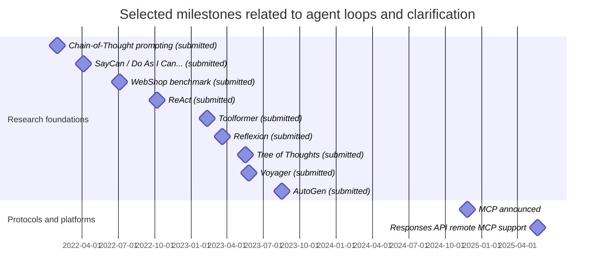

# Agent Loops That Enable LLMs to Question Users

## Executive summary

Agent loops turn a single, stateless LLM completion into a **stateful, iterative control system** that can (a) detect missing information, (b) ask targeted questions, (c) incorporate answers, and (d) continue reasoning and acting until a stopping condition is met. This “questioning” capability is not a special innate feature of the LLM; it emerges when the runtime lets the model choose an **“ask user” action** (or equivalent “pause for input” transition) and then re-enters the loop with the user’s reply in the agent state. citeturn8view0turn5view4turn5view2turn5view0

A rigorous way to think about clarification-capable agents is to separate: (1) **policy** (the model producing a next action, such as *askUser*, *callTool*, *answer*), from (2) **controller/runtime** (the code that executes actions, manages state, and enforces safety, cost, and latency constraints). Contemporary agent architectures—ReAct-style interleaving of reasoning and actions, tool-calling/function-calling, planner–executor hierarchies, and MCP-based tool ecosystems—are best seen as different *control-flow and state-management designs* around the model. citeturn21view0turn8view0turn5view5turn20view0turn3search3

Empirically, iterative agent loops can materially improve task success in interactive environments (for example, ReAct reports large absolute improvements on ALFWorld and WebShop) and improve robustness by reducing hallucination through grounded actions (e.g., tool calls, retrieval). citeturn13view0turn21view0 Clarification research in information retrieval similarly shows that asking *even a single good clarifying question* can dramatically improve outcomes under ambiguity, but user experience depends heavily on question quality and frequency. citeturn11view0turn2search9turn2search19

The main engineering trade-off is that **more turns** usually means **more tokens and latency**. Modern runtimes mitigate this with (a) server-managed conversation state (avoid resending history), (b) structured tool schemas (reduce retries), and (c) programmatic/parallel tool execution that keeps intermediate results out of the LLM context. These approaches are now explicitly documented by major platform providers. citeturn7view2turn5view4turn8view1turn7view4turn19view2

## Definitions and taxonomy of agent loops

An **agent loop** is a control process that repeatedly invokes an LLM to select a next step, executes that step (which may involve tools, environments, or user interaction), observes results, updates state, and repeats until a termination condition (“done”, “failed”, or “handoff”) is met. In the ReAct formulation, the loop is explicitly structured as interleaving “reasoning traces” and “actions”, where actions retrieve information from external sources and observations feed back into subsequent reasoning. citeturn5view0turn21view0

A key enabling observation is that most LLM APIs are **stateless per request** unless the application explicitly supplies prior messages or uses a server-side state mechanism. Therefore, an “agent” is an *application-level construct*: the developer builds multi-turn behaviour by managing conversation state, tool calls, and intermediate results across requests. citeturn5view4turn7view2turn8view0

Clarification-capable agent loops can be categorised across several orthogonal axes:

| Taxonomy axis | Endpoints of interaction | How “questioning” appears | Typical benefit | Typical risk/cost |
|---|---|---|---|---|
| User-in-the-loop clarification | User provides missing slots/constraints | Loop transitions into **ask-user** / pause state and resumes on reply | Disambiguation; avoids guessing | Extra turns; user friction; privacy concerns |
| Tool-in-the-loop (tool calling) | External APIs/functions | Model chooses a tool call; failure or missing args can trigger follow-up questions | Grounding; fresh data; deterministic ops | Tool errors; prompt injection via tool outputs; latency |
| Environment-in-the-loop (interactive tasks) | Simulated or real environment | Actions change environment; observations may prompt clarifying queries (“which target?”) | Long-horizon tasks; feedback-driven planning | Compounding errors; state explosion |
| Self-questioning (internal decomposition) | LLM asks itself sub-questions | “Self-ask” prompts model to produce follow-up questions and answers internally | Better decomposition without user burden | Hallucinated intermediate answers if ungrounded |

The first three categories align with the “LLM-as-agent in interactive decision-making” perspective found in ReAct and multi-agent frameworks, while the self-questioning category is exemplified by elicitive prompting methods like self-ask. citeturn21view0turn20view0turn16search3

A pragmatic taxonomy for engineering is also to label loops by **where control lives**:

- **Model-led control**: the LLM emits explicit next-action directives (tool call, ask user, finish), and the runtime acts as an executor. This maps directly to function/tool calling interfaces. citeturn8view0turn8view2  
- **Controller-led control**: the runtime enforces a policy (e.g., “always confirm before purchase”, “ask at most 2 questions”) and prompts the model within those boundaries. This is emphasised in safety guidance for agent builders (human oversight, prompt-injection minimisation). citeturn10view6turn10view8turn10view7

## Control-flow and runtime design patterns

### Single-pass vs iterative control

A **single-pass** assistant generates a complete answer in one shot. An **iterative** agent loop instead uses repeated cycles of (state → model → action → observation → updated state). ReAct explicitly motivates interleaving reasoning and acting to integrate external information and reduce hallucination propagation, which is a canonical iterative pattern. citeturn5view0turn21view0





The second diagram matches both (a) ReAct-style “think/act/observe” loops and (b) modern tool-calling patterns where the model decides whether it needs a tool call to satisfy the request. citeturn8view0turn5view0turn8view2

### Synchronous vs asynchronous, blocking vs non-blocking

**Synchronous (blocking)** loops pause execution until an external event occurs—most commonly, waiting for the user’s clarification. Frameworks that support explicit interrupts typically persist the graph/agent state and provide a “resume” mechanism (checkpointing + thread/run identifier). citeturn5view2turn4search6turn4search10

**Asynchronous (non-blocking)** loops decouple long-running steps from the user interaction thread. Platform-level features like background execution allow agent work to proceed asynchronously and return later, while workflow frameworks can model request/response ports that wait for outside responses without halting the whole system. citeturn19view2turn18view0

The high-level trade-off is:

- Blocking is simpler and preserves conversational coherence, but increases perceived latency and can strand resources while waiting. citeturn5view2turn18view0  
- Non-blocking improves UX for long operations and enables parallel work, but requires careful state reconciliation (e.g., stale assumptions if the user changes goals mid-flight). citeturn19view2turn7view2

### Context management, memory, and cost/latency optimisation

Agent loops are cost- and latency-sensitive because each additional step often implies at least one more model inference pass. This is explicitly highlighted in engineering guidance that notes the overhead of repeated tool round-trips and the burden of placing large intermediate tool results into the model context. citeturn7view4turn8view0

Three widely supported mitigation strategies are:

1. **Server-managed conversation state**: avoid resending full histories each turn by storing state server-side and passing only incremental input with an ID. citeturn7view2turn5view4  
2. **Structured outputs / strict tool schemas**: reduce retries caused by misformatted tool arguments by enforcing JSON-schema conformity. citeturn8view1turn8view2  
3. **Programmatic/parallel tool orchestration**: shift loops, filtering, and aggregation into code so the model sees only final summaries rather than raw intermediate data; one documented example reports substantial token reductions and latency improvements from this approach. citeturn7view4

Finally, “memory” in agent loops is best treated as *tiered state*:

- **Working memory**: current goal, constraints, and the last few turns (frequent updates). citeturn5view4turn5view0  
- **Episodic memory**: stored reflections/lessons from prior attempts (as in Reflexion’s episodic buffer) that influence future decisions without fine-tuning. citeturn15view0turn21view2  
- **External memory**: retrieval from documents/tools (often via tool calling or MCP servers). citeturn5view5turn7view3turn19view2  

## Architectures for clarification-capable agents

Clarification emerges differently depending on the architecture. The table below compares major families, focusing on *how user questioning is represented in control flow*.

| Architecture family | Core idea | How user questioning is implemented | Strengths for clarification | Key trade-offs / risks | Recommended use-cases |
|---|---|---|---|---|---|
| ReAct-style interleaving | Alternate reasoning with actions/observations | “Need info” can become a specific action (ask user) rather than a guess | Strong for long-horizon tasks; integrates observations; reduces hallucination via grounded steps | More turns → token/latency cost; needs stop criteria | Interactive tasks, browsing-like workflows, tool-augmented QA citeturn13view0turn5view0 |
| Tool-calling (function calling) | Model emits structured tool call requests | Add an explicit `ask_user` tool or treat the UI as a “tool”; missing tool args triggers clarification | Clear separation between planning and execution; tool schemas reduce brittleness | Tool outputs introduce injection surface; must manage permissions | CRUD, workflows, integration-heavy assistants citeturn8view0turn8view1turn10view6 |
| Learned tool-use (Toolformer-like) | Train model to decide when/how to call APIs | Questioning can be learned as a policy, but in practice still relies on runtime to route to user | Better tool-use decisions without prompt hackery | Training complexity; still needs safe runtime boundaries | High-volume systems with stable tool APIs citeturn21view1 |
| MCP-based tool ecosystem | Standard protocol for connecting tools/context | “Ask user” is outside MCP, but MCP standardises tool access so questions can focus on user intent not plumbing | Tool interoperability at scale; cleaner integration boundary | New trust boundary; tool outputs are untrusted input | Enterprise tool integration, IDE/assistant ecosystems citeturn5view5turn7view3turn19view2 |
| Planner–executor | Plan first, then execute steps | Clarification happens during planning (fill required slots) and at step boundaries (confirm) | Predictable; can batch questions upfront | Plans become stale; upfront planning can overfit | Multi-step ops, project planning, automation citeturn3search3turn18view0 |
| Hierarchical agents | Separate high-level deliberation from low-level execution | High-level asks user for ambiguous intent; low-level executes with minimal chatter | Better latency control; isolates fast reactions | Complexity; risk of mismatch across layers | Real-time/interactive coordination, robotics, games citeturn18view3turn22view0turn21view3 |
| Multi-agent conversation | Multiple specialised agents converse to solve | A “user proxy” agent can decide when to query the real user | Decomposes tasks; explicit interaction policies | Coordination overhead; more tokens | Complex workflows; roles (planner, critic, executor) citeturn20view0turn7view0 |

### ReAct and “reason–act–observe” as a clarification engine

ReAct’s core contribution is that interleaving reasoning traces with actions allows the model to dynamically update its plan from observations and reduce error propagation from purely internal chains of thought. That same structure naturally supports clarifying questions as just another “action” when the environment is *the user*. citeturn5view0turn21view0

ReAct also provides useful empirical grounding for the value of iterative loops in interactive settings, reporting large absolute success improvements on ALFWorld and WebShop relative to imitation learning / RL baselines under their evaluation setup. citeturn13view0turn21view0

### Tool-calling architectures and the “ask_user as tool” pattern

In function/tool calling, the model decides whether it needs external functionality to comply with a prompt and emits a structured tool call; the developer then executes the tool and returns the tool output for further model reasoning. This contracts cleanly with “ask user” because requesting missing arguments is conceptually identical to requesting missing tool input. citeturn8view0turn8view2

To reduce fragility, modern APIs explicitly recommend structured outputs and schema enforcement so that tool inputs adhere to a JSON schema (avoiding missing fields and type mismatches). citeturn8view1turn8view2

### MCP-based agents: standardising tool context so questions can target intent

Model Context Protocol standardises how a host application connects to clients and servers over JSON-RPC, with defined roles (host, client, server) and a shared contract for exposing tools and context. In clarification terms, MCP does not itself “ask the user”, but it reduces integration friction so the model can spend its questioning budget on **user goal ambiguity** rather than “which connector supports this data source?”. citeturn5view5turn7view3

MCP’s growing role is also reflected in major platform support for remote MCP servers in agentic APIs, signalling that clarification-capable agents are increasingly expected to operate in heterogeneous tool ecosystems. citeturn19view2turn5view5

### Planner–executor and hierarchical agents: controlling when questions happen

Planner–executor patterns explicitly separate (a) generating a plan and (b) executing steps, which creates natural “question gates” at (i) plan formation (fill missing slots) and (ii) before irreversible actions (confirm). Prompting approaches like Plan-and-Solve formalise a “plan then solve” decomposition, and workflow frameworks explicitly model request/response handling to wait for external input during execution. citeturn3search3turn18view0

Hierarchical agents go further by separating high-level intent reasoning from low-level reaction/execution, often explicitly measuring latency and responsiveness, and using an executor to translate macro actions into atomic actions. This layered separation is particularly useful when user questioning must be minimised (real-time systems) while still handling ambiguity robustly at the right abstraction level. citeturn18view3turn22view0turn21view3

## Clarification protocols and dialogue strategies

### What “good clarification” means in the literature

In information-seeking systems, ambiguity and underspecification motivate proactive clarifying questions; a major finding is that **a small number of high-quality questions** can significantly improve outcomes, while frequent or low-quality questions can harm user experience. citeturn11view0turn2search9turn10view0

Two primary research framings are particularly useful for agent loops:

1. **Conversational IR framing**: ask questions to narrow intent under limited bandwidth interfaces. Qulac’s offline evaluation setting and results emphasise the high leverage of “just one good question” under ambiguity. citeturn11view0turn12view0  
2. **Clarification Question Generation (CQG) framing**: large-scale datasets such as ClarQ use bootstrapping/self-supervision from community QA to study question generation quality and downstream effects. citeturn10view2turn6search6  

In practical agent loops, these framings translate directly into: (a) **how you decide to ask** (policy), and (b) **what you ask** (question content and format).

### Question templates that work well in agent loops

The most reliable clarification questions are those that map to a **small set of high-entropy “slots”** that materially change the next action. This is consistent with work that models clarification as intent partitioning (e.g., presenting candidate intent phrases/labels for user confirmation). citeturn2search3turn2search7

A compact template set that covers many agentic workflows:

| Template | When to use | Example prompt |
|---|---|---|
| Goal disambiguation | Multiple plausible intents | “Do you mean **A** or **B**?” |
| Constraint elicitation | Missing hard constraints | “What’s your budget range / deadline / target platform?” |
| Input availability | Action depends on data location | “Do you already have the file/link, or should I search?” |
| Output contract | Format affects downstream integration | “Do you want a JSON schema, Markdown report, or code?” |
| Confirmation gate | Irreversible/high-impact action | “Confirm I should send/purchase/delete X.” |

These map cleanly to tool calling and workflow safety patterns, where high-impact tool calls should be reviewed or explicitly approved. citeturn10view8turn10view7turn18view2

### Minimal question sets and multi-turn clarification strategies

A token- and UX-efficient strategy is **progressive disclosure**:

1. Ask the smallest number of questions needed to choose a correct next action.
2. Prefer *multiple choice / constrained responses* when the space is known.
3. Only ask open-ended questions when necessary. citeturn2search3turn11view0turn2search9

This is aligned with reinforcement-learning approaches to clarification that explicitly select distinguishing labels/phrases for intent confirmation, as well as with conversational IR evidence that a small number of good questions can yield large improvements. citeturn2search3turn11view0

A robust multi-turn strategy for ambiguous user intents is:

- **Turn 1**: present 2–4 candidate interpretations (“facets”) and ask the user to choose (or say “other”).  
- **Turn 2**: ask one constraint question only if needed by the selected interpretation.  
- **Turn 3**: summarise assumptions and confirm, then execute.  

This design also reflects findings that the *order and quality* of clarifying questions matter for user experience and effectiveness. citeturn2search9turn2search19

### A sample minimal clarification protocol designed to reduce token usage

Below is a practical, implementation-oriented protocol (two turns when possible) that is explicitly designed to reduce both (a) number of turns and (b) per-turn prompt size.

**Protocol: Compact Slot-First Clarification (CSFC)**  
Design rationale: minimise tokens by (i) limiting questions to the few slots that change tool choice, (ii) compressing user responses into enumerated choices, and (iii) avoiding repeated context via server-managed state and summarised state updates. citeturn7view2turn5view4turn8view1turn7view4turn11view0

**CSFC steps**

1. **Extract candidate task frame**: parse goal + likely tools; identify required slots for the chosen tool chain. citeturn8view0turn3search3  
2. **Ask at most 2 questions**, each either multiple choice or requesting a single short value. citeturn2search3turn11view0  
3. **Confirm a compact summary** of filled slots and defaults in one sentence, then proceed. citeturn10view7turn10view8  
4. **Persist state efficiently** (server-managed conversation ID / previous response ID, or equivalent) so you do not resend full transcripts. citeturn7view2turn5view4  
5. **Keep intermediate tool outputs out of the model context** where possible (aggregate/summarise in code), which is a documented method for reducing token consumption and avoiding repeated inference passes. citeturn7view4  

Pseudocode sketch:

```python
def csfc_clarify(user_request, state):
    frame = propose_task_frame(user_request, state)  # goal + candidate tools + required slots

    missing = required_slots(frame) - filled_slots(state, user_request)
    high_entropy = rank_by_decision_impact(missing)

    questions = []
    for slot in high_entropy[:2]:
        questions.append(make_compact_question(slot, frame))  # prefer multiple-choice

    if questions:
        ask_user("\n".join(questions))  # blocking: pause loop
        answers = get_user_reply()
        state = update_state_with_answers(state, answers)

    summary = summarise_slots_and_defaults(state, max_len_tokens=60)
    ask_user(f"Confirm: {summary} (yes/no)")  # optional if high-stakes
    if get_user_reply().strip().lower() != "yes":
        return "halt_or_reframe"

    return "continue_execution"
```

The key token-saving mechanisms are (a) **fewer turns**, and (b) **shorter turns** (by constraining responses and by avoiding injecting large intermediate results into context). A concrete example of large token reductions from keeping intermediate results out of context is documented in programmatic tool calling guidance, which reports lower average token usage for complex workflows when orchestration is done in code rather than in repeated natural-language tool-call round-trips. citeturn7view4

## Safety, privacy, and prompt-engineering guardrails

### Threat model: why clarification loops change safety posture

Agent loops expand the attack surface because the conversation context can include untrusted text from many sources (web pages, documents, tool outputs). Prompt injection is explicitly identified as a key challenge for agentic systems that browse, connect to apps, or call tools, because injected instructions can cause unintended actions or data exfiltration. citeturn10view7turn10view6turn9search3

From a clarification perspective, two risk patterns recur:

- **Injected “don’t ask the user, just do X” instructions** in tool outputs. citeturn10view6turn10view7  
- **Over-collection or over-sharing of sensitive information** when the agent asks broad questions or sends too much context to connected tools. citeturn10view6turn18view1  

### Prompt engineering that reduces hallucination and unsafe guessing

A core safety/quality principle is: **ask when required information is missing; do not guess**. This is consistent with documented safety best practices recommending prompt engineering to constrain behaviour and human oversight for high-stakes domains. citeturn10view8turn10view6

A robust system-prompt pattern (conceptual):

- Define what counts as “required information” (slots) for each tool/action.
- Instruct the model to output either (a) a tool call, (b) a clarification question, or (c) a final answer.
- Explicitly forbid irreversible actions without user confirmation. This matches recommended “confirm consequential actions” guidance. citeturn10view7turn18view2turn10view8

### Guardrails: consent, least privilege, and defensive runtime design

Practical guardrails that directly affect clarification loops:

- **Least privilege on tools and credentials**: limit what the agent can access; enforce scopes/permissions on every tool call, and avoid long-lived secrets. citeturn18view1turn10view7  
- **Human-in-the-loop review**: require human review or approval before high-impact tool calls, especially in high-stakes settings. citeturn10view8turn5view2  
- **Sandboxing and safe defaults**: start with read-only permissions and controlled web access modes; treat tool outputs as untrusted. citeturn18view2turn10view6turn9search3  
- **Adversarial testing (red teaming)**: explicitly recommended to assess whether users (or injected text) can redirect the agent. citeturn10view8turn10view7  
- **Risk management framing**: broader AI risk frameworks emphasise context-sensitive risk identification and governance for trustworthy deployment. citeturn9search2turn9search10  

## Evaluation, failure modes, and future directions

### Metrics for clarification-capable agent loops

Evaluation should measure not only final correctness but also the *process* (how efficiently and safely the agent converges). Benchmarks for LLM agents have increasingly shifted toward multi-turn, interactive evaluation (AgentBench), tool-use datasets (ToolBench/ToolLLM), and analytical boards that expose intermediate progress metrics (AgentBoard). citeturn17search1turn17search0turn17search2turn18view4

A practical metric suite:

| Metric | What it captures | How to measure | Representative sources/precedents |
|---|---|---|---|
| Task success | Did the agent accomplish the goal? | Success rate in environment or workflow | ReAct reports success on ALFWorld/WebShop citeturn13view0turn19view0 |
| Clarification efficiency | Did the agent ask the minimum necessary? | #questions, #turns before execution | Qulac framing; CQG literature citeturn11view0turn6search6 |
| Token usage | Cost proxy; prompt/response size | Total tokens per task, incl. tool returns | Tool orchestration guidance reports reductions citeturn7view4turn7view2 |
| Latency | UX and system throughput | Wall-clock time; #model inferences | Hierarchical agent work measures response latency citeturn18view3turn7view4 |
| User satisfaction | Subjective UX of questioning | Post-task survey, A/B tests | Studies on “benefit vs disturb” citeturn2search9 |
| Safety compliance | Avoided unsafe actions/data leaks | Policy checks; red-team outcomes | Agent-builder safety + prompt-injection guidance citeturn10view6turn10view7turn9search3 |

### Empirical signals and representative results

While direct “LLM asks user clarifications” head-to-head agent benchmarks are still comparatively scarce, there is substantial adjacent evidence that **iterative interaction loops** and **well-designed clarification** materially improve outcomes:

- ReAct reports large absolute success gains on interactive benchmarks and emphasises reduced hallucination by retrieving external information. citeturn13view0turn5view0  
- Conversational IR work reports that a single high-quality clarifying question can yield very large retrieval improvements under ambiguity (in their oracle evaluation). citeturn11view0  
- Programmatic tool orchestration guidance reports reduced token consumption and improved latency by keeping intermediate data out of the model context and reducing repeated inference passes. citeturn7view4  
- Tool-use benchmarks and frameworks (ToolBench, AgentBench, AgentBoard) reflect the broader shift toward measuring agent performance in multi-turn, tool-rich settings—precisely where clarification becomes a first-class capability. citeturn17search0turn17search1turn18view4turn17search2  

### Failure modes and mitigations

Over time, clarification-capable agents tend to fail in a small number of recurring ways:

1. **Over-questioning (user fatigue)**: the agent asks too many questions or asks low-value questions, which can disturb users and reduce satisfaction. Mitigation: cap questions per task (e.g., ≤2), prefer multiple-choice facets, and maintain an explicit “confidence threshold” for when to ask vs proceed. citeturn2search9turn12view0turn2search3  
2. **Under-questioning (hallucinated defaults)**: the agent silently assumes constraints, leading to wrong actions. Mitigation: “no-guess” system prompt + slot checks + mandatory confirmation gates for high-risk actions. citeturn10view8turn10view7turn18view2  
3. **Ambiguity loops (asking without converging)**: questions do not reduce uncertainty. Mitigation: ask discriminative questions that explicitly partition intent (label lists) and maintain a stopping criterion. citeturn2search3turn12view0  
4. **State drift / context bloat**: iterative loops accumulate irrelevant context, raising cost and confusing the policy. Mitigation: server-managed state with summarisation, strict memory tiering, and keeping large tool outputs out of context. citeturn7view2turn7view4turn5view4  
5. **Prompt injection and data exfiltration**: untrusted tool outputs override instructions or cause leakage. Mitigation: treat all external text as untrusted; enforce instruction hierarchy and explicit permission checks; least-privilege tools; human review for sensitive actions. citeturn10view7turn10view6turn18view1turn9search3  
6. **Non-idempotent side effects around pauses**: if the agent pauses mid-action and retries, it may duplicate side effects. Mitigation: design tools to be idempotent and follow interrupt rules that caution against unsafe control-flow placements. citeturn5view2turn18view0  

### Practical design checklist for building clarification-capable agents

This checklist distils the report into “build-time” decisions. Each item maps to documented patterns in agent tooling, clarification research, or agent safety guidance. citeturn8view0turn5view2turn11view0turn10view6turn7view4turn19view2

- Define a **task frame** schema (slots) for each major intent; implement a deterministic “missing required slots?” validator before tool calls. citeturn8view0turn8view1  
- Implement **ask_user as a first-class action** (tool or state transition) with a strict output schema and an explicit resume path. citeturn5view2turn8view0turn18view0  
- Enforce a **question budget** (e.g., max 2) and prefer multiple-choice facet questions when possible. citeturn2search3turn2search9turn11view0  
- Add **confirmation gates** before irreversible actions (purchase, send, delete) and log the user’s consent. citeturn10view7turn18view2  
- Minimise prompt injection risks: treat tool/web content as untrusted; validate/strip unexpected instructions; least-privilege scopes; red team. citeturn10view6turn10view7turn10view8turn18view1  
- Optimise token and latency: server-managed conversation state; structured outputs; summarise tool results in code; batch/parallel tool calls where safe. citeturn7view2turn8view1turn7view4turn19view2  
- Evaluate with both **outcome** and **process** metrics (success rate, turns/questions, tokens, latency, satisfaction, safety). Prefer multi-turn agent benchmarks when relevant. citeturn17search1turn17search2turn17search0turn18view4  

### Open research questions and future directions

Several research gaps are especially relevant to user-questioning agent loops:

- **When should an agent ask?** Formal policies that optimise information gain vs user burden are still an active area, with existing strands in conversational IR, RL-based clarification, and multi-turn agent benchmarks not yet fully unified. citeturn11view0turn2search7turn17search2  
- **Robustness under prompt injection with tool ecosystems**: as agents increasingly integrate with tool protocols and remote servers, distinguishing trusted instructions from untrusted context remains a central challenge, explicitly identified as “frontier” security work. citeturn10view7turn10view6turn5view5  
- **Evaluation beyond success rate**: analytical evaluation frameworks emphasise that stepwise progress and grounding accuracy provide deeper insight than final success alone; this is especially important for diagnosing “bad questions” and non-convergent dialogue. citeturn17search10turn18view4  
- **Cost-aware agent design**: platform features (background execution, reasoning summaries, encrypted reasoning items) and engineering patterns (programmatic tool calling) are moving quickly; the field still needs standardised methods to compare “more turns” vs “more compute per turn” trade-offs. citeturn19view2turn7view4  



The dates correspond to submission/publication timestamps on the cited primary sources and official announcements. citeturn20view1turn22view0turn19view0turn21view0turn21view1turn21view2turn14view0turn21view3turn20view0turn7view3turn19view2

```text
Selected primary sources (URLs)
- ReAct paper: https://arxiv.org/abs/2210.03629
- Chain-of-Thought prompting: https://arxiv.org/abs/2201.11903
- Toolformer: https://arxiv.org/abs/2302.04761
- Qulac / Asking Clarifying Questions (SIGIR 2019): https://arxiv.org/abs/1907.06554
- ClarQ dataset (ACL 2020): https://aclanthology.org/2020.acl-main.651.pdf
- OpenAI function calling guide: https://developers.openai.com/api/docs/guides/function-calling/
- OpenAI agent safety guidance: https://developers.openai.com/api/docs/guides/agent-builder-safety/
- OpenAI prompt injection overview: https://openai.com/index/prompt-injections/
- LangGraph interrupts (pause/resume): https://docs.langchain.com/oss/python/langgraph/interrupts
- MCP specification: https://modelcontextprotocol.io/specification/2025-06-18
- Anthropic MCP announcement: https://www.anthropic.com/news/model-context-protocol
```