# Executive Summary  
Retrieval-Augmented Generation (RAG) augments an LLM with an external knowledge store (e.g. vector DB), ensuring answers are grounded in real data【17†L240-L246】【25†L139-L144】. Its key strengths are **scalability**, **up-to-dateness** (since the datastore can be refreshed), and reduced hallucinations via citations【17†L248-L254】【20†L534-L537】. However, RAG requires building and maintaining a retrieval pipeline (vector index, embeddings) and can add latency. 

**Alternative architectures** trade off along similar axes: some rely entirely on larger LLM context windows, others on encoding knowledge in parameters (fine-tuning) or tools/external systems. For each approach, we compare core architecture, tradeoffs and use-cases below. A summary comparison is in Table 1 and the radar chart. 

**Key takeaways:** 
- **Long-Context LLMs** remove retrieval steps but incur huge token costs and often worse factual accuracy (no external check)【17†L248-L254】【20†L500-L507】. They excel at tasks like summarising very long documents end-to-end, but risk hallucination and cost far more compute.  
- **Fine-tuning / Parametric Methods** bake data into model weights. They’re great for narrow domains with abundant training data (custom LLMs for legal, medical, etc.), but are costly to train and hard to update continuously【25†L147-L156】【23†L21-L28】. They also still hallucinate absent data, and losing access to external facts. 
- **Tool/Function Calling** makes the LLM an orchestrator that invokes external APIs or code. This yields high **accuracy** for well-defined tasks (e.g. calculators, booking APIs) and ensures determinism, but demands engineering each tool interface【38†L566-L573】【36†L232-L239】. It’s ideal when tasks have clear algorithmic steps or need live data.  
- **Knowledge Graphs (KGs)** act as structured retrieval sources. Graph-based RAG (e.g. Microsoft’s GraphRAG【31†L111-L119】【58†L40-L49】) extracts entities/relations and augments LLM prompts with them. KGs support multi-hop reasoning and interpretability, but incur high engineering cost to build and maintain the graph structure. They suit complex query domains (enterprise data, scientific QA).  
- **Agent Memory Systems (Episodic/Semantic Memory)** let an agent persist conversation or action history (often as vectors, KGs or log entries)【27†L125-L134】【28†L102-L111】. This boosts personalization and multi-step continuity. It requires designing what to store (task-relevant facts, user history) and how to retrieve it. Memory systems can be vector caches, hierarchical storages, or event logs【28†L100-L109】. 
- **SQL/DB-Augmented Methods** make the LLM issue structured queries. For example, a prompt may be converted to SQL by the LLM, executed in a database, and results fed back (similar to fine-grained RAG but leveraging schema)【7†L219-L227】【25†L151-L160】. This is highly precise for data lookup/analytics and avoids hallucination, but only works when data are structured and the domain can be coded in queries. 
- **Symbolic/Programmatic Reasoning (Neurosymbolic)** has the LLM emit code or logic (e.g. Python, Prolog) which is executed by a precise engine【42†L122-L131】【48†L242-L249】. This yields **auditable, correct answers** for math, logic or rule-based tasks, and greatly reduces hallucination. It requires defining the right formalism (and safe execution environment) and works best in domains reducible to symbolic logic. 
- **Mixture-of-Experts (MoE) or Multi-Model Routing** uses a *router* to dispatch queries to specialized sub-models【44†L71-L80】【44†L106-L113】. For example, an incoming question is routed to a finance expert or a math expert model. This yields top performance in each niche (often with smaller models) and lowers inference cost (only one expert runs)【44†L34-L42】【44†L71-L80】. However, it adds complexity (router training, many models to maintain) and is nascent in practice. 
- **Compressed Knowledge Stores / Context Compression** refers to summarising or condensing information to fit within an LLM’s context【45†L37-L41】【46†L1637-L1645】. This includes techniques like hierarchical summarization, caching key tokens, or learned compression (e.g. QwenLong-CPRS, InfLLM)【45†L37-L41】【46†L1637-L1645】. It allows longer “virtual” context with limited compute, but with a risk of information loss and tuning complexity. It’s used for extremely long inputs (books, logs). 
- **Search-Based Agents** integrate web search engines or document search. Instead of a local store, the system might send queries to Google/Bing and feed snippets back to the LLM. This keeps knowledge fresh and broad but introduces external API dependencies and privacy concerns. Use-cases include answering current events or open-domain queries with web facts. 
- **MCP / Tool Ecosystems**: The Model Context Protocol (MCP) is an emerging standard that lets LLM clients discover and call arbitrary services as “plugins”【52†L148-L156】【52†L158-L166】. An agent using MCP can, for instance, route parts of a query to a Slack bot, an email sender, or a DB query without bespoke integration. This aims to unify tool access but is still new and requires ecosystem adoption. It effectively formalizes the tool-calling approach. 
- **Hybrid Systems** combine the above patterns. For example, *GraphRAG* is a hybrid of RAG+KG【31†L93-L100】【31†L125-L134】, *function-augmented RAG* adds tools to RAG【38†L580-L584】, and *Chain-of-Code* merges code-execution with LLM-based simulation【48†L242-L249】. Hybrids often exploit the best of each approach (e.g. retrieving knowledge and then applying symbolic logic to it). They are complex but increasingly common in production (agents that both search and compute, RAG with API calls, etc.).

Below we detail each alternative. Each section includes an **architecture diagram**, pros/cons, trade-offs (latency, cost, freshness, etc.), use-cases and examples, and guidance for migrating from RAG.

## Retrieval-Augmented Generation (RAG)  
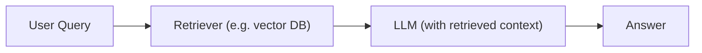
**Description:** The user’s query is used to fetch relevant documents (via embeddings) from an external store, and those documents are passed into the LLM’s prompt as context【17†L240-L246】. The LLM generates its answer using both its internal knowledge and the retrieved snippets【17†L248-L254】. RAG often includes a reranking or filtering step and may cite source IDs in the response.  

**Pros:** Freshness (knowledge can be updated by re-indexing), high **accuracy** on factual queries, and lower hallucination since answers are grounded in real data【17†L248-L254】. It is highly scalable: vector search over millions of chunks incurs only logarithmic latency growth【28†L142-L150】. Citations enable transparency and downstream verification【25†L139-L144】.  

**Cons:** Additional system complexity (maintaining an index, embedding pipeline). Retrieval adds latency (though often millisecond-scale). Hallucinations aren’t eliminated entirely (LLM may still misinterpret retrieved text). Also, if the retrieval fails to find a relevant chunk, RAG can still hallucinate or answer “I don’t know”.  

**Typical use-cases:** Customer support Q&A, knowledge bases, document QA, any application needing up-to-date information. For example, answering legal or medical questions by searching proprietary docs【25†L151-L160】【17†L248-L254】.  

**Examples:** OpenAI’s RAG patterns (using `text-embedding-ada-002` + vector DBs like Pinecone/Weaviate), LangChain’s RAG chains, AWS Bedrock Retrieval. Open-source projects: Haystack (deepset), LlamaIndex (indexing for RAG), Microsoft’s RAG-based Copilot. There are also prebuilt services like Azure AI Search’s RAG integration【39†L9-L13】.  

**When vs. moving away from RAG:** Continue RAG when you need continuous updates or explainability. Hybrid patterns often layer RAG with tools or graphs (e.g. RAG + API calls) if extra precision is needed【38†L580-L584】.

## Long-Context LLMs (no RAG)  
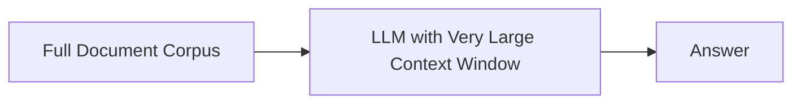
**Description:** Advances in model architecture have dramatically increased the context window (e.g. GPT-4o with >1M tokens). In a “long-context” approach, you feed the *entire* relevant text into the LLM prompt (often hierarchically chunked or with specialized sparse-attention). The LLM processes it end-to-end without separate retrieval.  

**Pros:** Conceptually simple: no need to build or maintain a retrieval system. Can achieve high *coverage* of content if the model is powerful enough【20†L500-L507】. Useful for tasks like summarizing or rewriting entire documents, or when you want the model to reason over many parts of a text.  

**Cons:** **Cost and latency:** processing very long prompts is expensive (self-attention scales quadratically) and slow. It also increases API token usage (thus cost). Crucially, without explicit retrieval, factual accuracy suffers; the model may hallucinate answers that aren’t in the text. Studies show pure long-context models have much lower citation accuracy than RAG variants【17†L248-L254】【20†L509-L517】. There is also “position bias”: items late in a long context may be overlooked. Models still have finite context, so exceedingly large corpora can’t be input at once.  

**Trade-offs:** Full-context inference may improve *coverage* (touching on every piece of info) but greatly reduces factual grounding【20†L500-L507】【20†L509-L517】. It also demands more compute and memory. If your LLM API allows extremely long inputs, you might try long-context. For example, Anthropic Claude 3 and GPT-4o support multi-hundred-thousand token contexts.  

**Use-cases:** Best for tasks needing global understanding rather than pinpoint facts – e.g. summarising a full book, generating code from large codebase, or doing extensive multi-document analysis in one go. For QA, it is typically inferior to RAG for factual precision【17†L248-L254】.  

**Examples:** GPT-4o (`gpt-4o` with 200K token context), Anthropic Claude 3 Grande (2M tokens). Tools like LongChat (Meta) or Llama2-70B with custom context.  

**Migration guidance:** If currently using RAG for QA but want to switch to longer context, ensure your model can handle it. A hybrid is often optimal: use RAG to filter to a smaller relevant set, *then* feed that to the model as a long context. In some cases, using retrieval *within* the long context (known as “self-RAG” or “agentic RAG”) can help. Only ditch RAG entirely if (a) your use-case is batch processing of large texts, and (b) you can afford the compute/time.  

## Fine-Tuning / Parametric Memory  
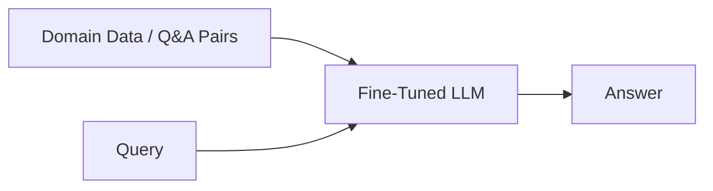
**Description:** Fine-tuning adjusts the weights of an LLM on domain-specific data or tasks. Unlike RAG, knowledge is encoded in the model parameters rather than retrieved at runtime. Parameter-efficient fine-tuning methods (LoRA, adapters) also exist to update only part of the model【23†L45-L52】.  

**Pros:** The model *internalises* domain knowledge and tasks. Inference is very fast (just a model call, no retrieval latency) and very interpretable in the sense that behavior is custom-trained (though not transparent!). If you have abundant labeled data, fine-tuned models often achieve very high accuracy on their niche tasks. You don’t need runtime external storage once the model is updated. Fine-tuning can also reduce some hallucinations by teaching the model correct Q&A pairs【25†L147-L156】.  

**Cons:** **Updatability:** knowledge is “frozen” at training time. Updating data requires retraining. Fine-tuning is compute-intensive and complex to set up (needs GPUs/TPUs, careful hyperparameter tuning). It can overfit to the provided data and amplify biases【25†L73-L81】. Also, there’s still a risk of hallucination on unseen questions (if knowledge wasn’t in training). You must gather large high-quality labeled datasets. Licensing is an issue: proprietary models may not allow fine-tuning, while open models may not match performance.  

**Trade-offs:** Fine-tuning yields excellent performance on specific tasks (like sentiment analysis, classification, or domain-specific QA【25†L39-L47】), but at cost of flexibility. Maintenance overhead is high: retune periodically as knowledge evolves. If your system currently uses RAG to keep model knowledge current, fine-tuning loses that quick-update advantage.  

**Use-cases:** Best when the target task is narrow and well-defined with plentiful data. Examples: customizing an LLM to answer legal queries about a specific law firm’s corpus, training a model to convert natural language to SQL for a fixed schema, or creating a medical chatbot trained on one hospital’s documents. Also used for tasks like summarization or translation by example【25†L43-L51】.  

**Examples:** OpenAI’s fine-tuning API (GPT-3.5/4 fine-tunes), Hugging Face PEFT scripts, Meta’s LLaMA fine-tuning. Domain-specific LLMs (BloombergGPT, BioBERT, etc.) are essentially fine-tuned. LoRA and Adapter libraries allow smaller edits.  

**Migration guidance:** Use RAG for broad, evolving knowledge needs, and reserve fine-tuning for clearly delimited tasks. In hybrid systems, one might fine-tune a model on likely questions and still back it with retrieval. The [Neo4j analysis][25] notes: *“The retrieval-augmented approach has some clear advantages over fine-tuning: The answer can cite sources… and update the underlying information easily”*【25†L139-L144】. Generally, migrate to fine-tuning only if a static, specialized knowledge base is small and stable, and you need maximum throughput or integration simplicity.

## Tool-/Function-Calling Agents  
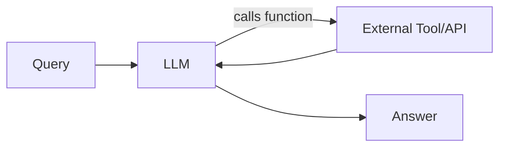
**Description:** Here the LLM is augmented with pre-defined *actions* or APIs it can call. Given a query, the model may decide to invoke an external function (e.g. a calculator, a search API, a database query) by outputting a structured JSON “function call”【36†L234-L242】. The result of that call is then fed back as additional context before finalizing the answer. This is the approach behind OpenAI’s Function Calling and agentic frameworks like LangChain’s tools.  

**Pros:** Deterministic and up-to-date. For tasks that can be clearly codified (math ops, data lookup, scheduling), this provides exact answers with no hallucination risk. For example, using a financial calculator API or a flight-booking API ensures correctness and live data【38†L566-L573】. It also offloads specialized processing (summations, database logic) outside the LLM. The LLM doesn’t need internal knowledge of those specifics. It’s also highly flexible: any service (weather, maps, CRM) can be a tool.  

**Cons:** Requires engineering each tool’s schema and hooking it up. The LLM must be trained or prompted to use the tool correctly, and there’s an integration layer to parse its calls and route them to actual endpoints. Latency depends on external API performance. There is still some hallucination risk in the reasoning parts, but not in the tool result. Also, security can be a concern (the model could attempt malicious function calls if not controlled). 

**Trade-offs:** Compared to RAG, tool-calling is superior when the task is an *action* or structured query rather than retrieval of info. It doesn’t directly handle free-text knowledge beyond what’s built into the model or tools. In terms of cost, tool calls may be cheaper (free internal compute) but incur API costs or dev time. Engineering complexity is high (you need developer integration) but once built, maintenance is lower than re-training.  

**Use-cases:** Booking systems, financial calculators, IoT control, or any workflow requiring an API. Example: Chatbot can call a weather API for current weather (instead of hallucinating data), or call `db_query()` to run SQL. It’s great for data-entry validation, precise coding tasks, and operations on structure.  

**Examples:** OpenAI’s Function Calling (GPT can invoke user-provided functions), Microsoft’s GPT-4 “plugins” (browsing, retrieval, weather). LangChain agents (ReAct, PAL) use tools. The Stripe AI SDK (Weather, payments examples)【36†L238-L242】. OpenRouter, LLamaIndex API tools, etc. A hybrid example: RAG can fetch relevant schema, then LLM calls a SQL API (function) to get answers.  

**Migration guidance:** If your RAG agent’s bottleneck is answering tasks that are algorithmic (calculators, queries) rather than knowledge-based, consider adding function calling. You can combine: e.g. retrieve facts with RAG and then call a computation tool on them【38†L580-L584】. The stream.ai guidance notes that *“If your application requires both up-to-date knowledge and system integration, a hybrid approach can combine RAG … and Function Calling”*【38†L580-L584】.  

## Knowledge Graphs & Graph-RAG  
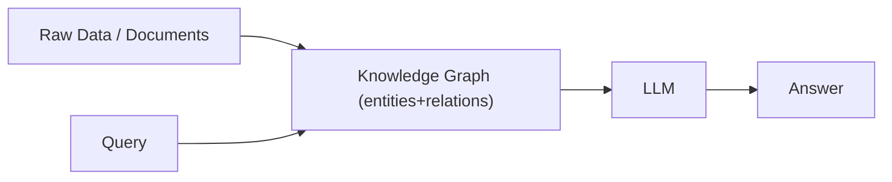
**Description:** A knowledge graph (KG) stores facts as triples or entities connected by edges. In a KG-based approach, queries navigate the graph (often using Cypher or path search) to retrieve relevant subgraphs, which are then provided to the LLM【31†L93-L100】【58†L40-L49】. Microsoft’s *GraphRAG* builds a hierarchical KG and summaries of communities, then augments prompts with graph-derived context【31†L93-L100】【31†L125-L134】.  

**Pros:** Excellent for relational and multi-hop queries. KGs encode explicit semantics, so reasoning can traverse relations (e.g. “What projects are led by Alice’s colleagues?”) more reliably than text search. They tend to reduce hallucinations since facts come from a precise schema. Graphs offer high **interpretability** – one can trace which path yielded the answer. They also naturally integrate with semantic search on entities.  

**Cons:** Building and updating a graph is laborious. You need entity extraction, ontology design, and continuous curation. Graph queries (traversals, community detection) can be complex to implement. Latency may increase if subgraph retrieval is large. Also, very long context windows may still be needed to prompt on a graph summary.  

**Trade-offs:** KG approaches **scale** well to extremely large, structured knowledge bases (e.g. Wikidata, enterprise metadata)【58†L30-L39】, but at high upfront cost. Freshness is moderate – graphs can be updated, but not as fluid as re-indexing vectors. Interpretability is high. Hallucination risk is very low. Overall engineering complexity is higher than vanilla RAG.  

**Use-cases:** Enterprise knowledge management, scientific literature mining, legal domains where relationships matter. E.g. querying corporate networks, supply chains, or complex regulatory networks. Multi-hop QA (questions requiring connecting two facts) is a sweet spot (GraphRAG showed big gains there【31†L123-L132】).  

**Examples:** Microsoft’s GraphRAG toolkit (open-source)【31†L83-L93】【31†L123-L134】. Neo4j’s Graph Data Science with LLM integration. LlamaIndex’s Graph Index. Google Knowledge Graph Search API (as an example). In academic work, KG-augmented RAG (often called “GraphRAG” or “KG-RAG”) is studied in QA tasks.  

**Migration guidance:** Graph RAG often **extends** RAG rather than replacing it. You might build a small graph on top of your existing RAG docs to capture key entities, then query that graph at runtime. If RAG’s retrieval produces many fragmented answers, introducing a graph layer can help synthesize them. If your domain is highly relational, consider pivoting to or augmenting with a graph.

## Agent Memory Systems (Episodic/Semantic Memory)  
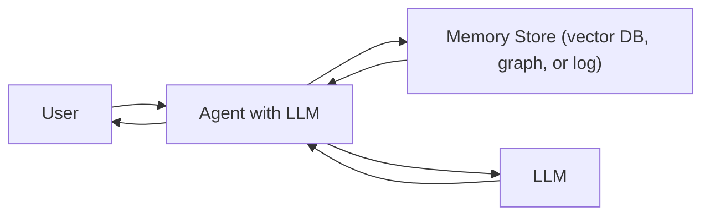
**Description:** Agentic AI frameworks often include explicit **memory** components. Short-term memory (e.g. a scratchpad) stores the current conversation context【27†L127-L134】, while long-term memory stores past interactions (semantics, user preferences, outcomes) in an external datastore (vector DB, graph, or event log)【27†L125-L134】【28†L100-L109】. At each step, the agent retrieves relevant memory (e.g. “previous solutions to similar problems”, user likes/dislikes) and uses it to inform the LLM.  

**Pros:** Memory enables personalization and long-term consistency. The agent “remembers” facts across sessions, learning from past dialogues. For multi-turn workflows, memory can dramatically improve efficiency (no need to restate facts) and relevance. Different memory architectures exist: plain vector caches (MemGPT style), hierarchical knowledge graphs (LangGraph/Zep), or even execution logs【28†L102-L111】.  

**Cons:** Designing memory is complex. Deciding what to store (every message? only key facts?) and how to index it affects performance. Vector memories risk “semantic drift” and temporal incoherence【28†L173-L182】. Graph memories need a schema and can become stale or hard to update. Overall system complexity is high (you now have an LLM plus retrieval logic plus update logic).  

**Trade-offs:** Memory systems score very high on personalization but can hurt scalability if not pruned. Recall accuracy depends on the storage method: vector memory is fast but less interpretable; graph memory is interpretable but harder to maintain【28†L100-L109】. Memory augmentation can reduce hallucinations (answers rely on stored facts) but also accumulate stale or incorrect data if unchecked【28†L173-L182】. 

**Use-cases:** Long-running assistants (personal aides, therapy bots), study or tutoring apps (remember what a user learned), or agents in multi-step pipelines (e.g. a planner that remembers subplans). For example, a code-assistant might remember a user’s coding style or a customer-service bot remembers prior tickets.  

**Examples:** LangChain’s Memory modules (ConversationBufferMemory, KnowledgeGraphMemory). The ALAS and LangGraph frameworks【28†L105-L114】. Vector-based agents like MemGPT. The advent of dedicated memory frameworks (e.g. Zep by LangChain, “MyAssistant” demos). Many agent libraries now include memory abstractions (LangGraph, Autogen memory).  

**Migration guidance:** Agentic memory typically *augments* RAG rather than replaces it. You would use memory for persisting context across turns and RAG for fresh external info. If you built a RAG chatbot that loses track of user preferences, adding memory is beneficial. But if you only need one-off factual QA, memory may be unnecessary overhead.

## SQL / Database-Augmented Generation  
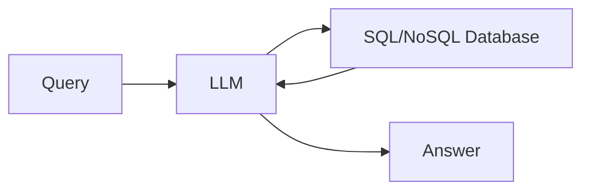
**Description:** Here the LLM generates and issues structured queries to a database as part of its process. It is similar to tool-calling, except the tool is a query engine. For instance, the LLM may translate a natural-language request to SQL (with or without user confirmation), run it on a data warehouse, then integrate the results in its final answer. This can also be seen as a special case of RAG: the retrieved “context” is the query result.  

**Pros:** Very high precision for data lookup. The LLM’s answer is backed by exact database answers, eliminating hallucination on factual data. Useful for analytics, reporting, and applications where data is already highly structured. Can leverage database features (joins, filters) that are hard to mimic in LLM context alone. May be faster than retrieving many text docs when the database is optimized.  

**Cons:** Requires perfect natural-to-SQL conversion or templates; otherwise the model may craft incorrect queries (with standard risks of SQL injection if unsafeguarded). Only works if the needed knowledge lives in the database. Complex transactions or proprietary DB logic require additional interfacing. Like any RAG variant, misinterpreted results can confuse the LLM’s generation.  

**Trade-offs:** Very low **hallucination risk** (once data is retrieved) and good **freshness** (live DB), but moderate to high engineering effort (schema mapping, secure connections). Scalability depends on DB size/indexing; very large tables may slow queries.  

**Use-cases:** Business intelligence bots, data assistants (e.g. “What were last quarter’s sales by region?”), any scenario with large structured data. A text-to-SQL agent (like Microsoft’s Power Virtual Agents) is a form of this.  

**Examples:** LangChain’s SQL Database chain, AWS QLDB/RDS with GPT. “Text-to-SQL” retrieval agents (Sigma Computing’s BI assistant). OpenAI’s recommended RAG recipes include a step where LLM emits SQL. Many engineers use LLMs (ChatGPT) with direct DB connections (via APIs or ODBC) for internal tools.  

**Migration guidance:** If your RAG setup was indexing table-exported text, switch to real SQL queries for precision. Hybrid: some systems use RAG to find relevant tables then LLM to query them. Use SQL-augmented LLMs when data is highly structured and correctness is paramount; keep using RAG when data is unstructured or you need broad retrieval.

## Symbolic / Programmatic Reasoning  
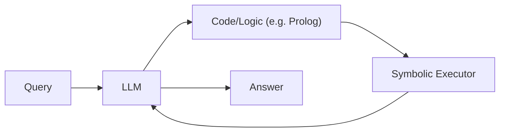
**Description:** In these architectures, the LLM formulates a solution in a formal language, and a separate engine executes it. For example, the model might output a Prolog program or a Python script (Chain-of-Thought as code). The code is then run by a symbolic reasoner or interpreter to get a definitive answer. The LLM can also simulate parts of the code if not executable (as in Chain-of-Code【48†L242-L249】).  

**Pros:** **Auditability and correctness.** Symbolic execution guarantees logical consistency, greatly reducing hallucination. This approach shines in math, logic puzzles, scheduling, or any domain expressible in code/rules【42†L122-L131】【48†L242-L249】. Also, one can inspect the code to understand the reasoning.  

**Cons:** Requires mapping the problem to a formalism. Not all tasks fit into code easily (e.g. open-ended dialogue). Execution environment complexity (sandboxes, safety). It is slower (code generation + execution). It often requires a multi-step loop (LLM writes code, engine runs, LLM continues), raising engineering complexity.  

**Trade-offs:** Very **low risk of hallucination** (since facts are computed), and high interpretability. However, scalability is limited by the symbolic engine’s capacity and the LLM’s ability to write correct code. Freshness depends on the language library (for external data calls).  

**Use-cases:** Math problem solving (GSM8K, MATH competitions), logical inference, optimization (e.g. route planning with a solver), any task where precise arithmetic or logic is needed. For instance, DeepMind’s AlphaCode style code generation tasks or WolframAlpha-like computations.  

**Examples:** The recent LoRP paper used GPT-4 to emit Prolog and executed it, achieving near-perfect reasoning【42†L122-L131】. OpenAI’s Code Interpreter (GPT-4o with Python runtime) lets the model write and run Python for data analysis. Chain-of-Code【48†L242-L249】 is a framework combining code execution with LLM-simulated steps. Tools like OpenAI’s `toolformer` fine-tune models to use functions or code.  

**Migration guidance:** Replace RAG when deterministic logic is needed. For example, a system now retrieving formulas could instead generate and run them in code. Often this is hybrid: use RAG to fetch facts, then symbolic code to compute. When to prefer symbolic: any time you catch the model hallucinating arithmetic or consistency.  

## Mixture-of-Experts (MoE) / Multi-Model Routing  
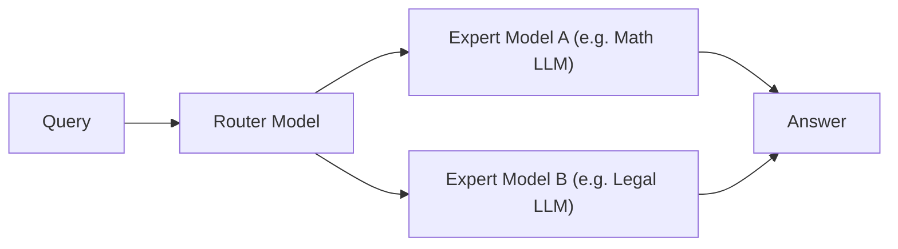
**Description:** These architectures use a gating mechanism (router) to select one or more specialized sub-models (“experts”) for each input. In *integrated MoE* (e.g. Switch Transformer) this routing happens at token-level inside a single Transformer. In *multi-model routing* (MoDEM【44†L71-L80】) a separate classifier (BERT, another LLM) assigns each query to a domain-specific LLM.  

**Pros:** By dispatching queries to smaller expert models (e.g. a medical-focused 7B LLM for health questions, a finance LLM for economics), one can achieve or exceed the performance of a much larger general model, with lower inference cost【44†L71-L80】. This yields high accuracy in each domain, plus modularity: each expert can be developed/updated independently.  

**Cons:** Requires training and maintaining many models and the router. The router itself must be very reliable. Integrated MoE (one-model) solutions can be unstable to train and suffer load-balancing issues【44†L112-L120】. Multi-model routing means deploying many endpoints. It also adds overall system complexity. Interpretability is medium: one knows which expert answered but not why.  

**Trade-offs:** Scalability is potentially very high (using ensembles of smaller models), and cost per query may drop since only one expert activates. Freshness and hallucination depend on the experts. Engineering complexity is very high (model zoo + routing pipeline).  

**Use-cases:** Scenarios with diverse query types. For instance, a general assistant that routes to a GPT specialized in code, another in medical Q&A, another in legal documents. Or multi-lingual assistants using a router per language. A MoE is beneficial when a single model must cover disparate tasks.  

**Examples:** Switch Transformers (Google) and GShard are classic MoE. RouteLLM (OpenAI) dynamically picks smaller models. HuggingGPT and SHARD (OpenAI research) use multiple models for subtasks. The MoDEM paper【44†L71-L80】【44†L96-L104】 explicitly implements domain routing. In practice, architectures like Anthropic’s Claude 3 employ mixture-of-experts internally (vertical scaling).  

**Migration guidance:** If a single RAG model is hitting performance ceilings on some domains, consider a MoE. You might start by fine-tuning clones of your RAG model on subdomains and use a simple classifier to route queries. In absence of heavy multi-domain needs, RAG or other methods usually suffice; MoE is best for large-scale, diverse systems.

## Compressed Knowledge Stores / Context Compression  
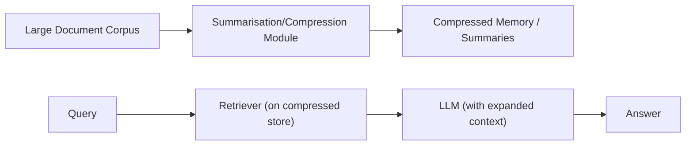
**Description:** These methods aim to fit more information in limited context by compressing it. Techniques include hierarchical summarization (summaries of summaries), memory caching (like ACRE bi-layer cache【46†L1646-L1654】), and learned compression (autoencoders on text【45†L37-L41】). In effect, documents are stored in condensed form; when needed, they are decompressed or expanded for the LLM.  

**Pros:** Extends effective context length far beyond the raw token limit. For example, Zhong et al.’s Recurrent Context Compression allows an LLM to “scroll” through a long text by repeatedly compressing past tokens【46†L1632-L1641】. This saves memory and compute. It can be combined with other methods (e.g. RAG with compressed indexes).  

**Cons:** Risk of losing nuance. Compressed summaries may omit key details, potentially causing errors. Also introduces a tunable approximation layer – extra complexity. Latency can increase due to on-the-fly decompression or summarization.  

**Trade-offs:** These techniques trade *accuracy* for *scale*: you gain ability to handle huge corpora at the cost of some fidelity. They reduce token usage (thus cost) and speed up retrieval (smaller indexes), but require careful engineering to compress relevant bits.  

**Use-cases:** Very long documents (e.g. books, transcripts) or chat logs. When you need an LLM to “remember” conversations across days. Systems like LongChat, SlidingWindow algorithms in Reddit chatbots, or multi-stage RAG (retrieve, then compress, then query).  

**Examples:** QwenLong-CPRS dynamically compresses context via instruction-guided summarisation【45†L37-L41】. The InfLLM approach of storing distant context in separate memory units【45†L37-L41】. Google’s REIGN (not public) reportedly does hierarchical summarization. Architecture projects like MemoryX or DeltaLM use these ideas.  

**Migration guidance:** If your RAG system’s index is too large or your chat needs cross-session context, implement compression. For instance, daily conversation could be summarized nightly and fed to the next day’s prompts. You can also compress rarely-used data in a cold storage. But for most use-cases, RAG alone is simpler.

## Programmatic / Code-Execution (Chain-of-Code)  
*(A specialized form of symbolic reasoning)*  
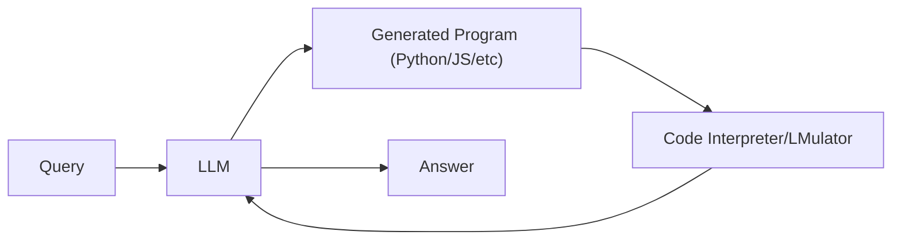
**Description:** Similar to symbolic reasoning but specifically focused on code. The LLM is prompted to “solve via program”: it generates a source code solution (with placeholders if needed), which is executed by a code interpreter. The interpreter may pause for “LMulator” simulation when hitting an unexecutable part (Chain-of-Code【48†L242-L249】).  

**Pros:** Enables mixing deterministic computation with language reasoning. It can handle tasks that need both math and semantics, e.g. counting or complex logic. It is more powerful than plain chain-of-thought since code execution is precise.  

**Cons:** Inherits downsides of symbolic plus added complexity of code integration. Running code is slower and requires a sandbox. It also needs a rich runtime environment (math libraries, etc.).  

**Trade-offs:** Very low hallucinations on executable parts. Allows solving novel algorithmic tasks. Very similar trade-offs as symbolic: higher engineering cost, but much higher answer accuracy for relevant tasks.  

**Use-cases:** Complex reasoning tasks, programming exercises, data transformation pipelines.  
**Examples:** The Chain-of-Code framework【48†L242-L249】, OpenAI’s Code Interpreter (run code in ChatGPT), and LangChain’s Python REPL tool. LangChain Agents often invoke Python for data analysis.  

## Search-Based Agents  
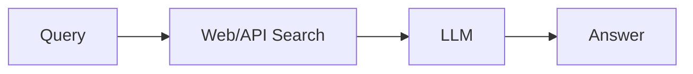
**Description:** These systems use web search (Google, Bing) or internal enterprise search. The query is sent to a search engine, which returns snippets; those become the LLM’s context (much like RAG but with dynamic, web-scale index).  

**Pros:** Access to constantly updated global knowledge. No need to maintain your own index of dynamic content. Can provide very current information (e.g. latest news, stock prices).  

**Cons:** Data quality depends on the search engine. Unfiltered web results may contain misinformation (more hallucination risk from unreliable sources). APIs can be rate-limited. Also, not always deterministic (search results change).  

**Trade-offs:** Freshness is maximized; interpretability depends on result provenance. Engineering is moderate (mostly hooking an API).  

**Use-cases:** Open-domain Q&A, chatbots that answer current events, or internal Q&A where intranet search is available.  

**Examples:** ChatGPT’s Bing plugins, Perplexity AI using web search, Microsoft Copilot (which can use Bing). In enterprise, integration with ElasticSearch or Solr.  

## MCP / Tool Ecosystem Architectures  
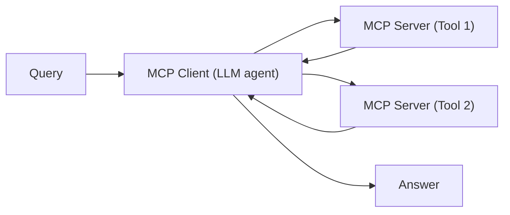
**Description:** The Model Context Protocol (MCP) is an open standard for connecting LLMs to arbitrary services【52†L148-L156】. In an MCP setup, the LLM (client) can call “servers” (tools) using a uniform protocol. Each server provides a service (email sending, database access, code execution, etc.), and the LLM can chain multiple servers in a flow. MCP formalizes and generalizes the tool-calling pattern【52†L148-L156】【52†L158-L166】.  

**Pros:** Plugs the LLM into a broad “app store” of tools. Developers can add new capabilities by writing an MCP server, and any MCP-compatible agent can use it. It abstracts tool integration, promising easier tool discovery and reuse.  

**Cons:** Very new (late 2024), so ecosystem is immature. Security, standardization, and trust models are still being worked out. It adds another layer in the stack.  

**Trade-offs:** Comparable to tool-calling: high flexibility and freshness, with high initial engineering. But once infrastructure exists, adding new tools is simpler than custom integration.  

**Use-cases:** Developer-centric workflows (e.g. coding IDEs using Slack or database MCP servers as in A16z’s Cursor example【52†L178-L187】). Essentially any multi-tool agent.  

**Examples:** Early MCP servers: Slack, Resend (email), Replicate (image gen)【52†L178-L187】. The Google Cloud guide on MCP【51†L8-L11】. Current LLMs (GPT-4, Claude) can use similar plugin frameworks, effectively a precursor to MCP.  

**Migration guidance:** If you’re building an agent with many external integrations (Slack, CRM, code, etc.), adopting MCP can future-proof your architecture. Start by writing or adopting MCP servers for your common tools.  

## Hybrid Architectures  
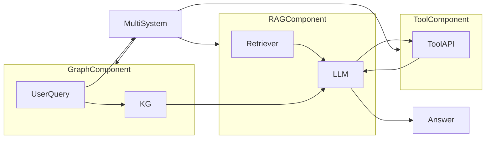
**Description:** Many real-world systems combine multiple of the above. For instance, *GraphRAG* combines vector retrieval with KG hierarchies【31†L93-L100】; some agents use RAG *and* invoke APIs in the same session【38†L580-L584】; Chain-of-Code blends LLM, symbolic and retrieval. In hybrid systems, different pipelines handle different aspects of the query, or steps are pipelined (e.g. retrieve → reason → act).  

**Trade-offs:** Hybrids aim to leverage each method’s strengths (e.g. RAG for covering facts, tools for execution, memory for context). They are usually the most accurate but also the most complex. Latency multiplies across components. Engineering cost is very high, but such systems can achieve state-of-art performance on complex tasks.  

**Use-cases & Examples:** Virtual assistants often hybridize: they retrieve data, call calculators, and store memory. Microsoft Copilot uses KG and RAG; modern chatbots use RAG with function calls. The SummHay paper noted that *“the best-performing systems all use retrieval in some form”*【20†L534-L537】, often alongside other techniques.  

## Comparison of Attributes  

Table 1 compares key properties of RAG and each alternative. Scalability refers to ease of handling large knowledge; Freshness to how easily knowledge can be updated; Interpretability to the traceability of answers; Complexity to engineering effort; Hallucination Risk to tendency to produce fabrications.

| Approach                   | Scalability | Freshness | Interpretability | Engineering Complexity | Cost   | Hallucination Risk |
|----------------------------|-------------|-----------|------------------|------------------------|--------|--------------------|
| **RAG**                    | High        | High      | Medium           | Medium                 | Medium | Low                |
| **Long-Context LLM**       | Medium      | Low       | Low              | Low                    | High   | High               |
| **Fine-Tuning**            | Low         | Low       | Low              | High                   | High   | High               |
| **Tool/Function Calling**  | High        | High      | High             | High                   | Medium | Low                |
| **Knowledge Graph RAG**    | Medium      | Medium    | High             | High                   | Medium | Low                |
| **Agent Memory**           | Low         | Medium    | High             | High                   | Medium | Low                |
| **SQL/DB-Augmented**       | High        | Medium    | Medium           | High                   | Medium | Low                |
| **Symbolic/Code Exec**     | Low         | High      | High             | High                   | Low    | Low                |
| **Mixture-of-Experts**     | High        | Medium    | Medium           | High                   | Medium | Medium             |
| **Context Compression**    | High        | Medium    | Medium           | High                   | Low    | Medium             |
| **Search-Agent**           | High        | High      | Medium           | Medium                 | Medium | Low                |
| **MCP/Tool Ecosystem**     | High        | High      | High             | High                   | Medium | Low                |
| **Hybrid Systems**         | Varies      | Varies    | Varies           | Very High              | Medium | Low                |

*Table 1: Comparison of RAG vs alternative architectures (qualitative). “High” indicates strength, “Low” weakness relative to other methods.*

## Recommended Decision Checklist  
- **Factual vs Generative:** Use **RAG** or **search** if you need *real-time facts* or citations. Use **long-context only** for holistic summarization tasks.  
- **Domain stability:** If knowledge updates frequently, prefer RAG/tool-calling. If the domain is fixed and you have data, consider **fine-tuning**.  
- **Structured data vs free text:** For tabular or relational data, use **SQL/KB** or **KG** approaches. For unstructured corpora, RAG/vector search is natural.  
- **Reasoning needs:** For logical/mathematical problems, use **symbolic or programmatic** methods. For complex multi-step goals (e.g. planning), consider **agentic** architectures with memory and tools.  
- **Interpretability requirements:** If you must explain reasoning, use methods that provide provenance: **RAG with citations, KG graphs, symbolic traces**, or explicit tools.  
- **Latency/Cost constraints:** If minimal inference time is critical (and domain changes slowly), **fine-tune** a smaller model and serve it. If high compute is affordable, RAG and tool-calling are flexible.  
- **Development resources:** RAG (with vector DB) is often the quickest to build (lots of open tooling). Graph and memory systems require more engineering.  

In summary, **no one architecture fits all**. RAG remains a strong default for knowledge-intensive tasks【17†L248-L254】【25†L139-L144】. Use hybrid designs to combine approaches when needed. This report has outlined the spectrum of options; choose based on your priorities (freshness, cost, scalability, etc.).  

**Sources:** Authoritative discussions and papers on RAG and its alternatives【17†L240-L246】【20†L500-L507】【25†L139-L144】【38†L566-L573】【31†L93-L100】【28†L100-L109】【42†L122-L131】【44†L71-L80】【46†L1637-L1645】【48†L242-L249】【52†L148-L156】 were used to compile this analysis. These include industry articles, academic surveys, and official docs.  

