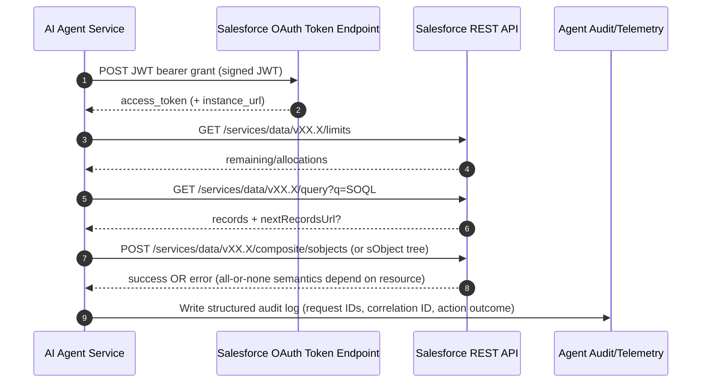
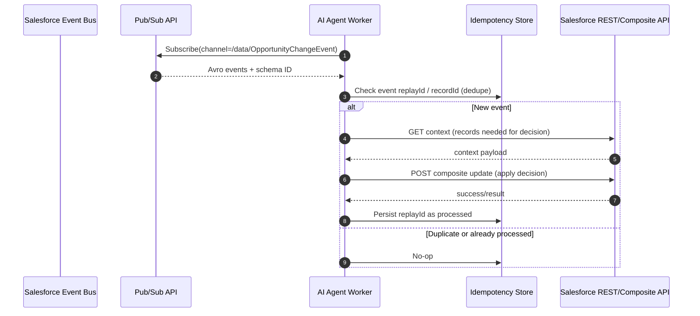
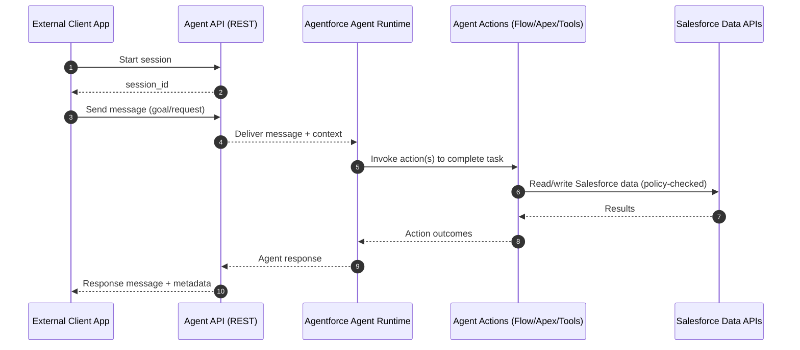

# Salesforce APIs and Agentic Integrations for AI Agents

## Executive summary

Salesforce exposes a broad API surface for *data*, *metadata*, and *events*, plus newer AI-focused interfaces (notably the Models API and Agent API under Agentforce). For an AI agent that must **read, reason, and act** on Salesforce, the most robust architecture is usually: OAuth-based authentication (JWT bearer or authorisation-code flows depending on whether actions are system- or user-delegated), REST/GraphQL/UI API for interactive CRUD and schema discovery, Composite REST for transactional multi-step writes, Bulk API 2.0 for large-scale ingest/extract, and Pub/Sub API (or Streaming API where required) for event-driven reactions to Change Data Capture and Platform Events. citeturn7search30turn7search1turn0search4turn0search3turn4search2turn1search16turn1search22turn1search6turn1search2turn1search7

On the AI side, Salesforce’s **Models API** provides REST endpoints and autogenerated Apex classes to call partner LLMs through the Einstein Trust Layer, with usage tied to “Einstein Requests” billing and governance controls. citeturn3search0turn3search6turn2search9 Separately, the **Agent API** lets external applications run conversational sessions with enabled Agentforce agents via REST, using a client-credentials style setup for external client apps (with important product constraints noted in the docs). citeturn2search4turn7search25

A large ecosystem of **third-party and open-source “agentic” tools** can autonomously operate on Salesforce via connectors and orchestration (iPaaS, RPA, and agent frameworks). These products vary widely in governance, auditability, and safe-action constraints—factors that become critical when LLMs can trigger writes, not just read data. citeturn9search3turn9search14turn9search7turn10search7turn11search0turn10search0

## Official Salesforce API landscape for AI agents

Salesforce documentation is explicit that “API-first” design underpins many platform capabilities and recommends choosing APIs based on interaction style (synchronous CRUD/query vs asynchronous bulk vs event streaming). citeturn0search6turn0search22 The table below inventories the most relevant *official* APIs and integration capabilities for an AI agent.

### API comparison table

| API / capability | Purpose and best-fit tasks for an AI agent | Primary interface | Auth methods typically used | Rate limits / org limits and notable constraints | Official documentation (primary) |
|---|---|---|---|---|---|
| REST API | General CRUD, SOQL query/search, lightweight metadata, limits inspection; good “default” for agents | HTTP + JSON (also XML in some contexts) | OAuth 2.0 via connected/external client app | Subject to org API request limits; `/limits` resource reports allocations and remaining usage | REST API Developer Guide citeturn8search26; Limits resource citeturn0search4 |
| SOAP API | Strongly-typed enterprise integrations; legacy systems; WSDL-driven clients | SOAP + XML (Enterprise/Partner WSDL) | OAuth 2.0 (session-based access also exists in some patterns) | Subject to org API request limits and version support policies | SOAP API Developer Guide citeturn5search0; About SOAP API citeturn4search10 |
| Composite REST API | Reduce round-trips; transactional multi-step operations; “agent plans” that execute atomically | HTTP + JSON (batched subrequests; sObject tree) | OAuth 2.0 | sObject Tree fails the entire request if any record fails; composite batch has version constraints for subrequests | Composite resources overview citeturn4search8; sObject Tree citeturn4search2; Composite Batch citeturn4search5 |
| Bulk API 2.0 | Large-scale ingest/export (async jobs); best for batch backfills and periodic syncs | REST + CSV (jobs: ingest/query) | OAuth 2.0 (Bulk uses standard auth patterns) | Dedicated Bulk limits and allocations (job, batch, file sizing, concurrency); limits are explicitly documented and queryable | Bulk API 2.0 & Bulk API Developer Guide citeturn1search16; Bulk limits page citeturn1search9 |
| Bulk API (v1) | Older async bulk processing; still present in some stacks | SOAP-oriented async batches | OAuth 2.0 | Limits differ from Bulk 2.0; Salesforce provides comparison and allocations guidance | Bulk API 2.0 & Bulk API Developer Guide citeturn1search16 |
| Streaming API | Real-time notifications via Bayeux/CometD; PushTopics, generic events; legacy event streaming patterns | CometD (Bayeux) + JSON | OAuth 2.0 | Allocations for PushTopic/generic streaming and concurrent CometD clients; Salesforce recommends Pub/Sub API for new event apps | Streaming API Developer Guide citeturn1search6; PushTopic allocations citeturn8search10; Generic streaming allocations citeturn8search2 |
| Pub/Sub API | Newer high-throughput event publish/subscribe and schema retrieval (CDC, platform events, event monitoring events) | gRPC/HTTP2; Avro payloads | OAuth 2.0 session token | Explicit guidance on publish request sizing, per-event size, fetch limits, managed subscription limits, and concurrent stream constraints | Pub/Sub API intro citeturn1search22; Allocations citeturn16view4 |
| Platform Events | Custom and standard event objects (pub/sub); key building block for event-driven agents | Publish via Apex/Flow/API; subscribe via Apex/Flow/Pub/Sub/CometD | OAuth 2.0 for external publish/subscribe | Platform event allocations span publishing/delivery and client types; usage metering objects exist | Platform Events Developer Guide citeturn1search7; Platform Event allocations page citeturn8search1 |
| Change Data Capture | Subscribe to record changes rather than polling; ideal for agent triggers | Channels consumed via Pub/Sub or Streaming | OAuth 2.0 | CDC has allocations and guidance; positioned as a way to avoid repeated API calls and periodic exports | CDC intro citeturn1search2; CDC allocations citeturn1search10 |
| Metadata API | Deploy/retrieve/create/update metadata between orgs; essential for agent setup tooling (config-as-code) | SOAP + file-based deploy/retrieve (and related REST resources) | OAuth 2.0 | Primarily bounded by org/API limits and deployment constraints; purpose is moving metadata between orgs | Metadata API Developer Guide (PDF) citeturn2search3; Metadata intro citeturn2search7 |
| Tooling API | Fine-grained metadata for dev tools; good for introspection (Apex, fields, entities) and CI/dev tooling | REST and SOAP interfaces | OAuth 2.0 | Intended for interactive tooling; explicitly called out for source control and CI use cases | Tooling API Developer Guide (PDF) citeturn2search2; Tooling intro citeturn2search6 |
| Connect REST API | Chatter/feeds/files/notifications/communities content and more; “social layer” + some platform features | REST (resource-oriented) | OAuth 2.0 | Connect API has its own limits; many other APIs (e.g., Analytics) are based on Connect conventions | Connect REST API Developer Guide (PDF) citeturn3search1; Overview page citeturn3search7 |
| User Interface API (UI API) | UI-shaped CRUD and metadata for building UI clients; includes layout-aware operations | REST + JSON | OAuth 2.0 | Designed for UI use; subject to API limits like other REST APIs | UI API Developer Guide (PDF) citeturn0search9 |
| GraphQL API (Lightning GraphQL/UI API) | Fewer round-trips for nested UI API queries; good for agent “read models” | GraphQL over HTTP | OAuth 2.0 | Uses Connect API limits; returns HTTP 503 when rate-limited; queries limited (e.g., up to 10 subqueries; per-subquery caps and UI API object support) | GraphQL rate limits citeturn0search3; Query limitations citeturn0search5 |
| Apex REST | Custom REST endpoints wrapping Apex business logic; ideal “safe action façade” for agents | REST endpoints (@RestResource) | OAuth 2.0 (session ID patterns exist) | Runs as Apex transactions (governor limits apply); best for policy-checked, domain-safe operations | Exposing Apex as REST citeturn4search1; Apex overview and transactions citeturn1search19 |
| Salesforce Connect (External Objects / OData) | Virtualise external data as “external objects” (no data copy); can support agent RAG/lookup without ETL | OData adapters (2.0/4.0/4.01); external object model | Varies by external data source (auth handled via external data source config) | Documented limits and behavioural constraints; external systems can impose their own throughput limits | OData adapters overview citeturn6search0; General limits citeturn6search1; External Objects reference citeturn6search3 |
| Models API (Einstein / generative AI) | Call configured LLMs via REST and Apex through Trust Layer; embeddings, chat/generation-style operations | REST endpoints + autogenerated Apex classes | JWT-based access patterns described for REST; Apex access via generated classes | Subject to Salesforce Einstein usage/billing (“Einstein Requests”); designed to route via Trust Layer | Models API dev guide citeturn3search0; Access with REST citeturn3search6; Trust Layer citeturn2search9 |
| Agent API (Agentforce) | Run sessions with an Agentforce agent via REST (start session, send/receive messages) | REST API | Client credentials flow via external client app (per setup docs) | Not supported for certain agent types (per doc); requires Agentforce enabled and an activated agent | Agent API “Get started” citeturn2search4; Agent API overview citeturn2search0 |
| Einstein Discovery REST API | Programmatic predictions/models/stories for Einstein Discovery | REST (Connect-based conventions) | OAuth 2.0 (Connect REST style) | Built on Connect REST API conventions | Einstein Discovery REST API guide (PDF) citeturn3search28 |
| CRM Analytics REST API | Programmatic access to datasets/dashboards/lenses/queries; agent analytics actions | REST (Connect-based conventions) | OAuth 2.0 | Salesforce commits to supporting API versions for at least 3 years (stated in guide); Connect-based | CRM Analytics REST API guide (PDF) citeturn3search10 |

**Interpretation caveat:** Salesforce’s limits documentation explicitly notes that stated limits may not apply uniformly across all orgs and that the quick reference is not exhaustive. citeturn8search4turn8search0

## Agentic ecosystem integrating with Salesforce

“Agentic” Salesforce integrations currently cluster into four practical architectures:

1) **Workflow/iPaaS + “agent builder” layers** that let an LLM select and execute pre-governed actions across Salesforce and other systems (often with human-in-the-loop approvals and audit logs). citeturn9search3turn9search14turn9search18turn9search27  
2) **RPA platforms** embedding bots into Salesforce UX (attended automation) or running headless back-office automations that read/write Salesforce objects. citeturn9search7turn9search12turn15search10  
3) **Lightweight automation connectors** (low-code SaaS and source-available tools) that can run autonomously on triggers and scheduled jobs, typically via REST API operations. citeturn10search8turn10search13turn10search7  
4) **Open-source agent frameworks and toolkits** that expose Salesforce as “tools” (CRUD, schema inspection) for LLM agents, often built atop community Salesforce clients such as `simple_salesforce` or similar libraries. citeturn11search0turn10search0turn15search2  

### Table of third-party and open-source agentic tools

| Tool / vendor | Architecture (where the “agent” runs) | Integration method to Salesforce | Key autonomous capabilities | Limitations / operational caveats | Pricing model evidence |
|---|---|---|---|---|---|
| entity["company","Workato","automation platform"] (Agentic / “Genies”) | SaaS agent + workflow orchestration | Uses prebuilt connectors and orchestrated workflows across apps | Build/manage AI agents that act across business systems; positioned as “agentic automation” | Enterprise platform; governance depends on connector scopes and recipe design | Public pages are demo-led / contact sales (no public price in cited sources) citeturn9search3turn9search27turn9search8 |
| entity["company","Tray.ai","integration and agent platform"] (Merlin Agent Builder) | SaaS “agent builder” + iPaaS workflows | Hundreds of connectors + HTTP; includes Salesforce-specific actions/templates | Agents can act across Salesforce and other systems with guardrails, RBAC, approvals, and execution logs | Some features gated (“reach out to Customer Success”); platform choice/lock-in considerations | Commercial; pricing via sales engagement (no fixed price in cited source) citeturn9search14turn9search18turn9search22turn9search36 |
| entity["company","UiPath","rpa vendor"] (Salesforce add-in / activities) | RPA (attended/unattended) plus integration-service connectors | Salesforce activities enable insert/update/upsert and SOQL querying; AppExchange add-in integrates Orchestrator with Salesforce | Automate Salesforce operations and orchestrate bots from Salesforce UI | Connector usage tied to API calls and activities; automation reliability depends on UI stability if using attended patterns | Integration Service usage calculated by API calls (not per connector) citeturn9search12turn9search16turn9search9turn9search0 |
| entity["company","Automation Anywhere","rpa vendor"] (Automation Anywhere for Salesforce) | RPA orchestrated via Control Room, callable from Salesforce pages | Salesforce AppExchange solution; uses REST APIs plus Lightning web component launcher | “Run bots from Salesforce” for routine tasks; supports launching configured bots from record pages; seat-based licensing described | Operates within a single Salesforce org context per installation; requires licences for users running automations | Seat-based model (licence per user running automations) and separate pricing docs exist citeturn9search7turn9search13turn9search10 |
| entity["company","Microsoft","software company"] (Power Automate Salesforce connector) | SaaS workflow automation (can be event-driven and scheduled) | Standard Power Platform connector for Salesforce objects | Automate workflows involving Salesforce data in Power Platform | Licensing and throttling depend on Power Platform and connector constraints (not detailed in cited snippet) | Commercial (Power Platform licensing) citeturn11search1 |
| entity["company","Zapier","workflow automation platform"] (Salesforce integration) | SaaS trigger/action automation | Salesforce triggers/actions: create/update/delete records; run reports; launch flows; custom SOQL query | Autonomous workflows that can write to Salesforce and invoke flows | Reliability depends on trigger semantics and polling vs push; complex change-detection may require Salesforce-side design | Commercial tiers (pricing not in cited sources) citeturn10search8turn10search3 |
| entity["company","n8n","workflow automation"] (Salesforce node) | Source-available workflow automation (self-host or cloud) | Built-in Salesforce node supports create/update/delete/get and uploading documents | Autonomous workflows with retries/branching; can be operated self-hosted for governance | Operational overhead if self-hosting; connector behaviour depends on node implementation | “Free and source-available” described in integration page citeturn10search7turn10search13 |
| entity["company","SS&C Blue Prism","rpa vendor"] (Power Pack for Salesforce) | Enterprise RPA with bidirectional connectors | AppExchange package + Blue Prism Digital Exchange assets; “bi-directional connectors” described | Bring RPA/IA into Salesforce environment; automate workflows between platforms | Paid connector access model; automation still constrained by API permissions and org limits | Paid connector; detailed commercial terms generally via sales contact citeturn15search10turn15search5turn15search27 |
| entity["company","Robocorp","rpa open source company"] (RPA Framework Salesforce library) | Open-source RPA libraries + bots | Library extends `simple-salesforce` and uses REST API; example robots show Salesforce REST operations | Build autonomous robots that can read/write via REST and orchestrate broader workflows | Requires engineering + operational discipline; not a managed governance layer by default | Open-source libraries (Apache-licensed framework) citeturn15search2turn15search18turn15search4 |
| entity["company","LangChain","llm framework company"] (Salesforce tools) | Open-source agent framework | `langchain-salesforce` provides tools for querying/managing records and exploring schemas | Enables LLM agents to perform schema-aware operations and CRUD via a tool abstraction | Requires you to implement security boundaries, approvals, and safe tool design | Open-source package approach (commercial support varies) citeturn11search0turn11search3 |
| entity["company","LlamaIndex","llm orchestration company"] (Salesforce ToolSpec) | Open-source LLM application/agent framework | Salesforce tool spec uses `simple_salesforce` to interact with Salesforce | Agent can interact with Salesforce through tool spec abstraction | Same governance caveats as other frameworks; requires correct OAuth setup and least privilege | Open-source integrations; enterprise offerings vary | citeturn10search0turn10search4 |
| entity["company","Composio","agent tool platform"] (Salesforce MCP integrations) | “Tool routing” / MCP-mediated tool access for agents | Provides Salesforce toolkit integrations for agent frameworks via MCP patterns | Expose Salesforce actions as agent-callable tools; supports framework integrations | Emerging pattern; security and audit posture depends on how tool permissions and execution are mediated | Commercial (pricing not in cited sources) citeturn10search21turn11search9 |

## Technical patterns for AI agents accessing and acting on Salesforce

This section is written from the viewpoint of “an AI agent as a service” that can (a) read Salesforce context, (b) decide on actions, and (c) safely write changes back.

### Authentication and authorisation patterns

**System-to-system agent (no interactive user): OAuth 2.0 JWT bearer flow.** Salesforce documents JWT bearer flow for server-to-server integrations, where the client posts a signed JWT to the token endpoint to obtain an access token. citeturn7search30turn0search16 This pattern is typically paired with a dedicated integration user and tightly scoped permissions. OAuth scopes and tokens are first-class configuration objects. citeturn0search1turn0search11turn12search6

**User-delegated agent (needs “act on behalf of user” semantics): OAuth 2.0 web server flow (authorisation code grant).** Salesforce positions the web server flow as the standard approach for integrating a web app with Salesforce APIs when a user grants access. citeturn7search1turn7search3

**Device and special-case flows.** Salesforce documents a device flow for IoT-style integration and a username-password flow for special scenarios; these exist but carry different risk profiles and operational constraints. citeturn7search4turn7search14

**Named Credentials and External Credentials (Salesforce as the caller).** While an external AI agent typically stores credentials outside Salesforce, Named/External Credentials become essential when *Salesforce-hosted* logic (Apex, Flow, External Services, or Agentforce actions) must call out to external systems (including AI endpoints). Salesforce provides “Create Named Credentials and External Credentials” guidance and supports JWT bearer flow in that context. citeturn7search10turn0search2turn0search12turn7search16

### API selection by task

A pragmatic agent chooses APIs based on *latency*, *volume*, and *transactionality*:

**Interactive reads (low/medium volume, need fast “situational awareness”).** REST API is the general-purpose baseline: query/search, CRUD, and “limits” monitoring via `/limits`. citeturn8search26turn0search4 For UI-shaped reads (layouts, picklists, UI semantics), UI API is designed specifically for that use case. citeturn0search9 For cross-object “read models” where minimising round-trips matters, GraphQL can bundle nested reads but is constrained (subquery and record limits) and uses Connect API limits. citeturn0search5turn0search3

**Transactional writes (small sets, multi-step plans).** Composite REST API is the core pattern to reduce agent “tool chatter”: sObject Tree enables creating nested parent-child records under one root, with all-or-nothing semantics for the request. citeturn4search2 Composite Batch can run multiple subrequests in one call (with API version constraints documented). citeturn4search5

**High-volume changes (bulk backfills, nightly sync, large extracts).** Bulk API 2.0 is the recommended modern bulk interface with async jobs for ingest and query. citeturn1search16turn1search28 Limit types (ingest, query, general) are documented and should be enforced in the agent’s job scheduler. citeturn1search9turn0search4

**Event-driven triggers (avoid polling).** Salesforce explicitly frames Change Data Capture as a way to update external systems instead of repeated API calls or periodic exports. citeturn1search2 Pub/Sub API is positioned as the newer gRPC/HTTP2 interface for publishing and subscribing to platform events, CDC events, and real-time event monitoring events, and the Streaming API guide recommends Pub/Sub API for new event apps. citeturn1search22turn1search6turn16view4

**Schema and configuration introspection.** Tooling API offers fine-grained metadata access and is explicitly positioned for interactive dev tooling, source control integration, and CI uses; Metadata API is the canonical deploy/retrieve mechanism for moving metadata between orgs. citeturn2search2turn2search7turn2search3

### Event-driven vs polling loops

An agent architecture should treat polling as a controlled fallback:

- **Prefer Pub/Sub + CDC** when the agent’s goals are triggered by record changes (e.g., “when Opportunity stage changes to Closed Won, do X”). CDC is designed to reduce periodic exports/imports and repeated API calls. citeturn1search2turn1search3  
- **Use Platform Events** when you control the event contract and want explicit domain signalling (e.g., `OrderValidated__e`). Publishing/subscribing options span Apex/Flow and external clients via APIs. citeturn1search7turn1search26  
- **Poll with backoff** only when no event source exists; use REST `/limits` to adapt polling frequency to remaining quotas. citeturn0search4turn0search21  

### Transaction handling, errors, and retries

**Atomicity.** Composite sObject Tree is explicitly all-or-nothing for the overall request, which is useful when an agent must create multiple dependent records safely. citeturn4search2 For Apex-mediated operations, Salesforce highlights that Apex runs in atomic transactions (which informs rollback behaviour within the platform). citeturn1search19

**Bulk job resilience.** Bulk API 2.0 documentation describes job state tracking and error handling, and notes built-in retry behaviour in some contexts (for example, query job chunking/retry notes appear in the guide). citeturn1search16turn1search5

**Rate limiting and overload responses.** GraphQL API documentation notes that it uses Connect API limits and returns HTTP 503 when rate-limited. citeturn0search3 Streaming and platform event delivery also have explicit allocation limits and error behaviours when exceeded. citeturn8search2turn8search1turn8search10

### Schema discovery and data modelling patterns

Agents need “self-serve” schema awareness to be robust across org customisations:

- **Object and field introspection:** REST API supports retrieving object metadata; Tooling API exposes metadata types and SOQL-queryable definitions (useful for incremental discovery). citeturn8search26turn2search2  
- **Event schema retrieval:** Change Data Capture docs state that you can retrieve event schema via REST or Pub/Sub API (`GetSchema`). citeturn1search11turn1search22  
- **Consent and privacy models:** Consent API aggregates consent settings across several objects to respect the “most restrictive” preferences, which affects what an agent is allowed to do (especially outbound communication actions). citeturn13search2turn13search28  

### Sample interaction sequence diagrams

#### Server-to-server agent using JWT bearer + Composite writes

This aligns with Salesforce’s JWT bearer flow definition and REST `/limits` resource, and uses Composite resources to reduce round-trips. citeturn7search30turn0search4turn4search2turn4search8

#### Event-driven agent loop using Pub/Sub + Change Data Capture

Salesforce positions CDC as a way to avoid repeated API calls, and Pub/Sub API as the recommended modern interface for event subscriptions with explicit allocation constraints and Avro payload delivery. citeturn1search2turn1search22turn16view4turn1search11

#### External app calling Agent API for an Agentforce agent

This corresponds to Salesforce’s Agent API documentation (sessions/messages) and the “actions” model for how agents get work done. citeturn2search4turn2search8turn2search0

## Security, governance, compliance, and audit considerations

### Least privilege and consent

**Least privilege starts at connected/external client apps and scopes.** Salesforce documents OAuth scopes and the principle of restricting scopes, and provides explicit guidance on connected/external client app security hardening (avoid overly broad scopes, admin-approve users where appropriate, and treat scopes as least-privilege controls). citeturn0search1turn12search6turn0search11

**Consent and preference enforcement is a first-class API concern.** The Consent API is designed to aggregate consent across multiple objects and help systems respect the most restrictive preferences—important when agents can send emails, create marketing actions, or trigger outreach. citeturn13search2turn13search31

### Data residency, retention, and AI trust controls

**Hyperforce data residency** documentation describes “local data storage” where customer data is stored at rest in-country and not relocated (for supported products in Hyperforce). citeturn13search0turn13search13

For generative AI, Salesforce documents the **Einstein Trust Layer** as including grounding, masking (feature-dependent), toxicity detection, audit trail/feedback, and “zero data retention” agreements with third-party LLM providers. citeturn2search9turn13search23turn2search1turn2search5  
Legal/privacy materials further describe “zero data retention” for Agentforce use cases and clarify broader contractual privacy commitments for processing customer data. citeturn13search1turn13search5turn13search8

A key nuance: Salesforce’s Agentforce privacy FAQ notes feature-specific behaviour (for example, it explicitly mentions cases where data masking is disabled for Agentforce to improve performance and accuracy, pointing to dedicated documentation). citeturn13search5

### Data masking, sandbox safety, and test data governance

Salesforce Data Mask is positioned as platform-native obfuscation for sandboxes, with the explicit property that masked sandbox data cannot be unmasked, and with best-practice guidance on masking PII and sensitive fields. citeturn12search3turn12search27turn12search7  
This is particularly important for agentic development: without masking, test prompts or model interactions can inadvertently expose real customer data in non-production environments.

### Logging, audit trails, and real-time controls

**Event Monitoring and related logs.** Salesforce documentation describes accessing event monitoring via the `EventLogFile` object through SOAP/REST, enabling integration of log data with external monitoring and SIEM pipelines. citeturn8search7turn12search0 A specific “API Total Usage” event type includes details about Platform SOAP, Platform REST, and Bulk API requests, supporting capacity planning and anomaly detection for agents. citeturn8search3turn8search21

**Transaction Security Policies (TSPs)** are documented as a framework to intercept real-time events and apply actions to monitor/control activity; TSPs are also representable in metadata. This is directly relevant for preventing agent-driven data exfiltration patterns (e.g., blocking suspicious API query behaviour). citeturn12search1turn12search9turn12search5  
Salesforce Security Guide material also describes real-time event monitoring for near-real-time detection and storage for auditing/reporting. citeturn12search29

### Rate limits and operational org limits

From an agent engineering perspective, limits fall into three overlapping groups:

- **Org-wide API request allocations** (SOAP/REST and APIs built on those frameworks). These are org- and licence-dependent and surfaced via Salesforce limits tooling and documentation. citeturn8search0turn0search4turn0search21  
- **Event streaming allocations** (platform events, CDC, streaming clients), with explicit allocations and error behaviours for PushTopics, generic streaming, and platform event publish/delivery. citeturn8search10turn8search2turn8search1turn1search10  
- **Protocol-specific constraints** such as Pub/Sub API publish sizing, per-event sizing, fetch limits, managed subscription caps, and concurrent stream constraints. citeturn16view4turn1search22  

## Best practices and implementation recommendations

### Build a “safe action façade” rather than exposing raw CRUD everywhere

A recurring failure mode in agentic CRM systems is letting an LLM directly compose unrestricted SOQL/DML or arbitrary REST writes. A safer pattern is to expose *policy-checked* domain actions (e.g., “CreateQualifiedLead”, “CloseOpportunityWithReason”, “EscalateCase”) via Apex REST endpoints or Agentforce actions, where you can enforce validation, field-level rules, and auditability. Salesforce provides guidance on exposing Apex as REST, and its action model for agents (actions as tools) reflects this “bounded capabilities” approach. citeturn4search1turn2search8turn2search28

### Prefer event-driven agents where possible

Using Change Data Capture and Pub/Sub API generally yields better scalability and user experience than polling, and Salesforce explicitly frames CDC as an alternative to periodic exports/imports and repeated API calls. citeturn1search2turn1search22turn16view4  
When the business event is “yours,” prefer Platform Events with a deliberate contract, because the event model supports multiple publish and subscribe paths (Apex/Flow and external) with documented allocations you can monitor. citeturn1search7turn8search1

### Treat limits as a first-class control loop

Agents should continuously adapt based on remaining quota and observed throttling:

- Query `/limits` before running high-cost tasks and after bursts; the REST Limits resource exists specifically for this. citeturn0search4  
- Use EventLogFile / API Total Usage logs to measure “who is burning calls” and to detect runaway agents or compromised credentials. citeturn8search7turn8search3  
- Where GraphQL is used, design queries to respect Salesforce’s documented query constraints and handle 503 rate-limit responses gracefully. citeturn0search5turn0search3  

### Keep development, testing, and rollback “org-safe”

- Use sandboxes for agent testing; apply Salesforce Data Mask to prevent sensitive data leaking into prompt logs and test runs. citeturn12search3turn12search7  
- For configuration-as-code and repeatable deployments, use Metadata API (deploy/retrieve) and Tooling API (fine-grained, interactive introspection and dev-tool integration). Tooling API explicitly calls out source control and CI use cases. citeturn2search7turn2search2turn2search3  
- When building analytics-driven agents, use CRM Analytics and Einstein Discovery APIs rather than scraping UI artefacts; both provide programmatic endpoints and are formally documented. citeturn3search10turn3search28  

## Gaps, risks, and open research areas

### Tool-use correctness and hallucination in enterprise APIs

A core open problem is ensuring that an LLM selects the correct tool, produces valid arguments, and does not hallucinate API calls or field names. Research such as ReAct (interleaving reasoning and actions), Toolformer (self-supervised tool-use learning), and Gorilla (retrieval-augmented API call generation) directly targets these failure modes in tool-using agents. citeturn14search0turn14search1turn14search2  
For Salesforce specifically, the combination of heavy customisation (custom objects/fields), permission constraints, and strict limits makes hallucinated field names and incorrect assumptions especially costly.

### Evaluating agent reliability beyond unit tests

Benchmarks like AgentBench highlight that evaluating LLMs “as agents” requires interactive environments and multi-dimensional metrics, not just static QA scores. citeturn14search3turn14search11 Survey work emphasises that agent evaluation remains complex and underdeveloped relative to the pace of deployment. citeturn14search23  
In practical Salesforce deployments, this translates into a need for: replayable simulations, structured audit logs, and hard-fail “safe action” contracts rather than open-ended tool access.

### Standardising API descriptions for agent tool routers

As organisations expose more internal Salesforce-adjacent services to agents, maintaining accurate OpenAPI descriptions becomes a bottleneck. Emerging research (e.g., OASBuilder) targets automatic transformation of unstructured API documentation into machine-readable OpenAPI specs for agent tool use. citeturn6academia37  
This matters because modern agent platforms (including those using MCP-style tool mediation) increasingly rely on structured tool definitions rather than ad-hoc prompt instructions. citeturn10search21turn11search9

### Data governance tension: grounding vs minimisation

Salesforce’s Trust Layer framing encourages grounding prompts in CRM context while applying masking and zero-retention protections. citeturn2search9turn13search23 A key open operational question is how to optimise this trade-off: enough grounding for accuracy, but minimal data exposure for privacy, especially under evolving regional residency requirements (Hyperforce) and consent obligations. citeturn13search0turn13search2

### Action-model training and enterprise agent behaviours

Salesforce AI research is explicitly exploring “action models” and infrastructure for training/evaluating them (for example ActionStudio), reflecting an industry-wide shift from “chat completion” to “tool-competent” agents. citeturn2academia38 This line of work is promising, but it also raises integration-specific risks: how to guarantee that trained action policies remain consistent with evolving Salesforce org schemas, permissions, and business rules over time.